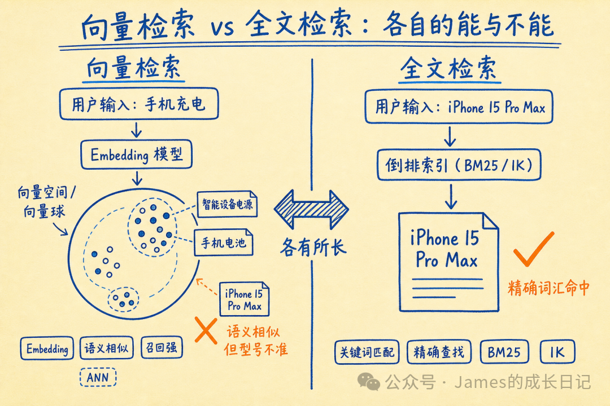
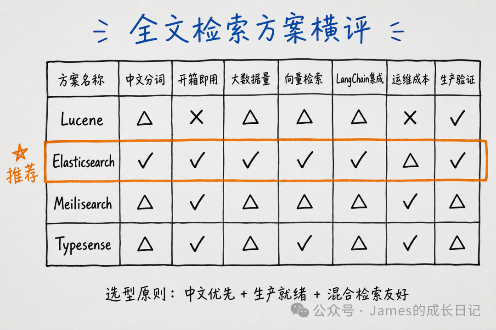
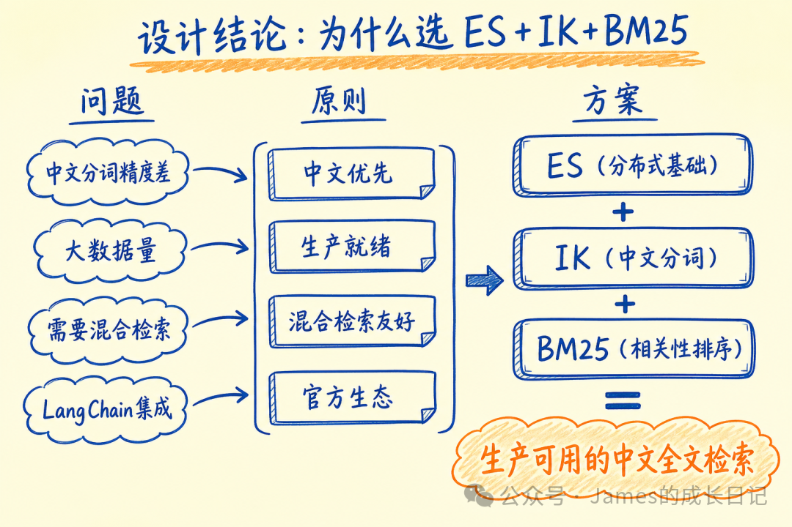
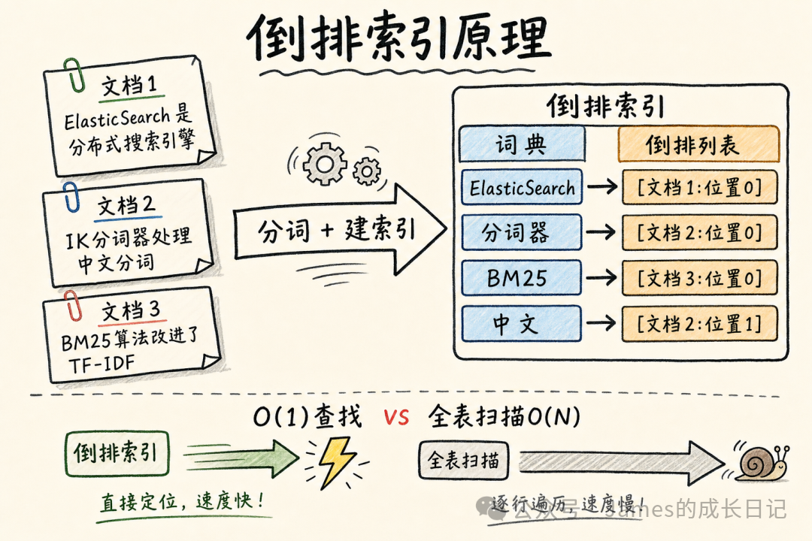
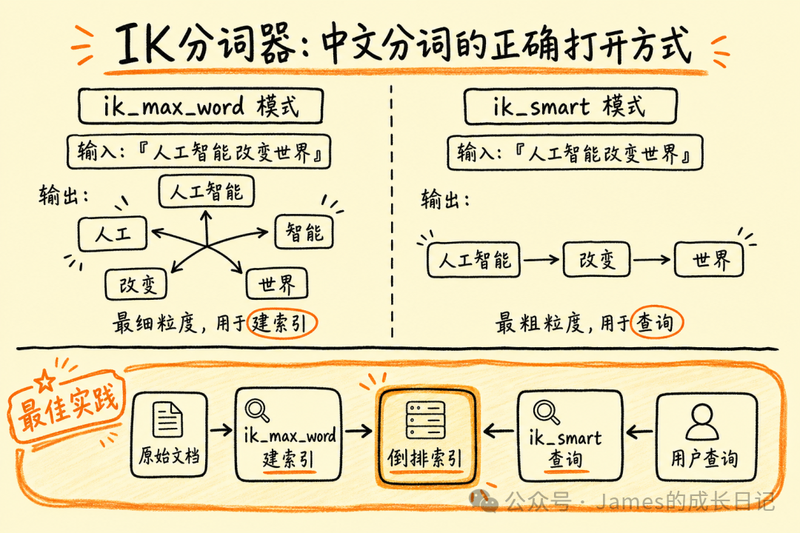
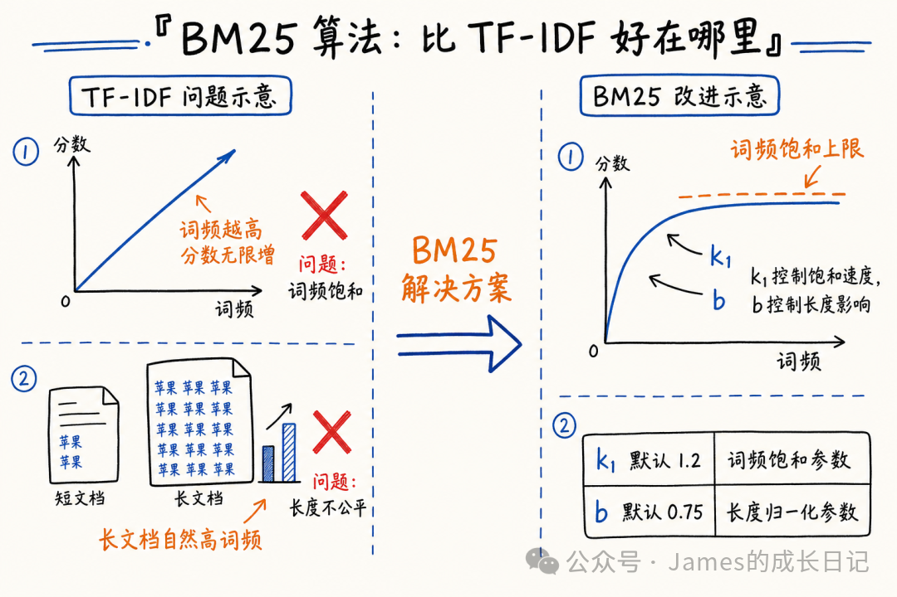
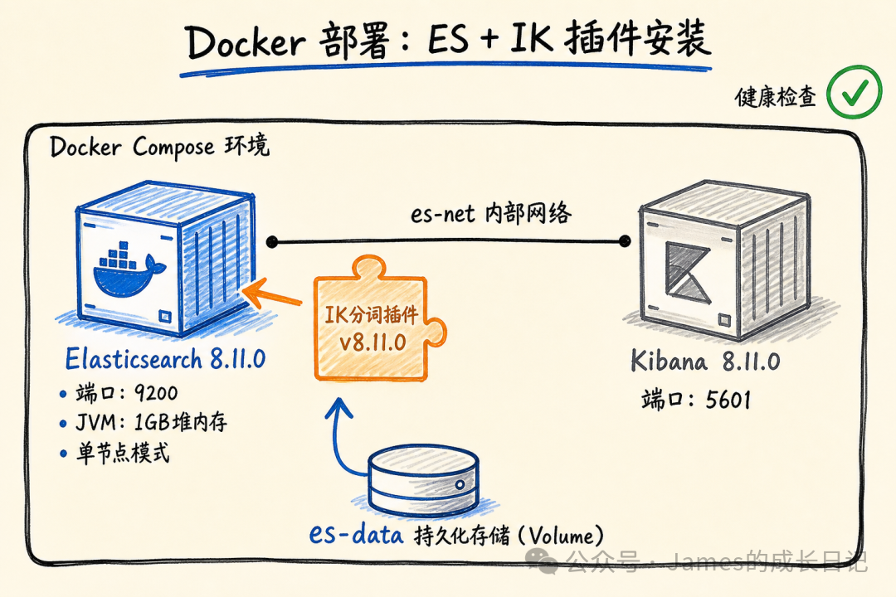
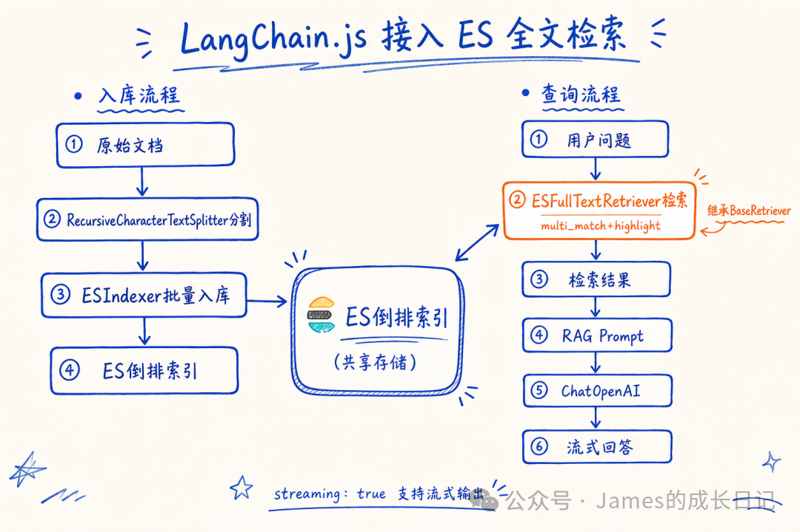

# ElasticSearch 全文检索原理：IK 分词 + BM25 一次讲透

> **来源：** 微信公众号  
> **作者：** James的成长日记  
> **原文链接：** [https://mp.weixin.qq.com/s/IHtul_wSH8wRovwJ2LRm9A](https://mp.weixin.qq.com/s/IHtul_wSH8wRovwJ2LRm9A)  
> **抓取日期：** 2026-05-30

---

大家好，我是 James。

上一篇（第51篇）我们聊了 Agent 失败了怎么办：重试、回退、人工接管的完整策略。处理好了失败，Agent 的韧性就有了。

这一篇我们进入 **板块四：检索引擎深度强化** 。

很多人搭 RAG 系统只用向量检索，遇到精确关键词匹配就翻车了。本篇要解决的就是这个问题——全文检索的原理和工程落地，重点是 **ElasticSearch + IK 分词器 + BM25 算法** 这套黄金组合，从原理到代码，一篇讲透。

* * *

## 01 | 为什么向量检索不够：关键词精确匹配的痛点

### 向量检索的能与不能

向量检索（语义检索）很强——它能理解语义，查"手机怎么充电"能找到"智能设备电池补充方法"的文档。这是它的优势：**语义相似性** 。

但向量检索有一个天然的弱点：**精确词汇匹配** 。

来看几个让向量检索吃瘪的场景：

**场景一：产品型号查询**

用户输入：「查 iPhone 15 Pro Max 256G 价格」

向量检索会把"iPhone 15"和"iPhone 14 Pro"、"Android 旗舰机"都召回来，因为语义相近。但用户要的是精确型号。

**场景二：法律条文检索**

用户输入：「《民法典》第1032条」

向量检索不认识"第1032条"——这是精确编号，不是语义概念。向量空间里，1032和1033没什么距离。

**场景三：代码错误查询**

用户输入：「ECONNREFUSED 127.0.0.1:5432 错误怎么解决」

`ECONNREFUSED`是一个精确字符串。向量模型可能把它 Embedding 成某个方向，但找到的结果不一定包含这个精确错误码。

**场景四：人名、地名、专有名词**

"张伟"在向量空间里和"李强"可能很近（都是中文人名），但用户要找的就是张伟，不是李强。

### 根本原因：向量检索的信息损失

向量检索的本质是把文本压缩成 N 维空间的一个点（比如768维）。这个压缩过程会保留语义，但会**丢失词汇精确性** 。
    
    
    "iPhone 15 Pro Max 256G"   
        → Embedding   
        → [0.23, -0.45, 0.67, ...] (768维)  
          
    "iPhone 14 Plus 512G"  
        → Embedding  
        → [0.21, -0.43, 0.66, ...] (768维，很接近)  
    

两个向量余弦相似度很高，但用户根本不想要 iPhone 14。

### 全文检索要解决的问题

全文检索（Full-Text Search）的核心使命：**在保留语义理解的前提下，支持精确词汇匹配** 。

它要回答的问题是：**这篇文档里有没有这个词/这个词的变体？**

这就需要倒排索引——一种为"词→文档"查找专门优化的数据结构。

* * *

## 02 | 行业调研：全文检索方案横评

在决定用 ES 之前，我做了一轮主流方案调研。

### 2.1 Apache Lucene

**定位** ：底层全文检索库，ES 和 Solr 都构建在它之上。

**策略** ：

  * 倒排索引的标准实现
  * 支持多种相似度算法（BM25、TF-IDF、向量相似度）
  * 内存中的索引结构，flush 到磁盘形成 Segment

**优势** ：

  * 是事实上的全文检索标准实现
  * 性能极好，Java 生态

**局限** ：

  * 只是个库，不是服务——你要自己搭集群、写 HTTP 接口
  * 运维成本高，分布式能力需要自己实现
  * 中文支持需要手动集成分词器

**适用** ：有定制需求、Java 团队、愿意自己搭基础设施

* * *

### 2.2 Elasticsearch（ES）

**定位** ：基于 Lucene 的分布式搜索引擎，RESTful API，开箱即用。

**策略** ：

  * Lucene 之上封装了完整的分布式能力（Shard、Replica、节点发现）
  * JSON 文档存储，天然支持嵌套结构
  * 强大的聚合能力（Aggregation）
  * 8.x 版本内置向量检索（kNN），原生支持混合检索

**优势** ：

  * 生产验证充分，社区庞大
  * 中文分词生态成熟（IK 分词器）
  * 与 LangChain.js 有官方集成
  * ES 8.x 支持全文+向量混合检索，一个方案解两个问题

**局限** ：

  * 资源消耗较大（JVM + Lucene 内存）
  * 集群配置和调优有一定学习成本
  * 版本升级偶尔有 Breaking Change

**适用** ：中大型生产项目，需要稳定的全文+向量混合检索

* * *

### 2.3 Meilisearch

**定位** ：以开发者体验为核心的现代搜索引擎，Rust 实现。

**策略** ：

  * 基于有限状态转换器（FST）的索引结构
  * 内置拼写纠错、停用词、同义词
  * 极简 API 设计，5 分钟跑起来
  * 默认相关性算法：词频 + 位置 + 属性权重的综合评分

**优势** ：

  * 极快（Rust 实现，内存效率高）
  * 开发体验超好，适合快速原型
  * 拼写纠错开箱即用

**局限** ：

  * 中文支持较弱，社区插件质量参差不齐
  * 大数据量下性能不如 ES
  * 与 LangChain 集成成熟度低
  * 没有内置的向量检索能力

**适用** ：英文内容、中小数据量、快速上手场景

* * *

### 2.4 Typesense

**定位** ：另一款 Rust 实现的开发者友好搜索引擎，Meilisearch 的竞品。

**策略** ：

  * 精确匹配 + 模糊匹配结合
  * 原生支持向量检索（混合搜索）
  * 极简的 Schema 定义

**优势** ：

  * 云服务（Typesense Cloud）开箱即用
  * 向量 + 全文混合搜索支持较好
  * API 设计简洁

**局限** ：

  * 中文支持同样薄弱
  * 生产验证不如 ES 充分
  * 社区和生态规模小

**适用** ：英文内容，需要向量+全文混合，中小项目

* * *

### 2.5 方案对比矩阵

维度 | Lucene | Elasticsearch | Meilisearch | Typesense  
---|---|---|---|---  
中文分词 | 需手动集成 | ✅ IK 插件 | ⚠️ 较弱 | ⚠️ 较弱  
开箱即用 | ❌ 只是库 | ✅ RESTful | ✅ 极简 | ✅ 极简  
大数据量 | ✅ | ✅ | ⚠️ | ⚠️  
向量检索 | ✅ 手动 | ✅ 8.x内置 | ❌ | ✅  
LangChain集成 | ❌ | ✅ 官方 | ⚠️ 社区 | ⚠️ 社区  
运维成本 | 高 | 中 | 低 | 低  
生产验证 | ✅ 充分 | ✅ 充分 | ⚠️ 有限 | ⚠️ 有限  
  
* * *

## 03 | 设计结论：为什么选 ES + IK + BM25

调研完了，结论很清晰。

### 选型原则

从调研中我提炼出四条原则：

  1. **中文优先** ：我们的场景是中文知识库，分词质量直接决定检索精度
  2. **生产就绪** ：方案要在大数据量、高并发下经过验证
  3. **混合检索友好** ：全文检索和向量检索要能共存，为下一篇混合检索打基础
  4. **LangChain 生态** ：有官方集成，减少胶水代码

基于这四条原则，**Elasticsearch 是唯一的选择** 。

### 为什么是 IK 分词器

中文的特殊性在于：中文没有天然的词分隔符（英文有空格）。
    
    
    英文: "Hello World"  
    分词: ["Hello", "World"]  ← 简单，按空格切  
      
    中文: "人工智能改变世界"  
    分词应该是: ["人工智能", "改变", "世界"]  ← 不是 ["人", "工", "智", "能", "改", "变", "世", "界"]  
    

ES 默认的 `standard` 分词器对中文就是**逐字切分** ——把"人工智能"切成4个单字，精度极差。

IK 分词器（IKAnalyzer）是目前中文 ES 场景的事实标准：

  * **ik_max_word** ：最细粒度切分，一个词尽量多切（用于建索引）
  * **ik_smart** ：最粗粒度切分，语义完整优先（用于查询）
  * 支持自定义词典，可以加入产品名称、专有名词

### 为什么选 BM25

ES 在 5.0 版本之后默认用 BM25 替代了 TF-IDF。BM25 是什么，为什么比 TF-IDF 好，第06节会详细讲。

这里先给结论：**BM25 解决了 TF-IDF 的两个核心缺陷** ——词频饱和问题和文档长度归一化问题。

### 组合的理由
    
    
    ES（分布式基础设施 + 倒排索引）  
      + IK（中文分词，解决精度问题）  
      + BM25（相关性排序，解决排名质量问题）  
    = 生产可用的中文全文检索方案  
    

三者各司其职，缺一不可。

* * *

## 04 | 倒排索引原理：一张图看懂

### 什么是倒排索引

"倒排"（Inverted）的含义是：从**词** 到**文档** 的映射，与正排（文档→词）相反。

**正排索引** （Forward Index）：
    
    
    文档1 → ["苹果", "手机", "发布"]  
    文档2 → ["苹果", "公司", "股价"]  
    文档3 → ["手机", "充电", "方案"]  
    

查"苹果"在哪些文档里：要遍历所有文档。N个文档就要扫描N次。**O(N) 查询，不可接受** 。

**倒排索引** （Inverted Index）：
    
    
    "苹果" → [文档1(位置:0), 文档2(位置:0)]  
    "手机" → [文档1(位置:1), 文档3(位置:0)]  
    "发布" → [文档1(位置:2)]  
    "公司" → [文档2(位置:1)]  
    

查"苹果"：直接查表，O(1) 拿到文档列表。

### 倒排索引的结构

倒排索引由两部分组成：

#### 词典（Dictionary / Term Dictionary）

存储所有出现过的词（Term），以及对应的倒排列表的指针。
    
    
    词典（B树或哈希表结构）:  
      "BM25"    → 指针→倒排列表A  
      "IK"      → 指针→倒排列表B  
      "分词"    → 指针→倒排列表C  
      "检索"    → 指针→倒排列表D  
      ...  
    

词典通常加载进内存，查找时间接近 O(1)。

#### 倒排列表（Posting List）

每个词对应一个倒排列表，存储包含该词的所有文档信息：
    
    
    "检索":  
      倒排列表 → [  
        { docId: 5,  termFreq: 3, positions: [2, 15, 47] },  
        { docId: 12, termFreq: 1, positions: [8]          },  
        { docId: 28, termFreq: 5, positions: [0, 3, 9, 21, 33] },  
      ]  
    

每个条目包含：

  * `docId`：文档 ID
  * `termFreq`：该词在文档中出现的次数（用于 BM25 计算）
  * `positions`：词在文档中的位置（用于短语匹配）

### 构建过程

建索引时，ES 对每篇文档做以下处理：
    
    
    原始文档: "ElasticSearch 是一款基于 Lucene 的分布式搜索引擎"  
      
    ↓ 分词（IK分词器）  
    ["ElasticSearch", "是", "一款", "基于", "Lucene", "的", "分布式", "搜索引擎"]  
      
    ↓ 归一化（小写、去停用词等）  
    ["elasticsearch", "一款", "基于", "lucene", "分布式", "搜索引擎"]  
      
    ↓ 更新倒排索引  
    "elasticsearch" → 加入 docId=X, pos=0  
    "一款"         → 加入 docId=X, pos=1  
    "基于"         → 加入 docId=X, pos=2  
    ...  
    

### 查询过程

用户查询 "elasticsearch 分布式"：

  1. 分词：`["elasticsearch", "分布式"]`
  2. 查词典，找到两个倒排列表
  3. **合并** （AND）或**联合** （OR）倒排列表
  4. 对命中的文档计算 BM25 分数
  5. 按分数排序，返回 Top-K

这就是全文检索比"LIKE '%keyword%'"快几个数量级的原因——后者是全表扫描，前者是索引查找。

* * *

## 05 | IK 分词器：中文分词的正确打开方式

### 中文分词的难点

中文分词本质上是一个**歧义消解** 问题：
    
    
    "南京市长江大桥"  
      
    切法一: ["南京市", "长江大桥"]   ← 地名+地名  
    切法二: ["南京市长", "江大桥"]   ← 职位+专有名词（错误）  
    切法三: ["南京", "市长", "江大桥"]  
    

没有词边界标记，必须依赖词典和上下文。

### IK 的两种模式

**ik_max_word（最细粒度，用于建索引）**
    
    
    输入: "中华人民共和国"  
    输出: ["中华人民共和国", "中华人民", "中华", "华人", "人民共和国", "人民", "共和国", "共和", "国"]  
    

尽可能多地切分，所有可能的词都保留。目的是提高召回率——确保用户无论输入哪个子词，都能命中文档。

**ik_smart（最粗粒度，用于查询）**
    
    
    输入: "中华人民共和国"  
    输出: ["中华人民共和国"]  
    

找出最合理的切分方式，避免过度切分。目的是提高精确率——用户输入"人民"时不要召回太多无关文档。

**最佳实践：索引用 ik_max_word，查询用 ik_smart**
    
    
    PUT /knowledge_base  
    {  
      "mappings": {  
        "properties": {  
          "content": {  
            "type": "text",  
            "analyzer": "ik_max_word",  
            "search_analyzer": "ik_smart"  
          }  
        }  
      }  
    }  
    

这样建索引时网最大，查询时最精准。

### 自定义词典

IK 支持添加自定义词典，解决行业术语、产品名称识别问题。

**问题场景** ：
    
    
    "LangGraph.js"  → IK默认切成 ["LangGraph", "js"]（或更碎）  
    "ChatGPT"       → IK可能切成 ["Chat", "GPT"]  
    

**解决方案** ：添加自定义词典文件。
    
    
    # /usr/share/elasticsearch/plugins/ik/config/custom_dict.dic  
    LangGraph.js  
    ChatGPT  
    LangChain  
    ElasticSearch  
    倒排索引  
    BM25算法  
    

在 IK 配置文件 `IKAnalyzer.cfg.xml` 中引用：
    
    
    <?xml version="1.0" encoding="UTF-8"?>  
    <!DOCTYPE properties SYSTEM "http://java.sun.com/dtd/properties.dtd">  
    <properties>  
        <comment>IK Analyzer 扩展配置</comment>  
        <!-- 配置自定义词典 -->  
        <entry key="ext_dict">custom_dict.dic</entry>  
        <!-- 配置停用词 -->  
        <entry key="ext_stopwords">stopwords.dic</entry>  
        <!-- 远程词典（可配置 HTTP 地址，动态热更新）-->  
        <!-- <entry key="remote_ext_dict">http://your-server/hot_words.txt</entry> -->  
    </properties>  
    

**热更新词典** （生产环境推荐）：配置远程词典 URL，IK 会定期拉取，无需重启 ES。

### 验证分词效果

通过 ES 的 `_analyze` API 可以直接测试分词结果：
    
    
    # 测试 ik_smart 分词  
    curl -X POST "localhost:9200/_analyze" -H 'Content-Type: application/json' -d'  
    {  
      "analyzer": "ik_smart",  
      "text": "人工智能改变了知识检索的方式"  
    }'  
      
    # 返回：  
    {  
      "tokens": [  
        { "token": "人工智能", "start_offset": 0, "end_offset": 4, "type": "CN_WORD" },  
        { "token": "改变",    "start_offset": 4, "end_offset": 6, "type": "CN_WORD" },  
        { "token": "知识",    "start_offset": 7, "end_offset": 9, "type": "CN_WORD" },  
        { "token": "检索",    "start_offset": 9, "end_offset": 11, "type": "CN_WORD" },  
        { "token": "方式",    "start_offset": 12, "end_offset": 14, "type": "CN_WORD" }  
      ]  
    }  
    

这个 API 是调试分词质量的利器，建完索引后第一件事就是用它验证。

* * *

## 06 | BM25 算法：比 TF-IDF 好在哪里

### 先理解 TF-IDF

TF-IDF 是最经典的词汇相关性算法：

**TF（Term Frequency，词频）** ：词在文档中出现的次数越多，文档越相关。
    
    
    TF(t, d) = 词t在文档d中出现的次数 / 文档d的总词数  
    

**IDF（Inverse Document Frequency，逆文档频率）** ：词在越少文档中出现，越能区分文档。
    
    
    IDF(t) = log(总文档数 / 包含词t的文档数 + 1)  
    

**TF-IDF 分数** ：
    
    
    Score(t, d) = TF(t, d) × IDF(t)  
    

### TF-IDF 的两个缺陷

**缺陷一：词频无上限（词频饱和问题）**

TF 是线性的：词出现10次的文档，分数是出现5次文档的2倍。

但现实中，一个词在文档里出现100次和出现50次，对相关性的影响差不多——用户不在乎你重复了多少次。

**缺陷二：文档长度不公平**

长文档天然词频高——一篇10000字的文章，几乎任何词都会出现很多次。TF-IDF 会对长文档有系统性偏好，即使它并不更相关。

### BM25 如何解决这两个问题

**BM25 完整公式** ：

不用被这个公式吓到，逐项拆解就很清晰：

**组件一：IDF 部分** （和 TF-IDF 类似）
    
    
    IDF(q_i) = log((N - n(q_i) + 0.5) / (n(q_i) + 0.5) + 1)  
      
    N      = 总文档数  
    n(q_i) = 包含查询词 q_i 的文档数  
    

**组件二：词频饱和项** （解决缺陷一）
    
    
    f(q_i, D) × (k1 + 1)  
    ─────────────────────────────────────────────  
    f(q_i, D) + k1 × (1 - b + b × |D| / avgdl)  
      
    f(q_i, D) = 词 q_i 在文档 D 中出现的次数  
    k1         = 词频饱和参数（默认 1.2）  
    

关键是分母里的 `f(q_i, D)` 让整个分数趋于饱和：
    
    
    # 模拟词频饱和效果  
    k1 = 1.2  
    for freq in [1, 2, 5, 10, 20, 50]:  
        score = freq * (k1 + 1) / (freq + k1)  
        print(f"词频={freq:2d}, BM25词频项={score:.3f}")  
      
    # 输出：  
    # 词频= 1, BM25词频项=1.182  
    # 词频= 2, BM25词频项=1.500  
    # 词频= 5, BM25词频项=1.818  
    # 词频=10, BM25词频项=1.936  
    # 词频=20, BM25词频项=1.981  
    # 词频=50, BM25词频项=1.995  ← 接近上限 2.2（k1+1），不再线性增长  
    

**组件三：文档长度归一化** （解决缺陷二）
    
    
    b × |D| / avgdl  
      
    |D|    = 文档 D 的长度（词数）  
    avgdl  = 所有文档的平均长度  
    b      = 长度归一化参数（默认 0.75，0=不归一化，1=完全归一化）  
    

长文档的 `|D| / avgdl > 1`，会降低分数；短文档 `|D| / avgdl < 1`，会提高分数。这样就消除了长度偏差。

### k1 和 b 参数的含义

参数 | 默认值 | 含义 | 调大效果 | 调小效果  
---|---|---|---|---  
`k1` | 1.2 | 词频饱和速度 | 词频更重要（饱和更慢） | 词频几乎不重要（更快饱和）  
`b` | 0.75 | 文档长度影响 | 更偏爱短文档 | 文档长度影响减弱  
  
**针对中文知识库的调优建议** ：

  * 文档长度差异较大（有摘要也有全文）：适当提高 `b`（0.75→0.85）
  * 关键词精确匹配优先：降低 `k1`（1.2→0.8），让词汇是否命中比频率更重要
  * 长文档为主（技术手册）：降低 `b`（0.75→0.5），避免惩罚长文档

* * *

## 07 | 实战：Docker 搭 ES + 装 IK 插件

### 7.1 Docker Compose 配置

创建 `docker-compose.yml`：
    
    
    version: '3.8'  
      
    services:  
      elasticsearch:  
        image: elasticsearch:8.11.0  
        container_name: es-ik  
        environment:  
          - node.name=es01  
          - cluster.name=es-docker-cluster  
          - discovery.type=single-node          # 单节点模式  
          - ES_JAVA_OPTS=-Xms1g -Xmx1g         # JVM 堆内存，根据机器调整  
          - xpack.security.enabled=false         # 开发环境关闭安全认证  
          - xpack.security.http.ssl.enabled=false  
        ulimits:  
          memlock:  
            soft: -1  
            hard: -1  
        volumes:  
          - es-data:/usr/share/elasticsearch/data  
          - ./ik-plugin:/usr/share/elasticsearch/plugins/ik  # 挂载 IK 插件  
        ports:  
          - "9200:9200"  
          - "9300:9300"  
        networks:  
          - es-net  
        healthcheck:  
          test: ["CMD-SHELL", "curl -f http://localhost:9200/_cluster/health || exit 1"]  
          interval: 10s  
          timeout: 5s  
          retries: 5  
      
      kibana:  
        image: kibana:8.11.0  
        container_name: kibana  
        environment:  
          - ELASTICSEARCH_HOSTS=http://elasticsearch:9200  
        ports:  
          - "5601:5601"  
        networks:  
          - es-net  
        depends_on:  
          elasticsearch:  
            condition: service_healthy  
      
    volumes:  
      es-data:  
        driver: local  
      
    networks:  
      es-net:  
        driver: bridge  
    

> 这里把 IK 插件通过 volume 挂载进去，而不是在容器里执行 `elasticsearch-plugin install`，原因是离线环境下安装更稳定，也便于版本管理。`xpack.security.enabled=false` 仅用于开发环境，生产环境必须开启认证。

### 7.2 安装 IK 分词器

IK 版本必须与 ES 版本完全匹配（`8.11.0` 对应 `8.11.0`），否则启动报错。
    
    
    # 方法一：在线安装（需要网络）  
    docker exec -it es-ik \  
      elasticsearch-plugin install \  
      https://github.com/medcl/elasticsearch-analysis-ik/releases/download/v8.11.0/elasticsearch-analysis-ik-8.11.0.zip  
      
    # 方法二：离线安装（推荐，生产环境网络受限）  
    # 1. 下载 zip 包  
    wget https://github.com/medcl/elasticsearch-analysis-ik/releases/download/v8.11.0/elasticsearch-analysis-ik-8.11.0.zip  
      
    # 2. 解压到 ik-plugin 目录（对应 docker-compose 里的 volume）  
    mkdir -p ./ik-plugin  
    unzip elasticsearch-analysis-ik-8.11.0.zip -d ./ik-plugin/  
      
    # 3. 重启 ES  
    docker-compose restart elasticsearch  
    

### 7.3 验证安装
    
    
    # 检查插件是否安装成功  
    curl http://localhost:9200/_cat/plugins?v  
      
    # 应该看到类似输出：  
    # name  component               version  
    # es01  analysis-ik             8.11.0  
      
    # 测试分词  
    curl -X POST "localhost:9200/_analyze" \  
      -H 'Content-Type: application/json' \  
      -d '{"analyzer": "ik_smart", "text": "倒排索引是全文检索的核心"}'  
    

### 7.4 创建 Index 并配置中文分析器
    
    
    # 创建知识库索引，配置 IK + BM25 参数  
    curl -X PUT "localhost:9200/knowledge_base" \  
      -H 'Content-Type: application/json' \  
      -d '{  
        "settings": {  
          "index": {  
            "number_of_shards": 1,  
            "number_of_replicas": 0,  
            "similarity": {  
              "custom_bm25": {  
                "type": "BM25",  
                "k1": 1.2,  
                "b": 0.75  
              }  
            }  
          },  
          "analysis": {  
            "analyzer": {  
              "ik_index_analyzer": {  
                "type": "custom",  
                "tokenizer": "ik_max_word",  
                "filter": ["lowercase"]  
              },  
              "ik_search_analyzer": {  
                "type": "custom",  
                "tokenizer": "ik_smart",  
                "filter": ["lowercase"]  
              }  
            }  
          }  
        },  
        "mappings": {  
          "properties": {  
            "content": {  
              "type": "text",  
              "analyzer": "ik_index_analyzer",  
              "search_analyzer": "ik_search_analyzer",  
              "similarity": "custom_bm25"  
            },  
            "title": {  
              "type": "text",  
              "analyzer": "ik_index_analyzer",  
              "search_analyzer": "ik_search_analyzer",  
              "boost": 2.0  
            },  
            "metadata": {  
              "type": "object",  
              "properties": {  
                "source": { "type": "keyword" },  
                "doc_type": { "type": "keyword" },  
                "created_at": { "type": "date" }  
              }  
            }  
          }  
        }  
      }'  
    

> 这里配置了自定义的 `custom_bm25` 相似度算法，将 `k1=1.2, b=0.75` 作为初始值，后续根据实际效果调优。`title` 字段设置 `boost: 2.0`，让标题命中的权重是正文的两倍。

* * *

## 08 | 实战：接入 LangChain.js 做全文检索

### 8.1 安装依赖
    
    
    npm install @langchain/community @langchain/core @langchain/openai  
    npm install @elastic/elasticsearch  
    

### 8.2 完整的 ES 向量存储封装

LangChain.js 的 `ElasticVectorSearch` 主要面向向量检索场景。对于纯全文检索，我们需要自己封装一个符合 LangChain 接口的 Retriever。
    
    
    // src/retrievers/es-fulltext-retriever.ts  
    import { Client } from "@elastic/elasticsearch";  
    import { BaseRetriever } from "@langchain/core/retrievers";  
    import { Document } from "@langchain/core/documents";  
      
    interface ESFullTextRetrieverConfig {  
      client: Client;  
      indexName: string;  
      searchField: string;  
      topK?: number;  
      minScore?: number;  
    }  
      
    export class ESFullTextRetriever extends BaseRetriever {  
      lc_namespace = ["langchain", "retrievers", "es-fulltext"];  
      
      private client: Client;  
      private indexName: string;  
      private searchField: string;  
      private topK: number;  
      private minScore: number;  
      
      constructor(config: ESFullTextRetrieverConfig) {  
        super();  
        this.client = config.client;  
        this.indexName = config.indexName;  
        this.searchField = config.searchField;  
        this.topK = config.topK ?? 5;  
        this.minScore = config.minScore ?? 0.1;  
      }  
      
      async _getRelevantDocuments(query: string): Promise<Document[]> {  
        const response = await this.client.search({  
          index: this.indexName,  
          body: {  
            size: this.topK,  
            min_score: this.minScore,  
            query: {  
              multi_match: {  
                query,  
                fields: ["title^2", this.searchField],  // title 权重是 content 的 2 倍  
                type: "best_fields",  
                operator: "or",  
                minimum_should_match: "30%",             // 至少匹配 30% 的词  
                fuzziness: "AUTO",                        // 自动模糊匹配（处理错别字）  
              },  
            },  
            highlight: {  
              fields: {  
                [this.searchField]: {  
                  fragment_size: 200,  
                  number_of_fragments: 3,  
                },  
              },  
            },  
          },  
        });  
      
        const hits = response.hits.hits;  
      
        return hits.map((hit: any) => {  
          const source = hit._source;  
          const highlights = hit.highlight?.[this.searchField]?.join("...") ?? "";  
      
          return new Document({  
            pageContent: source[this.searchField] ?? "",  
            metadata: {  
              ...source.metadata,  
              score: hit._score,  
              highlight: highlights,  
              docId: hit._id,  
            },  
          });  
        });  
      }  
    }  
    

> `ESFullTextRetriever` 继承自 LangChain 的 `BaseRetriever`，实现 `_getRelevantDocuments` 方法。这里用了 `multi_match` 查询，同时搜索 `title` 和 `content` 字段，并开启了高亮（highlight）——高亮片段可以在后续生成 LLM 提示词时作为上下文摘要。

### 8.3 文档入库
    
    
    // src/indexer/es-indexer.ts  
    import { Client } from "@elastic/elasticsearch";  
    import { Document } from "@langchain/core/documents";  
    import { RecursiveCharacterTextSplitter } from "@langchain/textsplitters";  
      
    export class ESIndexer {  
      private client: Client;  
      private indexName: string;  
      
      constructor(client: Client, indexName: string) {  
        this.client = client;  
        this.indexName = indexName;  
      }  
      
      async indexDocuments(docs: Document[]): Promise<void> {  
        // 先按块分割文档  
        const splitter = new RecursiveCharacterTextSplitter({  
          chunkSize: 500,  
          chunkOverlap: 50,  
          separators: ["\n\n", "\n", "。", "！", "？", "；", " ", ""],  
        });  
      
        const chunks = await splitter.splitDocuments(docs);  
        console.log(`分割成 ${chunks.length} 个片段`);  
      
        // 批量写入 ES（bulk API 提高吞吐）  
        const batchSize = 100;  
        for (let i = 0; i < chunks.length; i += batchSize) {  
          const batch = chunks.slice(i, i + batchSize);  
          const operations = batch.flatMap((doc, idx) => [  
            { index: { _index: this.indexName, _id: `${Date.now()}-${i + idx}` } },  
            {  
              content: doc.pageContent,  
              title: doc.metadata?.title ?? "",  
              metadata: {  
                source: doc.metadata?.source ?? "unknown",  
                doc_type: doc.metadata?.doc_type ?? "text",  
                created_at: new Date().toISOString(),  
              },  
            },  
          ]);  
      
          const { errors, items } = await this.client.bulk({ operations });  
          if (errors) {  
            const failed = items.filter((item: any) => item.index?.error);  
            console.error(`批次 ${i / batchSize + 1} 有 ${failed.length} 条写入失败`);  
          } else {  
            console.log(`批次 ${i / batchSize + 1} 成功写入 ${batch.length} 条`);  
          }  
        }  
      
        // 刷新索引确保数据可查  
        await this.client.indices.refresh({ index: this.indexName });  
        console.log("索引刷新完成，数据可查");  
      }  
      
      async deleteIndex(): Promise<void> {  
        const exists = await this.client.indices.exists({ index: this.indexName });  
        if (exists) {  
          await this.client.indices.delete({ index: this.indexName });  
          console.log(`索引 ${this.indexName} 已删除`);  
        }  
      }  
    }  
    

> 分割器的 `separators` 加入了中文标点（`。！？；`），这是中文文本分割的关键——按中文句子边界切分，比按英文句号切分更合理。`bulk` API 一次性写入多条文档，比循环单条写入快 10-50 倍。

### 8.4 构建 RAG Chain
    
    
    // src/chains/es-rag-chain.ts  
    import { Client } from "@elastic/elasticsearch";  
    import { ChatOpenAI } from "@langchain/openai";  
    import { ChatPromptTemplate } from "@langchain/core/prompts";  
    import { RunnablePassthrough, RunnableSequence } from "@langchain/core/runnables";  
    import { StringOutputParser } from "@langchain/core/output_parsers";  
    import { ESFullTextRetriever } from "../retrievers/es-fulltext-retriever";  
      
    const formatDocs = (docs: any[]) => {  
      return docs  
        .map((doc, i) => {  
          const highlight = doc.metadata.highlight  
            ? `\n[匹配片段]: ${doc.metadata.highlight}`  
            : "";  
          return `[文档${i + 1}] (相关度: ${doc.metadata.score?.toFixed(2)})\n${doc.pageContent}${highlight}`;  
        })  
        .join("\n\n---\n\n");  
    };  
      
    const RAG_PROMPT = ChatPromptTemplate.fromMessages([  
      [  
        "system",  
        `你是一个专业的知识库问答助手。请根据以下检索到的文档内容回答用户问题。  
      
    如果文档中没有相关信息，请明确说明"根据当前知识库，我无法找到相关信息"，不要编造答案。  
      
    检索到的文档：  
    {context}`,  
      ],  
      ["human", "{question}"],  
    ]);  
      
    export async function createESRagChain(esClient: Client, indexName: string) {  
      const retriever = new ESFullTextRetriever({  
        client: esClient,  
        indexName,  
        searchField: "content",  
        topK: 5,  
        minScore: 0.5,  
      });  
      
      const llm = new ChatOpenAI({  
        modelName: "gpt-4o-mini",  
        temperature: 0,  
        streaming: true,  
      });  
      
      const chain = RunnableSequence.from([  
        {  
          context: retriever.pipe(formatDocs),  
          question: new RunnablePassthrough(),  
        },  
        RAG_PROMPT,  
        llm,  
        new StringOutputParser(),  
      ]);  
      
      return chain;  
    }  
      
    // 使用示例  
    export async function main() {  
      const esClient = new Client({ node: "http://localhost:9200" });  
      
      const chain = await createESRagChain(esClient, "knowledge_base");  
      
      // 流式输出  
      const stream = await chain.stream("ElasticSearch 的倒排索引是如何工作的？");  
      for await (const chunk of stream) {  
        process.stdout.write(chunk);  
      }  
      console.log("\n");  
    }  
      
    main().catch(console.error);  
    

> `formatDocs` 函数把检索结果格式化成提示词，注意这里把相关度分数和高亮片段都包含进去了。高亮片段比原始全文更紧凑，有助于减少 Token 消耗同时保留关键信息。

### 8.5 完整的查询测试脚本
    
    
    // src/test-search.ts  
    import { Client } from "@elastic/elasticsearch";  
    import { ESFullTextRetriever } from "./retrievers/es-fulltext-retriever";  
      
    async function testSearch() {  
      const client = new Client({ node: "http://localhost:9200" });  
      
      const retriever = new ESFullTextRetriever({  
        client,  
        indexName: "knowledge_base",  
        searchField: "content",  
        topK: 3,  
        minScore: 0.1,  
      });  
      
      const testQueries = [  
        "倒排索引原理",  
        "IK分词器怎么配置",  
        "BM25 k1参数",  
        "ElasticSearch 中文搜索",  
        "iPhone 15 Pro Max",  // 精确词匹配测试  
      ];  
      
      for (const query of testQueries) {  
        console.log(`\n🔍 查询: "${query}"`);  
        console.log("─".repeat(50));  
      
        const docs = await retriever._getRelevantDocuments(query);  
      
        if (docs.length === 0) {  
          console.log("❌ 无结果");  
          continue;  
        }  
      
        docs.forEach((doc, i) => {  
          console.log(`[${i + 1}] 分数: ${doc.metadata.score?.toFixed(3)}`);  
          console.log(`    内容: ${doc.pageContent.slice(0, 100)}...`);  
          if (doc.metadata.highlight) {  
            console.log(`    高亮: ${doc.metadata.highlight.slice(0, 80)}...`);  
          }  
        });  
      }  
      
      await client.close();  
    }  
      
    testSearch().catch(console.error);  
    

* * *

## 09 | BM25 参数调优与常见坑

### 坑一：IK 版本与 ES 版本不匹配

**现象** ：ES 启动报错 `java.lang.IllegalArgumentException: Unknown plugin analysis-ik`

**原因** ：IK 版本与 ES 版本严格对应，哪怕小版本号不同也会失败。
    
    
    # 查看当前 ES 版本  
    curl http://localhost:9200/ | grep "number"  
      
    # 确保 IK 下载链接里的版本号完全一致  
    # ES 8.11.0 → IK 8.11.0  
    # ES 8.10.4 → IK 8.10.4  
    

**解决** ：从 IK Releases[1] 找到完全匹配的版本。

* * *

### 坑二：建索引时用了 ik_smart

**现象** ：查"人工智能"找不到，查"人工"或"智能"才能找到。

**原因** ：`ik_smart` 建索引时把"人工智能"整体存入，用户输入"人工"时无法命中。

**解决** ：建索引始终用 `ik_max_word`，查询用 `ik_smart`。
    
    
    // ❌ 错误配置  
    "content": {  
      "type": "text",  
      "analyzer": "ik_smart"  // 建索引和查询都用 smart，召回率低  
    }  
      
    // ✅ 正确配置  
    "content": {  
      "type": "text",  
      "analyzer": "ik_max_word",       // 建索引：最细粒度  
      "search_analyzer": "ik_smart"    // 查询：最粗粒度  
    }  
    

* * *

### 坑三：中文专有名词被切碎

**现象** ："ChatGPT" 被切成 "Chat" + "GPT"，"LangGraph.js" 被切成碎片。

**解决** ：

  1. 添加自定义词典（见第05节）
  2. 对于 code/product name 字段，单独设置不分词：

    
    
    "product_name": {  
      "type": "keyword"  // keyword 类型不分词，精确匹配  
    }  
    

* * *

### 坑四：BM25 分数范围不一致

**现象** ：有时候搜出来分数是 15.3，有时候是 0.8，无法设置统一的 min_score。

**原因** ：BM25 分数是相对的，受文档数量、词频分布影响，不同索引的分数不可比较。

**解决** ：

  1. 不要硬编码 min_score，改用 `min_score` 相对于最高分的比例
  2. 或者用 `function_score` 归一化分数到 [0, 1]：

    
    
    {  
      "query": {  
        "function_score": {  
          "query": { "match": { "content": "查询词" } },  
          "functions": [  
            {  
              "script_score": {  
                "script": {  
                  "source": "_score / (_score + 10.0)"  // sigmoid归一化  
                }  
              }  
            }  
          ]  
        }  
      }  
    }  
    

* * *

### 坑五：大量文档时刷新延迟

**现象** ：写入文档后立刻查询，返回旧结果或空结果。

**原因** ：ES 默认每 1 秒刷新一次索引（index.refresh_interval），写入后数据不是立即可查的。

**解决** ：

  * 写入后手动刷新：`client.indices.refresh({ index: 'knowledge_base' })`
  * 批量写入完成后统一刷新，而不是每次写入都刷新
  * 生产环境如果对实时性要求高，可以设置 `index.refresh_interval: "500ms"`（但会增加 CPU 开销）

* * *

### BM25 参数调优实操

建议用这套流程调 k1 和 b：
    
    
    // src/tuning/bm25-tuning.ts  
    // 用评估集测试不同参数组合的效果  
      
    const paramGrid = [  
      { k1: 0.8, b: 0.5 },  
      { k1: 1.0, b: 0.75 },  
      { k1: 1.2, b: 0.75 },  // ES 默认  
      { k1: 1.5, b: 0.8 },  
      { k1: 2.0, b: 0.75 },  
    ];  
      
    // 测试集：查询 + 期望排名第一的文档ID  
    const evalSet = [  
      { query: "倒排索引原理", expectedTopDoc: "doc_001" },  
      { query: "IK分词配置",   expectedTopDoc: "doc_015" },  
      { query: "BM25调优",    expectedTopDoc: "doc_023" },  
    ];  
      
    async function evaluateParams(client: Client, k1: number, b: number) {  
      // 1. 创建临时索引，配置对应 BM25 参数  
      const tmpIndex = `eval_${k1}_${b}`.replace(".", "_");  
      await createIndexWithBM25(client, tmpIndex, k1, b);  
      
      // 2. 写入测试文档  
      await indexTestDocs(client, tmpIndex);  
      
      // 3. 对每个查询计算 MRR（Mean Reciprocal Rank）  
      let totalMRR = 0;  
      for (const { query, expectedTopDoc } of evalSet) {  
        const results = await client.search({  
          index: tmpIndex,  
          body: {  
            size: 10,  
            query: { match: { content: query } },  
          },  
        });  
        const rank = results.hits.hits.findIndex(  
          (hit: any) => hit._id === expectedTopDoc  
        ) + 1;  
        totalMRR += rank > 0 ? 1 / rank : 0;  
      }  
      
      const mrr = totalMRR / evalSet.length;  
      
      // 4. 清理临时索引  
      await client.indices.delete({ index: tmpIndex });  
      
      return mrr;  
    }  
    

> 用 MRR（Mean Reciprocal Rank，平均倒数排名）评估参数效果：期望结果排第1得1分，排第2得0.5分，排第N得1/N分。选 MRR 最高的参数组合。这是搜索引擎调优的标准方法。

* * *

## 总结

这篇文章把 ElasticSearch 全文检索的完整技术栈从头到尾讲了一遍：

**🔑 倒排索引是全文检索速度的本质** ：通过词→文档的预建映射，把"查这个词在哪些文档里"的复杂度从 O(N) 降到 O(1)，这是比 SQL LIKE 快几个数量级的根本原因。

**🔑 IK 分词器是中文搜索精度的保障** ：索引用 `ik_max_word`（最大召回），查询用 `ik_smart`（最优精度），加自定义词典处理专有名词——这三板斧是中文 ES 搜索的标准配置。

**🔑 BM25 解决了 TF-IDF 的两个核心问题** ：词频饱和参数 `k1` 避免高频词无限加分，长度归一化参数 `b` 消除长文档的系统性偏差——`k1=1.2, b=0.75` 是经过大量实验验证的默认值，多数场景开箱即用。

**🔑 索引建设要「宽进严出」** ：入库时最大化分词粒度（ik_max_word），查询时最精准匹配（ik_smart），用 `boost` 给高价值字段（title）加权，用 `minimum_should_match` 控制精度，不要全靠分数阈值。

**🔑 生产踩坑要提前预判** ：IK 版本严格对齐、建索引用 max_word 不用 smart、BM25 分数只能同索引内比较、写入后要手动 refresh——这些坑提前知道，省得生产翻车。

* * *

关注我，James 的成长日记，持续分享干货，帮你在 AI 时代少走弯路。

### 引用链接

[1]IK Releases: _https://github.com/medcl/elasticsearch-analysis-ik/releases_

---

> 本文由 Agent Reach 通过 Playwright 抓取并转换为 Markdown 格式。  
> 图片已保存至 `./images/` 目录。
