# Graph RAG 进阶：用 Neo4j 做多跳推理，比向量检索更精准的场景在哪里

> **来源：** 微信公众号  
> **作者：** James的成长日记  
> **原文链接：** [https://mp.weixin.qq.com/s/VleMw8SKhpBmmERk8XCvsQ](https://mp.weixin.qq.com/s/VleMw8SKhpBmmERk8XCvsQ)  
> **抓取日期：** 2026-05-30

---

大家好，我是James。

上一篇我们把 Neo4j 的知识图谱接进了 LangChain，跑通了 Cypher 查询的基本链路。今天往深走一步：多跳推理——这才是知识图谱碾压向量检索的核心战场。

很多同学搭 RAG 时第一反应是上向量库，然后上线后遇到这种问题就傻了：「哪些供应商的零件，间接影响了我们 Q3 那批次产品的召回？」向量检索返回了一堆「供应商」相关文档，但就是拼不出这条推理链——**因为答案不在任何单一的文档片段里，它藏在三个实体之间的关系路径上。**

这就是多跳推理问题。向量检索天生不擅长这个。

## 01 向量检索的盲区：它不认识"之间"

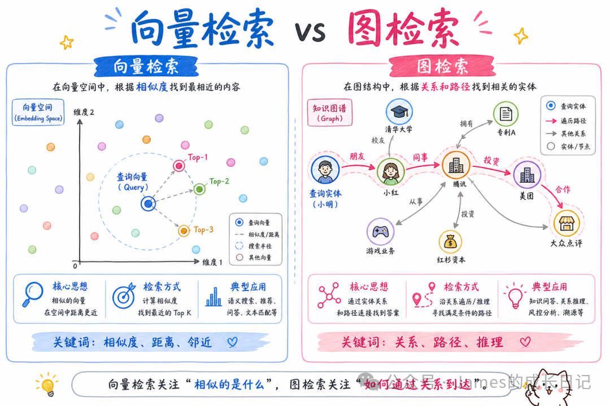

先把失败案例说透，这比上来就讲图更重要。

向量检索的工作方式是：把问题 embed 成向量，找距离最近的 top-k 文档片段，塞进 LLM 的 context 里。这个机制有个根本性限制：**它找的是"语义接近"，不是"逻辑相连"。**

拿一个真实的供应链场景举例：
    
    
    供应商 A → 提供零件 X → 用于产品 B → B 属于召回批次 C  
    

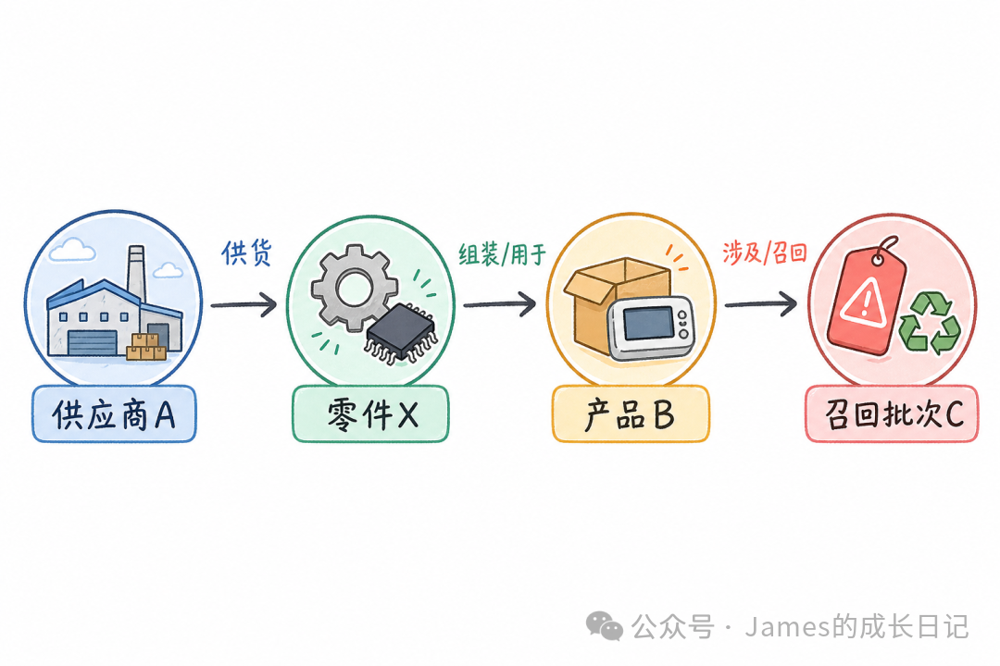

这四个实体分散在四个不同的文档里。你问「供应商 A 和召回批次 C 有关系吗？」——向量检索召回的文档里，每个单独来看都不足以回答，但它们之间的连接路径是答案。

这类问题有一个特征：**需要跨越 2 跳或以上的关系链才能得出答案。** 向量检索处理不了，因为它没有"路径"这个概念，只有"距离"。

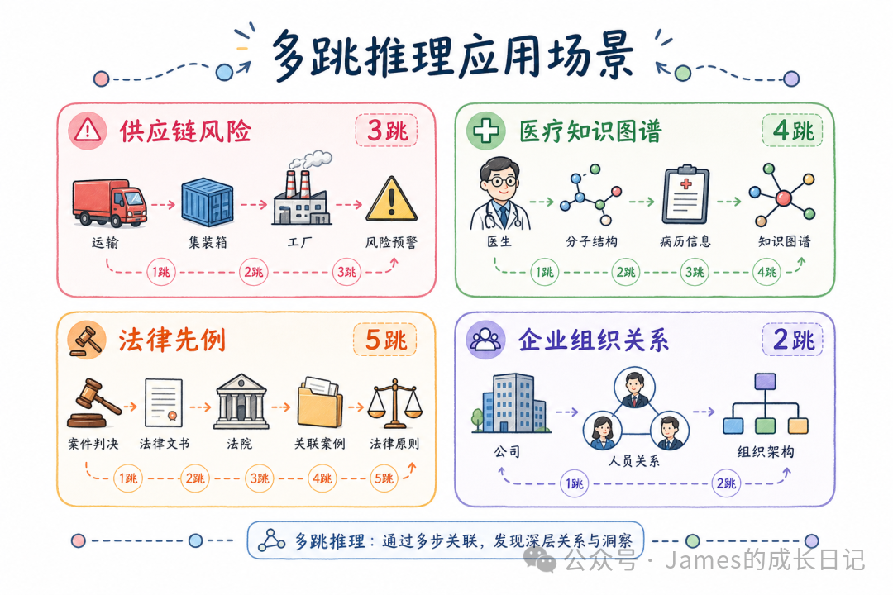

典型的多跳推理场景：

场景 | 问题举例 | 跳数  
---|---|---  
供应链风险 | 哪些二级供应商影响了主力产品线？ | 3 跳  
医疗知识图 | 治疗糖尿病的药物，哪些同时与心脏病有关联？ | 2 跳  
法律先例 | 这个案件引用的判例，是否也被反垄断案件引用过？ | 2 跳  
企业组织 | 负责 A 项目的工程师，通过哪个部门和 CEO 相连？ | 3 跳  
  
* * *

## 02 多跳推理的图遍历原理：路径就是答案

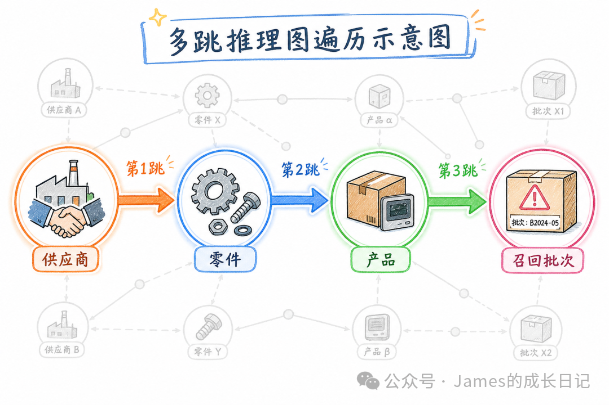

知识图谱里，多跳推理本质上是**路径遍历** 问题。在 Cypher 里写起来非常直观：
    
    
    -- 1跳：直接关系查供应商提供了哪些零件  
    MATCH (supplier:Supplier)-[:PROVIDES]->(part:Part)  
    WHERE supplier.name = "Supplier A"  
    RETURN part.name  
      
    -- 2跳：供应商 → 零件 → 产品  
    MATCH (supplier:Supplier)-[:PROVIDES]->(part:Part)-[:USED_IN]->(product:Product)  
    WHERE supplier.name = "Supplier A"  
    RETURN supplier.name, part.name, product.name  
      
    -- 3跳：供应商 → 零件 → 产品 → 召回批次（多跳推理核心）  
    MATCH (supplier:Supplier)-[:PROVIDES]->(part:Part)  
          -[:USED_IN]->(product:Product)  
          -[:IN_RECALL]->(recall:RecallBatch)  
    WHERE supplier.name = "Supplier A"  
    RETURN supplier.name, part.name, product.name, recall.batchId, recall.reason  
      
    -- 可变跳数：1到4跳之间都找（向量检索完全无法表达这个）  
    MATCH path = (supplier:Supplier)-[*1..4]->(recall:RecallBatch)  
    WHERE supplier.name = "Supplier A"  
    RETURN path  
    

**核心差异就在这里** ：Cypher 的 `-[*1..4]->` 可以声明式地说「我要在 1 到 4 跳之间找到连接路径」，向量数据库没有等价的表达方式。

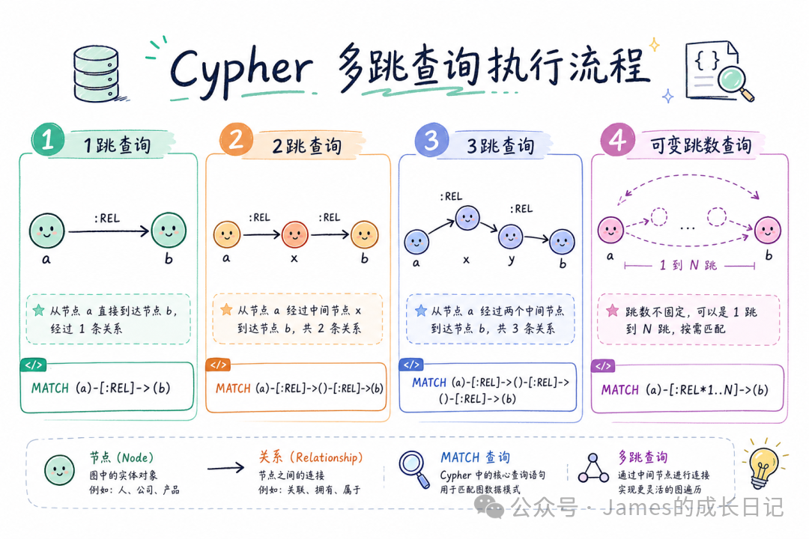

现在用 TypeScript 把 Cypher 封装进 LangChain，跑通最基础的多跳查询链路：
    
    
    import { Neo4jGraph } from "@langchain/community/graphs/neo4j_graph";  
    import { ChatOpenAI } from "@langchain/openai";  
    import { GraphCypherQAChain } from "@langchain/community/chains/graph_qa/cypher";  
      
    // 初始化 Neo4j 连接  
    const graph = await Neo4jGraph.initialize({  
      url: "bolt://localhost:7687",  
      username: "neo4j",  
      password: process.env.NEO4J_PASSWORD!,  
    });  
      
    // 刷新 schema，让 LLM 理解图结构（必须调用）  
    await graph.refreshSchema();  
    console.log("图谱 schema:", graph.schema);  
      
    const llm = new ChatOpenAI({ model: "gpt-4o", temperature: 0 });  
      
    // CypherQA 链：自然语言 → Cypher → 执行 → 自然语言回答  
    const chain = GraphCypherQAChain.fromLLM({  
      llm,  
      graph,  
      verbose: true, // 开发阶段开启，可以看到生成的 Cypher  
      returnIntermediateSteps: true,  
    });  
      
    const result = await chain.invoke({  
      query: "供应商 A 的哪些零件间接导致了 Q3 召回批次的问题？",  
    });  
      
    console.log("生成的 Cypher:", result.intermediateSteps?.[0]?.query);  
    console.log("答案:", result.result);  
    
    
    
    from langchain_community.graphs import Neo4jGraph  
    from langchain_openai import ChatOpenAI  
    from langchain_community.chains.graph_qa.cypher import GraphCypherQAChain  
      
    # 初始化 Neo4j 连接  
    graph = Neo4jGraph(  
        url="bolt://localhost:7687",  
        username="neo4j",  
        password=os.environ["NEO4J_PASSWORD"],  
    )  
      
    # 刷新 schema，让 LLM 理解图结构（必须调用）  
    graph.refresh_schema()  
    print("图谱 schema:", graph.schema)  
      
    llm = ChatOpenAI(model="gpt-4o", temperature=0)  
      
    # CypherQA 链：自然语言 → Cypher → 执行 → 自然语言回答  
    chain = GraphCypherQAChain.from_llm(  
        llm,  
        graph=graph,  
        verbose=True,  # 开发阶段开启，可以看到生成的 Cypher  
        return_intermediate_steps=True,  
    )  
      
    result = chain.invoke(  
        {"query": "供应商 A 的哪些零件间接导致了 Q3 召回批次的问题？"}  
    )  
      
    print("生成的 Cypher:", result["intermediate_steps"][0]["query"])  
    print("答案:", result["result"])  
    

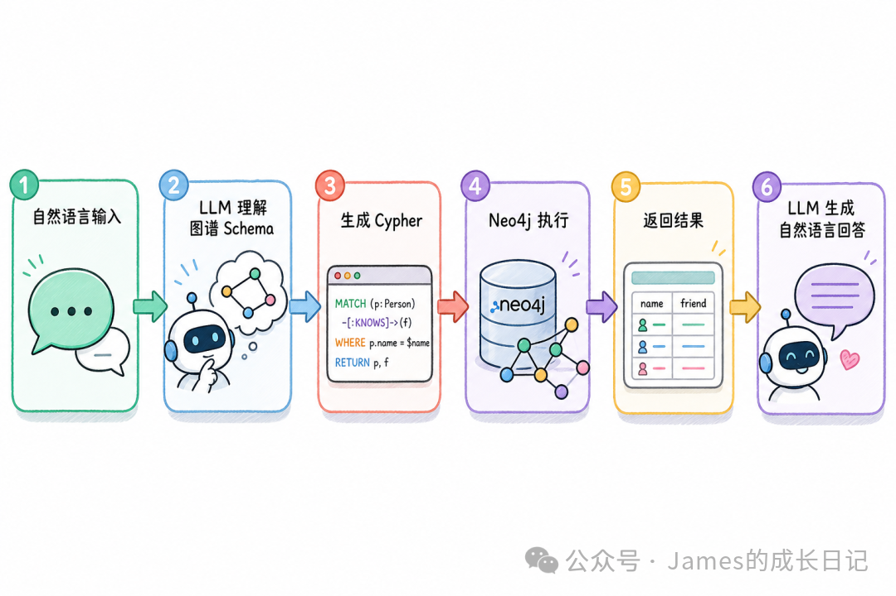

`GraphCypherQAChain` 会把自然语言转成 Cypher，在 Neo4j 上执行，再把结果翻译成人话。LLM 理解了 schema 后，能自动推断出需要几跳。

* * *

## 03 构建多跳推理图谱：数据建模决定天花板

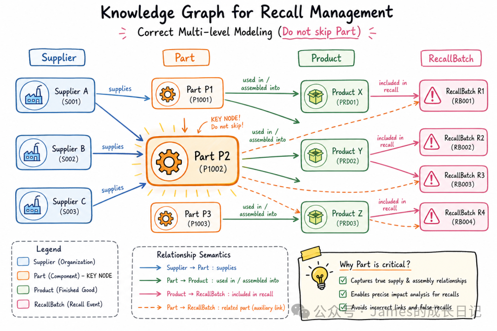

图谱的检索质量，70% 取决于建模好不好。多跳推理对建模有特殊要求：**关系要细粒度，不要贪图省事把多层关系压平。**

反面教材和正确写法对比：
    
    
    -- ❌ 错误示范：直接连到最终结论，丢失了中间路径  
    CREATE (supplier:Supplier {name: "Supplier A"})  
    CREATE (recall:RecallBatch {id: "Q3-2024"})  
    CREATE (supplier)-[:RELATED_TO]->(recall)  
    -- 这样的话，你永远查不出"为什么相关"，路径断了  
      
    -- ✅ 正确示范：每一跳都有意义，中间节点不省  
    CREATE (s1:Supplier {name: "Supplier A", country: "China"})  
    CREATE (p1:Part {id: "PART-001", name: "制动片", criticalLevel: "HIGH"})  
    CREATE (prod1:Product {id: "MODEL-X", name: "X系列轿车"})  
    CREATE (r1:RecallBatch {id: "Q3-RECALL-001", reason: "制动系统故障", count: 15000})  
      
    -- 关系带属性，LLM 回答时可以引用  
    CREATE (s1)-[:PROVIDES {since: "2022-01", quality: "B+"}]->(p1)  
    CREATE (p1)-[:USED_IN {quantity: 4, position: "front"}]->(prod1)  
    CREATE (prod1)-[:IN_RECALL {affectedCount: 8000}]->(r1)  
    

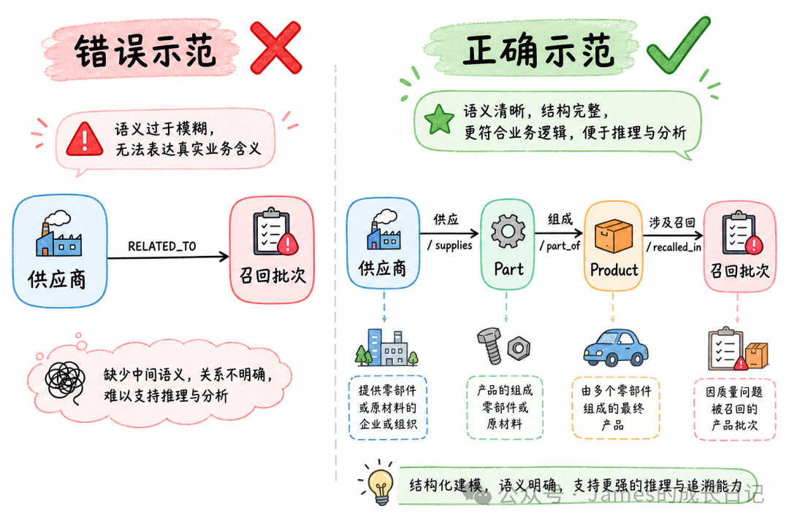

用 TypeScript 批量建立供应链知识图谱，生产代码里推荐用 `MERGE` 而非 `CREATE`，避免重复节点破坏路径查询：
    
    
    import { Neo4jGraph } from "@langchain/community/graphs/neo4j_graph";  
      
    const graph = await Neo4jGraph.initialize({  
      url: "bolt://localhost:7687",  
      username: "neo4j",  
      password: process.env.NEO4J_PASSWORD!,  
    });  
      
    // 用 MERGE 确保幂等，避免重复建节点  
    const setupQuery = `  
      MERGE (s1:Supplier {name: "Supplier A", country: "China",  
             description: "主要供应制动系统零件的中国供应商，2022年起合作"})  
      MERGE (s2:Supplier {name: "Supplier B", country: "Japan",  
             description: "精密传感器模块供应商，2020年起合作，质量评级 A"})  
      MERGE (p1:Part {id: "PART-001", name: "制动片", criticalLevel: "HIGH"})  
      MERGE (p2:Part {id: "PART-002", name: "传感器模块", criticalLevel: "MEDIUM"})  
      MERGE (prod1:Product {id: "MODEL-X", name: "X系列轿车"})  
      MERGE (prod2:Product {id: "MODEL-Y", name: "Y系列SUV"})  
      MERGE (r1:RecallBatch {  
        id: "Q3-RECALL-001", date: "2024-09-15",  
        reason: "制动系统故障", count: 15000  
      })  
      MERGE (s1)-[:PROVIDES {since: "2022-01", quality: "B+"}]->(p1)  
      MERGE (s2)-[:PROVIDES {since: "2020-06", quality: "A"}]->(p2)  
      MERGE (p1)-[:USED_IN {quantity: 4, position: "front"}]->(prod1)  
      MERGE (p1)-[:USED_IN {quantity: 4, position: "all"}]->(prod2)  
      MERGE (prod1)-[:IN_RECALL {affectedCount: 8000}]->(r1)  
      MERGE (prod2)-[:IN_RECALL {affectedCount: 7000}]->(r1)  
    `;  
      
    await graph.query(setupQuery);  
      
    // 给最常用的查询入口建索引，避免全图扫描  
    await graph.query(`  
      CREATE INDEX supplier_name_idx IF NOT EXISTS FOR (s:Supplier) ON (s.name);  
      CREATE INDEX recall_id_idx IF NOT EXISTS FOR (r:RecallBatch) ON (r.id);  
    `);  
      
    console.log("知识图谱构建完成，索引已建立");  
    
    
    
    from langchain_community.graphs import Neo4jGraph  
      
    graph = Neo4jGraph(  
        url="bolt://localhost:7687",  
        username="neo4j",  
        password=os.environ["NEO4J_PASSWORD"],  
    )  
      
    # 用 MERGE 确保幂等，避免重复建节点  
    setup_query = """  
      MERGE (s1:Supplier {name: "Supplier A", country: "China",  
             description: "主要供应制动系统零件的中国供应商，2022年起合作"})  
      MERGE (s2:Supplier {name: "Supplier B", country: "Japan",  
             description: "精密传感器模块供应商，2020年起合作，质量评级 A"})  
      MERGE (p1:Part {id: "PART-001", name: "制动片", criticalLevel: "HIGH"})  
      MERGE (p2:Part {id: "PART-002", name: "传感器模块", criticalLevel: "MEDIUM"})  
      MERGE (prod1:Product {id: "MODEL-X", name: "X系列轿车"})  
      MERGE (prod2:Product {id: "MODEL-Y", name: "Y系列SUV"})  
      MERGE (r1:RecallBatch {  
        id: "Q3-RECALL-001", date: "2024-09-15",  
        reason: "制动系统故障", count: 15000  
      })  
      MERGE (s1)-[:PROVIDES {since: "2022-01", quality: "B+"}]->(p1)  
      MERGE (s2)-[:PROVIDES {since: "2020-06", quality: "A"}]->(p2)  
      MERGE (p1)-[:USED_IN {quantity: 4, position: "front"}]->(prod1)  
      MERGE (p1)-[:USED_IN {quantity: 4, position: "all"}]->(prod2)  
      MERGE (prod1)-[:IN_RECALL {affectedCount: 8000}]->(r1)  
      MERGE (prod2)-[:IN_RECALL {affectedCount: 7000}]->(r1)  
    """  
      
    graph.query(setup_query)  
      
    # 给最常用的查询入口建索引，避免全图扫描  
    graph.query("""  
      CREATE INDEX supplier_name_idx IF NOT EXISTS FOR (s:Supplier) ON (s.name);  
      CREATE INDEX recall_id_idx IF NOT EXISTS FOR (r:RecallBatch) ON (r.id);  
    """)  
      
    print("知识图谱构建完成，索引已建立")  
    

建模三原则：**关系要带属性** （回答时可引用）、**保留中间节点** （供应商→零件→产品，不要跳过零件直连）、**节点描述要语义丰富** （影响后续向量检索的召回质量）。

* * *

## 04 自然语言 → Cypher：让 LLM 帮你写查询

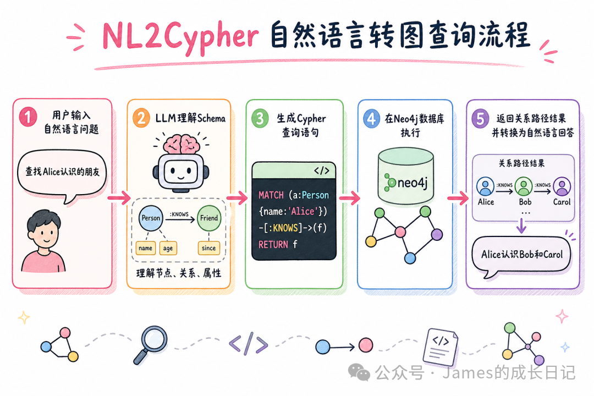

手写 Cypher 没问题，但让用户写 Cypher 就不现实了。Graph RAG 的核心价值之一，就是 LLM 能把自然语言自动转成结构化图查询。

`GraphCypherQAChain` 的默认提示词面对复杂多跳查询时生成质量参差不齐。加 few-shot 示例来校准，效果显著提升：
    
    
    import { GraphCypherQAChain } from "@langchain/community/chains/graph_qa/cypher";  
    import { PromptTemplate } from "@langchain/core/prompts";  
      
    // 自定义 Cypher 生成提示词：加入 few-shot 示例  
    const CYPHER_GENERATION_TEMPLATE = `  
    你是一个 Neo4j Cypher 专家。根据图谱 schema 和问题，生成准确的 Cypher 查询。  
      
    Schema:  
    {schema}  
      
    规则：  
    1. 只返回 Cypher 语句，不要任何解释文字  
    2. 多跳查询优先使用 MATCH path = 形式，返回完整路径  
    3. 必须加 LIMIT 防止全图扫描  
      
    Few-shot 示例：  
    Q：哪些供应商提供了被召回产品使用的零件？  
    A：MATCH (s:Supplier)-[:PROVIDES]->(p:Part)-[:USED_IN]->(prod:Product)-[:IN_RECALL]->(r:RecallBatch) RETURN DISTINCT s.name AS supplier, p.name AS part, prod.name AS product, r.id AS recall  
      
    Q：从供应商到召回批次的完整路径是什么？  
    A：MATCH path = (s:Supplier)-[*1..4]->(r:RecallBatch) RETURN path LIMIT 20  
      
    Q：{question}  
    A：`;  
      
    const cypherPrompt = PromptTemplate.fromTemplate(CYPHER_GENERATION_TEMPLATE);  
      
    const chain = GraphCypherQAChain.fromLLM({  
      llm,  
      graph,  
      cypherPrompt,  
      verbose: true,  
      returnIntermediateSteps: true, // 必须开启，方便调试生成的 Cypher  
    });  
      
    const result = await chain.invoke({  
      query: "Supplier A 的零件通过几跳才能连到最近那次召回事件？",  
    });  
      
    console.log("生成的 Cypher:", result.intermediateSteps?.[0]?.query);  
    console.log("查询结果:", result.intermediateSteps?.[1]?.context);  
    console.log("最终答案:", result.result);  
    
    
    
    from langchain_community.chains.graph_qa.cypher import GraphCypherQAChain  
    from langchain_core.prompts import PromptTemplate  
    from langchain_community.graphs import Neo4jGraph  
    from langchain_openai import ChatOpenAI  
      
    graph = Neo4jGraph(  
        url="bolt://localhost:7687",  
        username="neo4j",  
        password=os.environ["NEO4J_PASSWORD"],  
    )  
    graph.refresh_schema()  
      
    llm = ChatOpenAI(model="gpt-4o", temperature=0)  
      
    # 自定义 Cypher 生成提示词：加入 few-shot 示例  
    CYPHER_GENERATION_TEMPLATE = """  
    你是一个 Neo4j Cypher 专家。根据图谱 schema 和问题，生成准确的 Cypher 查询。  
      
    Schema:  
    {schema}  
      
    规则：  
    1. 只返回 Cypher 语句，不要任何解释文字  
    2. 多跳查询优先使用 MATCH path = 形式，返回完整路径  
    3. 必须加 LIMIT 防止全图扫描  
      
    Few-shot 示例：  
    Q：哪些供应商提供了被召回产品使用的零件？  
    A：MATCH (s:Supplier)-[:PROVIDES]->(p:Part)-[:USED_IN]->(prod:Product)-[:IN_RECALL]->(r:RecallBatch) RETURN DISTINCT s.name AS supplier, p.name AS part, prod.name AS product, r.id AS recall  
      
    Q：从供应商到召回批次的完整路径是什么？  
    A：MATCH path = (s:Supplier)-[*1..4]->(r:RecallBatch) RETURN path LIMIT 20  
      
    Q：{question}  
    A："""  
      
    cypher_prompt = PromptTemplate.from_template(CYPHER_GENERATION_TEMPLATE)  
      
    chain = GraphCypherQAChain.from_llm(  
        llm,  
        graph=graph,  
        cypher_prompt=cypher_prompt,  
        verbose=True,  
        return_intermediate_steps=True,  # 必须开启，方便调试生成的 Cypher  
    )  
      
    result = chain.invoke(  
        {"query": "Supplier A 的零件通过几跳才能连到最近那次召回事件？"}  
    )  
      
    print("生成的 Cypher:", result["intermediate_steps"][0]["query"])  
    print("查询结果:", result["intermediate_steps"][1]["context"])  
    print("最终答案:", result["result"])  
    

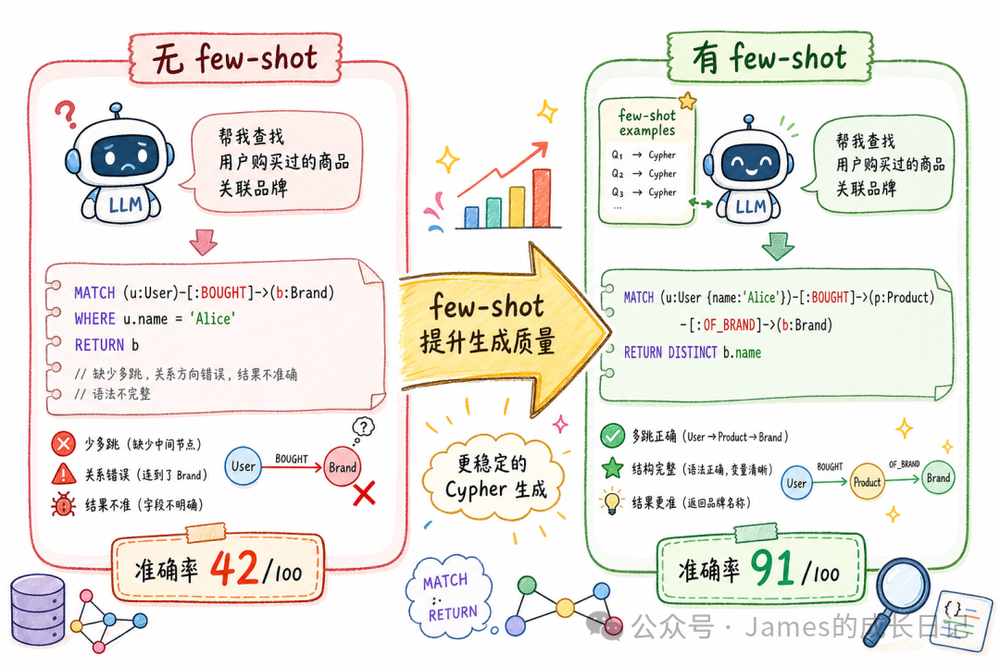

上线前的校准清单：开 `verbose` 跑所有核心查询类型；把错误的 Cypher 加入 few-shot 反例；建测试集，每次改提示词都回归一遍。这三步不能省。

* * *

## 05 混合检索：图遍历 + 向量语义，两路合并

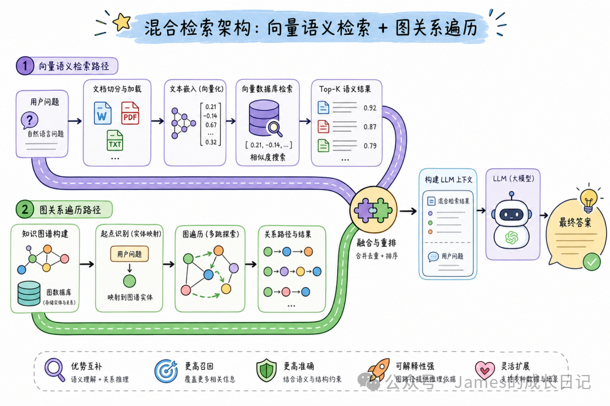

图检索擅长结构化关系推理，向量检索擅长语义模糊匹配。生产环境里，把两路合并才是最强姿势。

典型场景：用户问「有没有类似糖尿病治疗方案的方法，用在心脏病上？」

  * 向量检索负责：「类似方案」这个语义模糊匹配
  * 图检索负责：「糖尿病 → 治疗药物 → 也治心脏病」这个关系推理

    
    
    import { Neo4jVectorStore } from "@langchain/community/vectorstores/neo4j_vector";  
    import { OpenAIEmbeddings, ChatOpenAI } from "@langchain/openai";  
    import { RunnableSequence, RunnablePassthrough } from "@langchain/core/runnables";  
    import { StringOutputParser } from "@langchain/core/output_parsers";  
    import { ChatPromptTemplate } from "@langchain/core/prompts";  
      
    const embeddings = new OpenAIEmbeddings({ model: "text-embedding-3-small" });  
    const llm = new ChatOpenAI({ model: "gpt-4o", temperature: 0 });  
      
    // 向量检索：基于节点 description 的语义召回  
    const vectorStore = await Neo4jVectorStore.fromExistingIndex(embeddings, {  
      url: "bolt://localhost:7687",  
      username: "neo4j",  
      password: process.env.NEO4J_PASSWORD!,  
      indexName: "entity_embeddings",  
      textNodeProperty: "description",  
      embeddingNodeProperty: "embedding",  
    });  
    const vectorRetriever = vectorStore.asRetriever({ k: 5 });  
      
    // 图检索：用 Cypher 做多跳关系遍历  
    async function graphRetrieve(question: string): Promise<string> {  
      const result = await graph.query(`  
        MATCH (n)-[r]->(m)  
        WHERE n.description CONTAINS $kw OR m.description CONTAINS $kw  
        RETURN n.name AS from, type(r) AS rel, m.name AS to  
        LIMIT 30  
      `, { kw: question.slice(0, 15) });  
      
      return result  
        .map((row: Record<string, unknown>) =>  
          `${row.from} -[${row.rel}]-> ${row.to}`)  
        .join("\n");  
    }  
      
    // 混合检索：两路合并进 context  
    async function hybridRetrieve(question: string): Promise<string> {  
      const [vectorDocs, graphContext] = await Promise.all([  
        vectorRetriever.invoke(question),  
        graphRetrieve(question),  
      ]);  
      const vectorContext = vectorDocs.map((d) => d.pageContent).join("\n");  
      return `【语义检索】\n${vectorContext}\n\n【图关系路径】\n${graphContext}`;  
    }  
      
    const prompt = ChatPromptTemplate.fromTemplate(`  
    基于以下知识回答用户问题。优先用图关系路径回答多跳推理类问题，语义结果补充细节。  
      
    {context}  
      
    问题：{question}  
    回答：`);  
      
    const ragChain = RunnableSequence.from([  
      {  
        context: (input: { question: string }) => hybridRetrieve(input.question),  
        question: new RunnablePassthrough(),  
      },  
      prompt,  
      llm,  
      new StringOutputParser(),  
    ]);  
      
    const answer = await ragChain.invoke({  
      question: "供应商 A 和这次召回事件有什么关联？",  
    });  
    console.log(answer);  
    
    
    
    from langchain_community.vectorstores.neo4j_vector import Neo4jVector  
    from langchain_openai import OpenAIEmbeddings, ChatOpenAI  
    from langchain_core.runnables import RunnablePassthrough  
    from langchain_core.output_parsers import StrOutputParser  
    from langchain_core.prompts import ChatPromptTemplate  
    from langchain_community.graphs import Neo4jGraph  
    import os  
      
    graph = Neo4jGraph(  
        url="bolt://localhost:7687",  
        username="neo4j",  
        password=os.environ["NEO4J_PASSWORD"],  
    )  
    graph.refresh_schema()  
      
    embeddings = OpenAIEmbeddings(model="text-embedding-3-small")  
    llm = ChatOpenAI(model="gpt-4o", temperature=0)  
      
    # 向量检索：基于节点 description 的语义召回  
    vector_store = Neo4jVector.from_existing_index(  
        embeddings,  
        url="bolt://localhost:7687",  
        username="neo4j",  
        password=os.environ["NEO4J_PASSWORD"],  
        index_name="entity_embeddings",  
        text_node_property="description",  
        embedding_node_property="embedding",  
    )  
    vector_retriever = vector_store.as_retriever(search_kwargs={"k": 5})  
      
    # 图检索：用 Cypher 做多跳关系遍历  
    def graph_retrieve(question: str) -> str:  
        result = graph.query("""  
            MATCH (n)-[r]->(m)  
            WHERE n.description CONTAINS $kw OR m.description CONTAINS $kw  
            RETURN n.name AS from, type(r) AS rel, m.name AS to  
            LIMIT 30  
        """, params={"kw": question[:15]})  
      
        return "\n".join(  
            f"{row['from']} -[{row['rel']}]-> {row['to']}"  
            for row in result  
        )  
      
    # 混合检索：两路合并进 context  
    def hybrid_retrieve(question: str) -> str:  
        vector_docs = vector_retriever.invoke(question)  
        graph_context = graph_retrieve(question)  
        vector_context = "\n".join(d.page_content for d in vector_docs)  
        return f"【语义检索】\n{vector_context}\n\n【图关系路径】\n{graph_context}"  
      
    prompt = ChatPromptTemplate.from_template("""  
    基于以下知识回答用户问题。优先用图关系路径回答多跳推理类问题，语义结果补充细节。  
      
    {context}  
      
    问题：{question}  
    回答：""")  
      
    rag_chain = (  
        {"context": lambda x: hybrid_retrieve(x["question"]), "question": RunnablePassthrough()}  
        | prompt  
        | llm  
        | StrOutputParser()  
    )  
      
    answer = rag_chain.invoke(  
        {"question": "供应商 A 和这次召回事件有什么关联？"}  
    )  
    print(answer)  
    

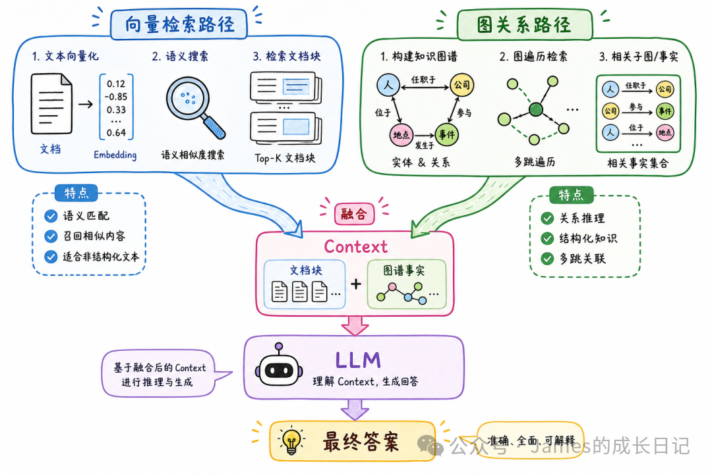

两路结果合并进 context 后，LLM 会自动判断哪部分信息更可信——图路径是确定性的结构化事实，优先级高；向量结果是语义近似，补充细节用。

* * *

## 06 Graph RAG vs 向量 RAG：别选错了

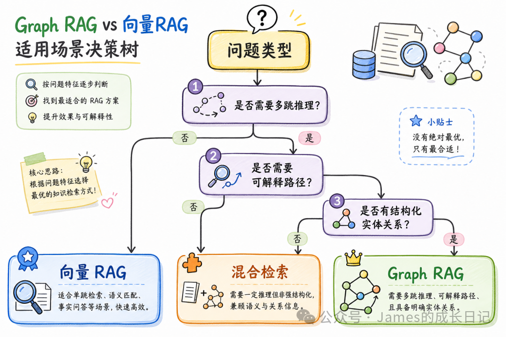

见过太多团队花两周接 Graph RAG，发现效果提升不大，才意识到场景根本不对。别踩这个坑，先看场景对不对再动手。

对比维度 | 向量 RAG | Graph RAG  
---|---|---  
构建成本 | 低，embed 就完事 | 高，需要实体抽取 + 关系建模  
查询延迟 | 毫秒级 | 毫秒~秒级（取决于跳数）  
多跳推理 | ❌ 基本做不到 | ✅ 天然擅长  
可解释性 | 低（只知道哪段相似） | 高（路径即解释）  
更新成本 | 低（重 embed 就行） | 中（改节点/关系）  
适合数据类型 | 自由文本 | 结构化实体关系  
全局聚合查询 | ❌ 只看 top-k 片段 | ✅ 可以全图聚合  
索引构建成本 | 低（$1.45/M tokens） | 高（$1544/M tokens，约 1000x）  
  
最后一行数据来自微软 LazyGraphRAG 的基准测试，这是真实的代价。**如果场景真的需要多跳推理和全局聚合，这个成本是值得的；如果不需要，向量 RAG 足够了。**

三个信号说明该建图：**数据被高频复用** （同一知识库被查询上千次，索引成本摊平）；**答案需要可审计的路径** （合规/监管场景）；**问题是「什么模式」类型** （「这些案例里最常见的风险是什么」）。

三个都没有？用向量 RAG + LLM Reranker，性价比最高。

* * *

## 07 常见坑：踩过才知道有多深

**坑 1：Schema 设计太粗糙**

把所有关系都建成 `RELATED_TO`，查询时无法区分关系类型，LLM 生成的 Cypher 也会一塌糊涂。关系类型要细，`PROVIDES`、`USED_IN`、`IN_RECALL` 这种语义明确的词是正确打开方式。

**坑 2：LLM 生成 Cypher 不靠谱**

`GraphCypherQAChain` 默认提示词对复杂多跳查询生成质量参差不齐。上线前必须在 verbose 模式下跑所有核心查询类型，把错误 Cypher 加入 few-shot 反例，建专用测试集回归。

**坑 3：`[*1..N]` 没加上限**

可变跳数遍历在数据量大时极容易全图扫描，直接超时。务必加 `LIMIT`。用 `EXPLAIN` 命令确认查询走了索引：
    
    
    -- 查询计划分析，确认走索引而不是全图扫描  
    EXPLAIN MATCH path = (s:Supplier)-[*1..4]->(r:RecallBatch)  
    WHERE s.name = "Supplier A"  
    RETURN path  
      
    -- 给高频查询入口建索引  
    CREATE INDEX supplier_name_idx IF NOT EXISTS  
    FOR (s:Supplier) ON (s.name);  
    

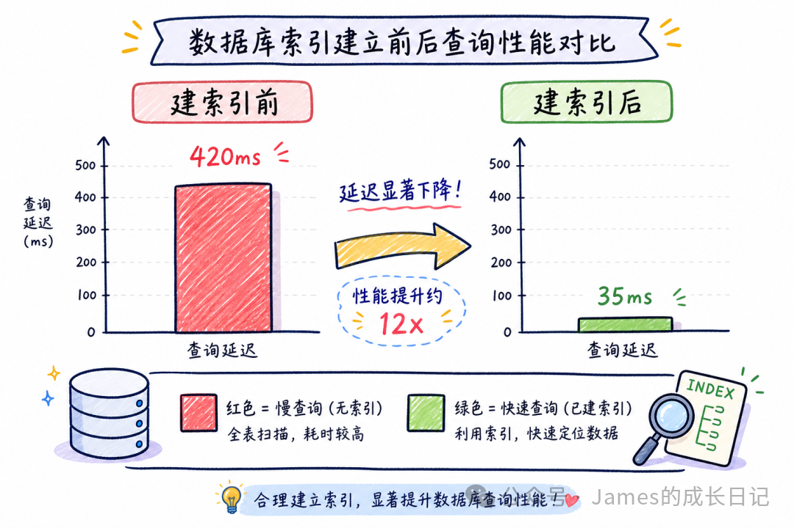

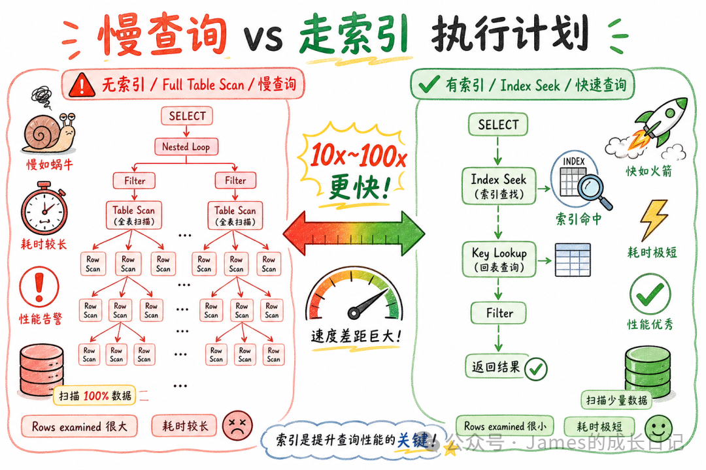

**坑 4：节点描述不够，向量检索召回失败**

混合检索里，向量检索的质量取决于节点的 `description` 属性是否语义丰富。不要只存 `name: "Supplier A"`，加背景信息：`description: "Supplier A 是主要供应制动系统零件的中国供应商，2022年起合作，质量评级 B+"` ——这样语义召回才能精准命中。

**坑 5：关系方向写反了**

Cypher 是有方向的：`-[:PROVIDES]->` 和 `<-[:PROVIDES]-` 是两个不同查询。初期建图时关系方向混乱，查询结果就会出现诡异的空返回，而且难以排查。建立统一的方向约定，贯穿整个建模过程。

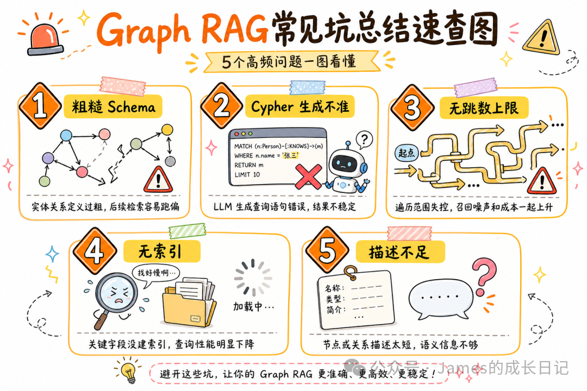

* * *

## 总结

这篇从多跳推理的本质出发，完整拆解了 Graph RAG 进阶的核心路径：

  * **向量检索的盲区是「路径」** ：它找语义相近，不找逻辑相连，多跳推理就是它的死角
  * **Cypher 的`[*1..N]` 是多跳推理的核心武器**：一行声明式语法能做到向量库完全无法表达的路径遍历
  * **建模质量决定检索质量** ：中间节点不能省、关系要细粒度、节点描述要语义丰富——这三条是图谱建模底线
  * **混合检索才是生产级姿势** ：图遍历负责关系推理，向量检索负责语义模糊匹配，合并进 context 让 LLM 综合判断
  * **别为了用图而用图** ：只有数据高频复用 + 需要可解释路径 + 问题是聚合模式时，Graph RAG 才值得它约 1000x 的构建成本

下一篇进入板块四的收尾：三种检索策略终极选型——全文检索 vs 向量检索 vs 图检索，每种适合哪个场景，用一张决策图一次讲清楚。

* * *

关注我，James 的成长日记，持续分享干货，帮你在 AI 时代少走弯路。

---

> 本文由 Agent Reach 通过 Playwright 抓取并转换为 Markdown 格式。  
> 图片已保存至 `./images/` 目录。
