# Neo4j 知识图谱：实体建模+Cypher查询+LangChain接入

> **来源：** 微信公众号  
> **作者：** James的成长日记  
> **原文链接：** [https://mp.weixin.qq.com/s/m6uiDshbCJQ1tp7J2iu2wQ](https://mp.weixin.qq.com/s/m6uiDshbCJQ1tp7J2iu2wQ)  
> **抓取日期：** 2026-05-30

---

大家好，我是James。

上一篇我们用 ES 全文检索 + 向量检索拼出了混合召回，现在是时候把第三条腿补上——图检索。

搭 RAG 系统时，很多同学到了"多跳推理"这一关就卡死了。问题是这样的：你有一份公司知识库，用户问「负责 payment 模块的工程师最近在做哪个项目?」

向量检索给你的是语义最相近的几段文字，但没有任何一段同时包含"工程师-模块-项目"这三个维度的信息。因为这个问题本身就不是语义相似度能回答的——它需要**跨两层关系推理** ：人 → 负责模块 → 参与项目。

关系型数据库也不好使，你得写三张表的 JOIN，性能一塌糊涂，还没法扩展到任意深度的路径查询。

这就是 Neo4j 的主场：**用图结构存储实体和关系，用 Cypher 做任意深度的路径遍历，再通过 LangChain 的 Neo4jGraph 让 LLM 自动生成查询——整套打通，效果碾压纯向量** 。

本文使用版本：

  * **TypeScript** ：`langchain@1.4.1` · `@langchain/openai@1.4.6` · `@langchain/community@1.4.2`（含 Neo4j 支持）
  * **Python** ：`langchain>=0.3.x` · `langchain-openai>=0.3.x` · `langchain-community>=0.3.x`

* * *

## 01 为什么选图数据库：关系密集型查询的天然优势

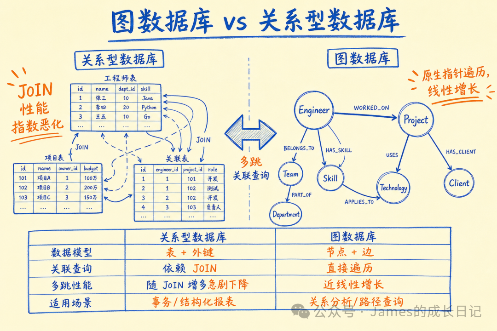

先说清楚图数据库解决什么问题，不然很多同学会觉得"用向量也能查，何必搞这个"。

**关系型数据库的痛** 在于多表关联查询。比如「找出所有在 2025 年参与过 payment 相关项目的工程师的直属上级」，SQL 需要三张表 JOIN，数据量大时索引失效，慢到用不了。

**图数据库的答法** ：
    
    
    成MATCH (m:Manager)<-[:REPORTS_TO]-(e:Engineer)  
          -[:WORKED_ON]->(p:Project)  
    WHERE p.name CONTAINS 'payment' AND p.year = 2025  
    RETURN DISTINCT m.name  
    

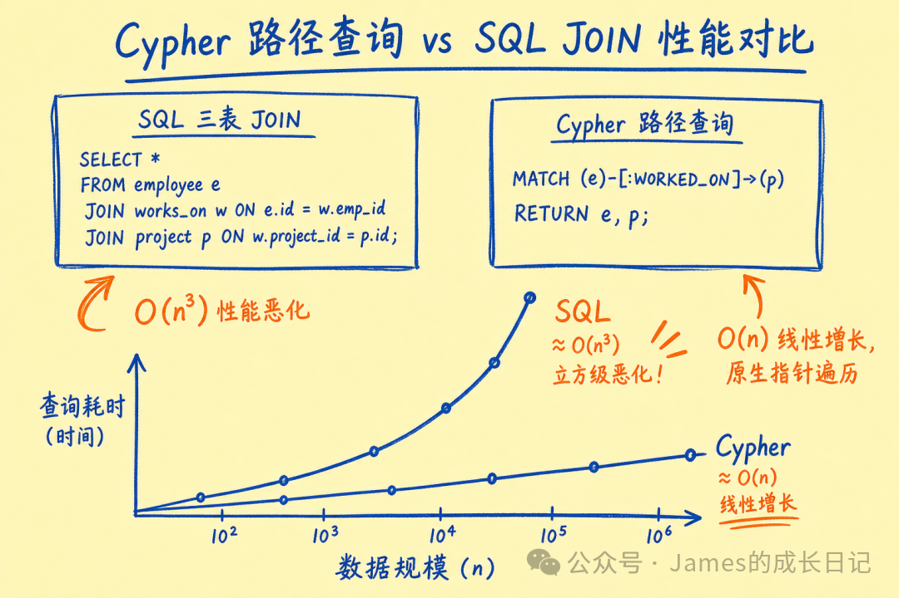

一句 Cypher，无论关系链多深，图引擎都走原生指针遍历，不做 JOIN，时间复杂度和关系深度呈线性增长而非指数增长。

**三种数据库的横向对比** ：

维度 | 关系型(PostgreSQL) | 向量数据库(Milvus) | 图数据库(Neo4j)  
---|---|---|---  
核心优势 | 精确查询、事务 | 语义相似度 | 关系路径遍历  
查询方式 | SQL | ANN 近似最近邻 | Cypher 路径匹配  
多跳关联 | JOIN，性能指数恶化 | 不支持 | 原生支持，线性增长  
模糊查询 | LIKE，效率低 | 语义向量，效果强 | 弱(需配合向量)  
最适合场景 | 结构化事务数据 | 语义检索 | 知识图谱、关系网络  
  
结论：**三者不是替代关系，而是互补关系** 。本文重点是 Neo4j，下一篇讲怎么把三者拼在一起。

* * *

## 02 核心概念：Node、Relationship、Property 三分钟建立直觉

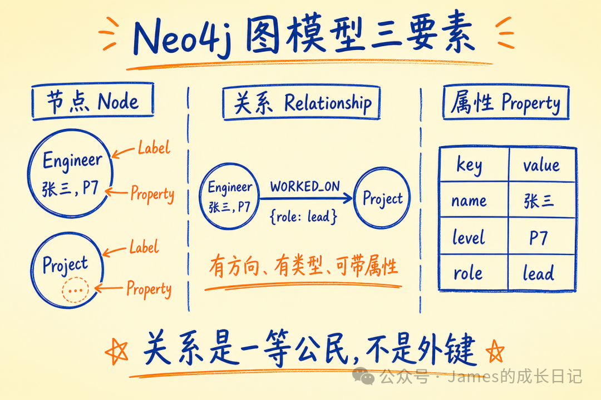

Neo4j 的数据模型只有三个概念：

**Node(节点)** ：实体。一个工程师、一个项目、一项技术，都是节点。节点上有 Label(标签)表示类型，有 Property(属性)存储数据。示例：`(e:Engineer {id: "E001", name: "张三", level: "P7"})`

**Relationship(关系)** ：两个节点之间的边，**有方向、有类型、可带属性** 。关系是一等公民，不是外键，而是真实的存储单元。示例：`(e:Engineer)-[:WORKED_ON {since: "2024-01", role: "lead"}]->(p:Project)`

**Property(属性)** ：节点和关系都可以有属性，存 key-value，支持字符串、数字、布尔、列表。

用 ASCII 图示意实际结构：
    
    
    (张三:Engineer) ──[WORKED_ON]──> (payment服务:Project)  
           |                                  |  
    [REPORTS_TO]                      [USES_TECH]  
           ↓                                  ↓  
    (李总:Manager)              (TypeScript:Technology)  
    

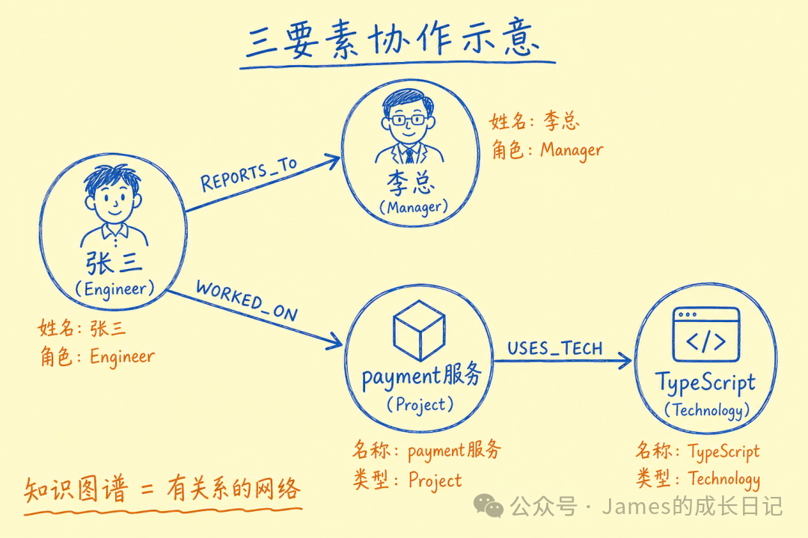

这就是知识图谱：**把零散知识变成有关系的网络** ，查询时沿着边走就行。

* * *

## 03 环境搭建：Docker 启动 Neo4j + TypeScript 连接

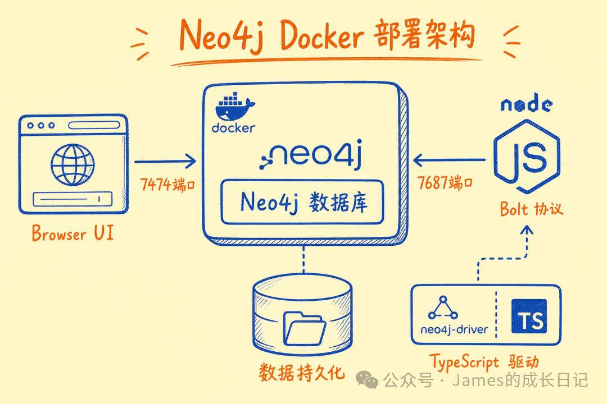

用 Docker 起 Neo4j 最快：
    
    
    docker run \  
      --name neo4j -p 7474:7474 -p 7687:7687 \  
      -e NEO4J_AUTH=neo4j/your-password \  
      -v $PWD/neo4j-data:/data \  
      -d neo4j:5.18  
    

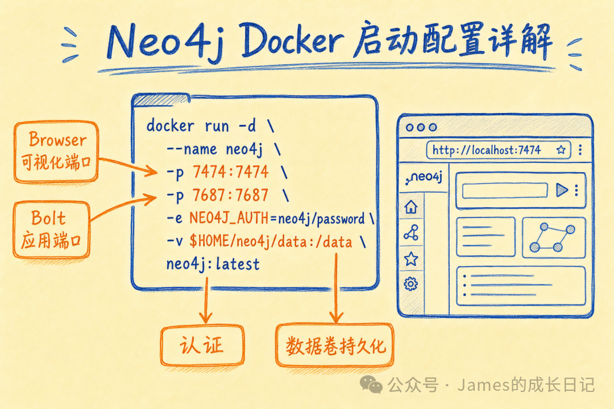

7474 是 Browser 可视化端口，7687 是应用程序用的 Bolt 协议端口。起来之后打开 `http://localhost:7474` 就能看到可视化界面。

安装依赖并连接：
    
    
    import neo4j from "neo4j-driver";  
      
    // npm install neo4j-driver @langchain/community @langchain/openai  
    const driver = neo4j.driver(  
      "bolt://localhost:7687",  
      neo4j.auth.basic("neo4j", "your-password")  
    );  
      
    const serverInfo = await driver.getServerInfo();  
    console.log("Connected to:", serverInfo.address);  
    console.log("Neo4j version:", serverInfo.agent);  
    
    
    
    from neo4j import GraphDatabase  
      
    # pip install neo4j langchain-community langchain-openai  
    driver = GraphDatabase.driver(  
        "bolt://localhost:7687",  
        auth=("neo4j", "your-password")  
    )  
      
    with driver.session() as session:  
        result = session.run("RETURN 1 AS n")  
        print("Connected! Result:", result.single()["n"])  
      
    server_info = driver.get_server_info()  
    print("Connected to:", server_info.address)  
    print("Neo4j version:", server_info.agent)  
    

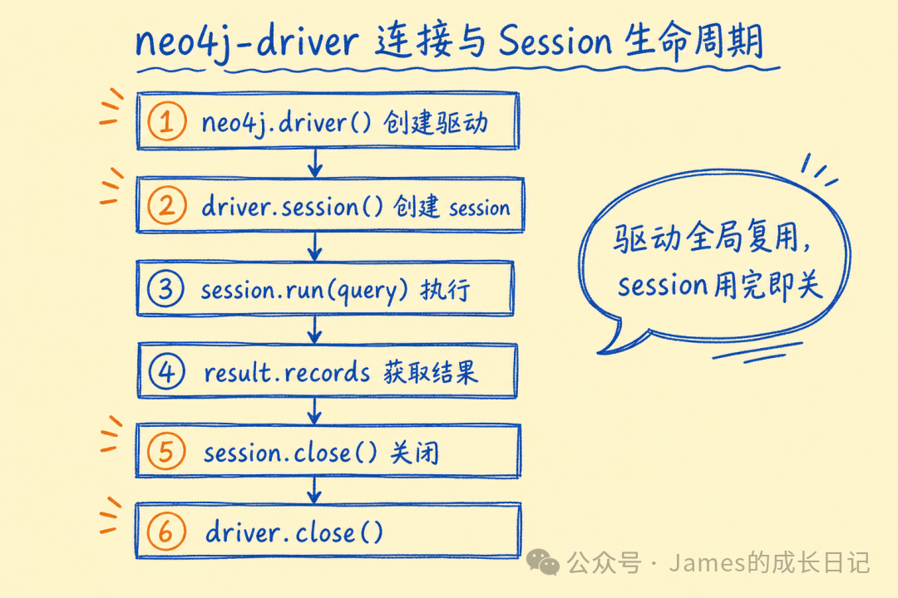

* * *

## 04 Cypher 实战：六个高频模式全覆盖

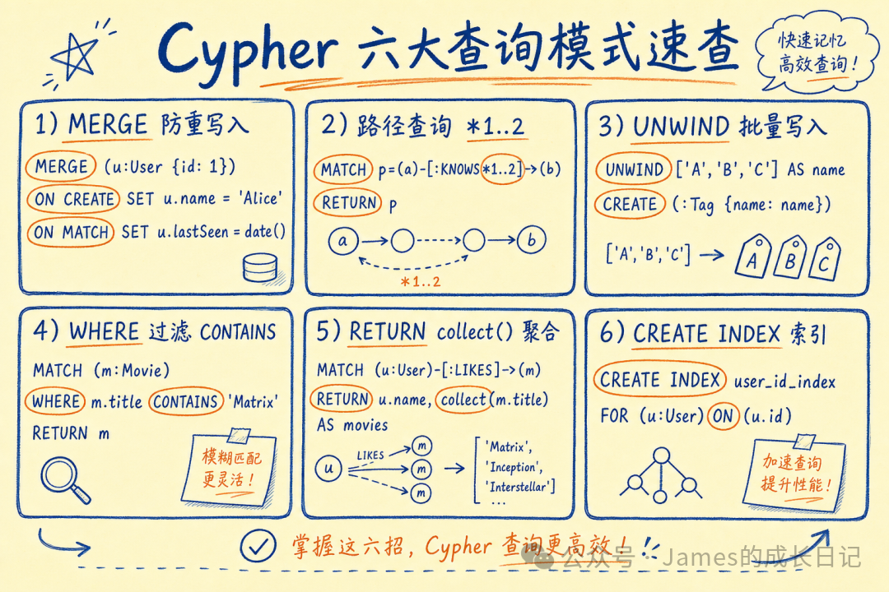

Cypher 的语法设计非常直观——它用 ASCII 画图来描述你想查什么。

**模式一：MERGE(防重写入，生产必备)**
    
    
    const session = driver.session();  
      
    // MERGE = 存在则更新,不存在则创建。生产中永远用 MERGE,不用 CREATE  
    await session.run(`  
      MERGE (e:Engineer {id: $id})  
      ON CREATE SET e.name = $name, e.level = $level, e.createdAt = datetime()  
      ON MATCH SET e.level = $level, e.updatedAt = datetime()  
      RETURN e  
    `, { id: "E001", name: "张三", level: "P8" });  
    
    
    
    with driver.session() as session:  
        # MERGE = 存在则更新，不存在则创建。生产中永远用 MERGE，不用 CREATE  
        result = session.run(  
            """  
            MERGE (e:Engineer {id: $id})  
            ON CREATE SET e.name = $name, e.level = $level, e.createdAt = datetime()  
            ON MATCH SET e.level = $level, e.updatedAt = datetime()  
            RETURN e  
            """,  
            id="E001", name="张三", level="P8"  
        )  
        print(result.single())  
    

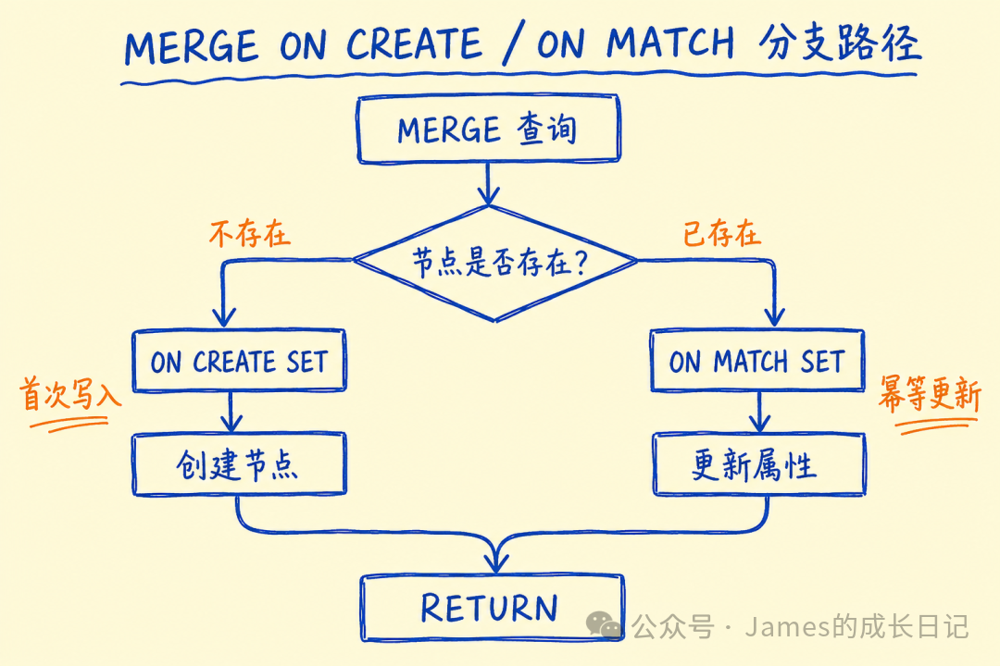

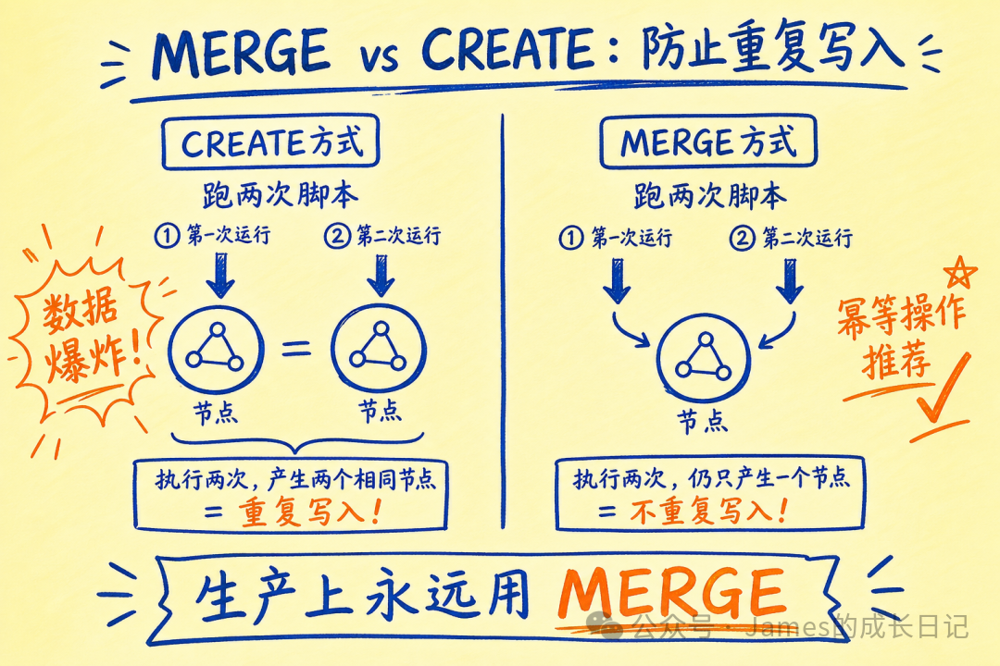

**模式二：路径查询(多跳遍历)**
    
    
    // *1..2 表示路径长度 1 到 2 跳  
    const result = await session.run(`  
      MATCH (e:Engineer {id: $id})-[:WORKED_ON*1..2]->(p:Project)  
      RETURN DISTINCT p.name AS project, p.status  
    `, { id: "E001" });  
      
    // 找参与过 payment 项目的工程师的所有协作者  
    const collab = await session.run(`  
      MATCH (e:Engineer)-[:WORKED_ON]->(p:Project {name: 'payment服务'})  
            <-[:WORKED_ON]-(colleague:Engineer)  
      WHERE e.id <> colleague.id  
      RETURN e.name AS engineer, collect(DISTINCT colleague.name) AS colleagues  
    `);  
    
    
    
    with driver.session() as session:  
        # *1..2 表示路径长度 1 到 2 跳  
        result = session.run(  
            """  
            MATCH (e:Engineer {id: $id})-[:WORKED_ON*1..2]->(p:Project)  
            RETURN DISTINCT p.name AS project, p.status  
            """,  
            id="E001"  
        )  
        for record in result:  
            print(record["project"], record["status"])  
      
        # 找参与过 payment 项目的工程师的所有协作者  
        collab = session.run(  
            """  
            MATCH (e:Engineer)-[:WORKED_ON]->(p:Project {name: 'payment服务'})  
                  <-[:WORKED_ON]-(colleague:Engineer)  
            WHERE e.id <> colleague.id  
            RETURN e.name AS engineer, collect(DISTINCT colleague.name) AS colleagues  
            """  
        )  
        for record in collab:  
            print(record["engineer"], record["colleagues"])  
    

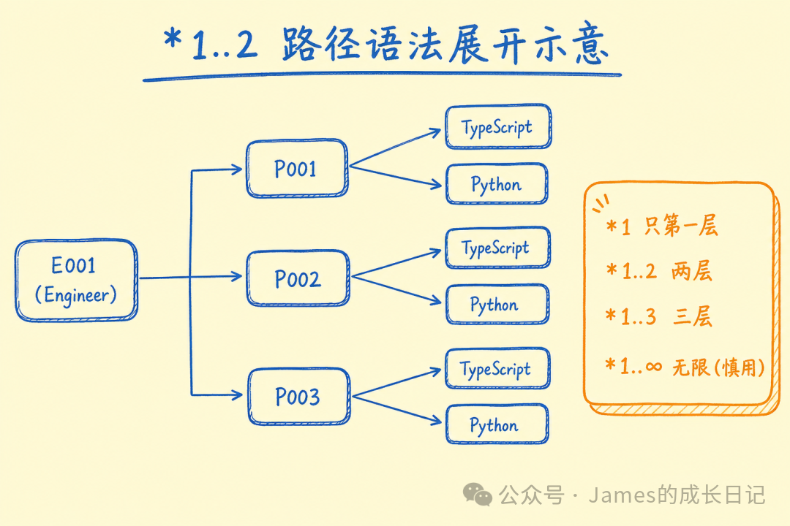

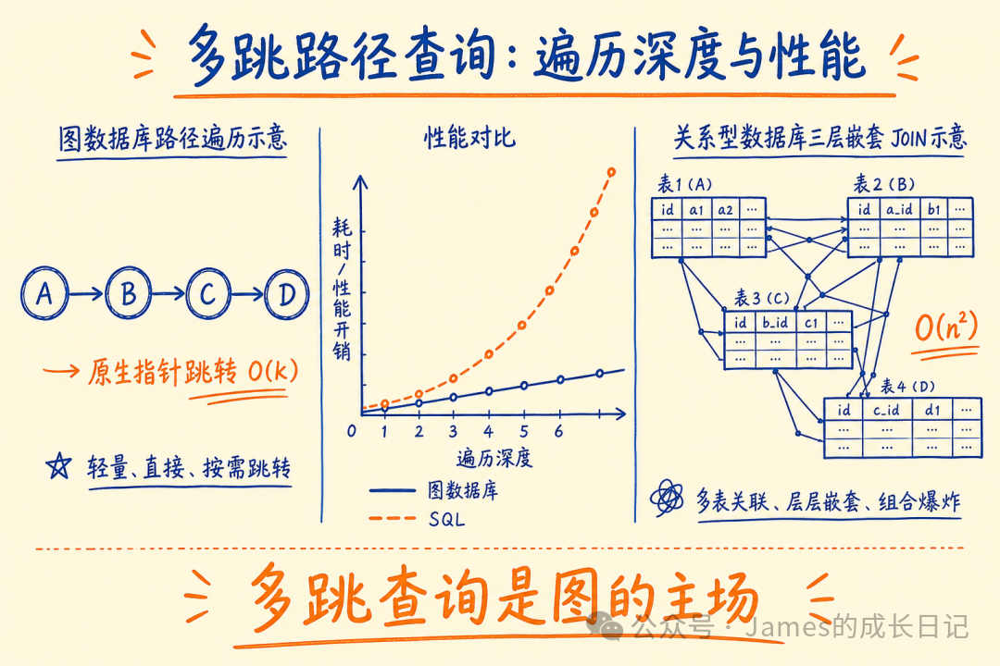

**模式三：UNWIND 批量写入(比单条循环快 10x+)**
    
    
    // UNWIND 展开数组,批量写入减少网络往返  
    await session.run(`  
      UNWIND $engineers AS eng  
      MERGE (e:Engineer {id: eng.id})  
      ON CREATE SET e.name = eng.name, e.level = eng.level  
    `, {  
      engineers: [  
        { id: "E002", name: "李四", level: "P6" },  
        { id: "E003", name: "王五", level: "P8" },  
      ]  
    });  
      
    // 批量建立关系  
    await session.run(`  
      UNWIND $assignments AS assign  
      MATCH (e:Engineer {id: assign.engineerId})  
      MATCH (p:Project {id: assign.projectId})  
      MERGE (e)-[r:WORKED_ON {role: assign.role}]->(p)  
      SET r.since = assign.since  
    `, {  
      assignments: [  
        { engineerId: "E001", projectId: "P001", role: "lead", since: "2024-01" },  
        { engineerId: "E002", projectId: "P001", role: "backend", since: "2024-03" },  
      ]  
    });  
    
    
    
    with driver.session() as session:  
        # UNWIND 展开数组，批量写入减少网络往返  
        session.run(  
            """  
            UNWIND $engineers AS eng  
            MERGE (e:Engineer {id: eng.id})  
            ON CREATE SET e.name = eng.name, e.level = eng.level  
            """,  
            engineers=[  
                {"id": "E002", "name": "李四", "level": "P6"},  
                {"id": "E003", "name": "王五", "level": "P8"},  
            ]  
        )  
      
        # 批量建立关系  
        session.run(  
            """  
            UNWIND $assignments AS assign  
            MATCH (e:Engineer {id: assign.engineerId})  
            MATCH (p:Project {id: assign.projectId})  
            MERGE (e)-[r:WORKED_ON {role: assign.role}]->(p)  
            SET r.since = assign.since  
            """,  
            assignments=[  
                {"engineerId": "E001", "projectId": "P001", "role": "lead", "since": "2024-01"},  
                {"engineerId": "E002", "projectId": "P001", "role": "backend", "since": "2024-03"},  
            ]  
        )  
    

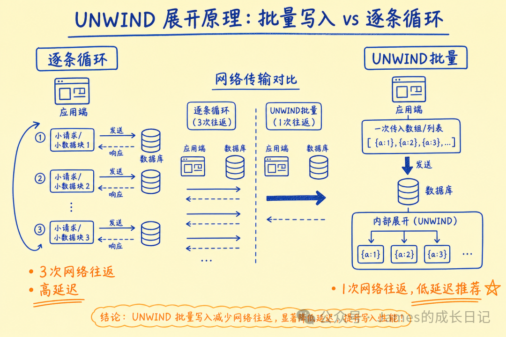

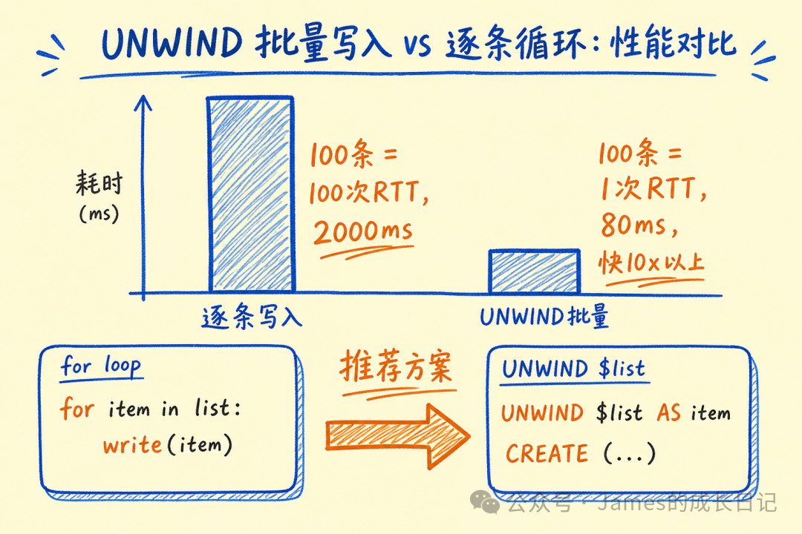

* * *

## 05 LangChain 接入：让 LLM 自动生成 Cypher 查询

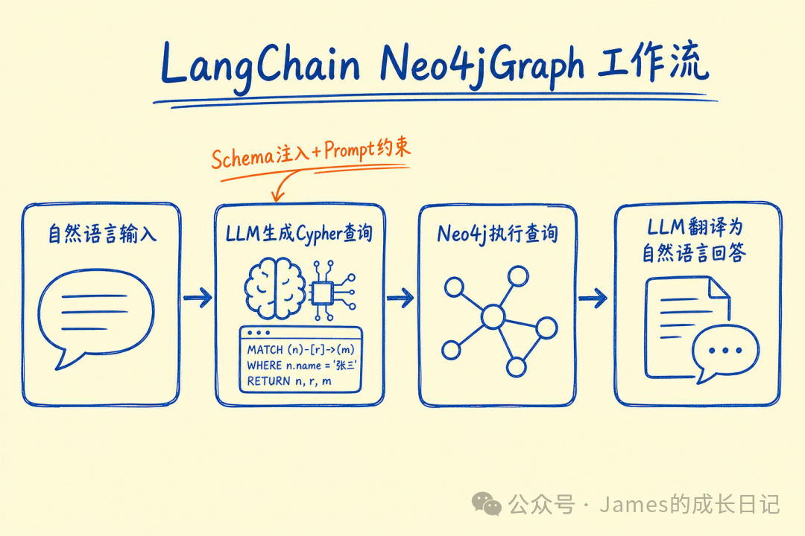

这是本篇最核心的一节。手写 Cypher 门槛高，但 LangChain 的 `GraphCypherQAChain` 可以让 LLM 根据图的 schema 自动生成查询语句。

**初始化 + QA Chain + 自定义 Prompt** ：
    
    
    import { Neo4jGraph } from "@langchain/community/graphs/neo4j_graph";  
    import { ChatOpenAI } from "@langchain/openai";  
    import { GraphCypherQAChain } from "@langchain/community/chains/graph_qa/cypher";  
    import { PromptTemplate } from "@langchain/core/prompts";  
      
    // 1. 初始化图连接,刷新 schema 让 LLM 了解结构  
    const graph = await Neo4jGraph.initialize({  
      url: "bolt://localhost:7687",  
      username: "neo4j",  
      password: "your-password",  
    });  
    await graph.refreshSchema();  
    // schema 输出类似:  
    // Node properties: Engineer {id: STRING, name: STRING, level: STRING}  
    // Relationships: (:Engineer)-[:WORKED_ON]->(:Project)  
      
    // 2. 定制 Cypher 生成 Prompt,提升准确率  
    const cypherPrompt = PromptTemplate.fromTemplate(`  
    你是 Neo4j 专家,根据以下图 schema 生成精确 Cypher 查询。  
      
    Schema: {schema}  
      
    规则:  
    1. 只生成 READ 查询(MATCH/RETURN),禁止写入操作  
    2. 关系方向严格按 schema,不随意反向  
    3. 字符串比较用 CONTAINS,避免大小写问题  
    4. 结果必须加 LIMIT 50  
      
    用户问题:{question}  
    Cypher 查询:  
    `);  
      
    // 3. 构建 Chain  
    const chain = GraphCypherQAChain.fromLLM({  
      llm: new ChatOpenAI({ modelName: "gpt-4o", temperature: 0 }),  
      graph,  
      cypherPrompt,  
      verbose: true,   // 开发时打开,能看到生成的 Cypher  
      returnDirect: false,  
    });  
      
    // 4. 自然语言查询  
    const result = await chain.invoke({  
      query: "负责 payment 服务的工程师有哪些?他们的 level 是什么?"  
    });  
    console.log(result.result);  
    // → "负责 payment 服务的工程师有:张三(P7)、李四(P6)。其中张三担任 lead 角色。"  
    
    
    
    from langchain_community.graphs import Neo4jGraph  
    from langchain_community.chains.graph_qa.cypher import GraphCypherQAChain  
    from langchain_openai import ChatOpenAI  
    from langchain_core.prompts import PromptTemplate  
      
    # 1. 初始化图连接，刷新 schema 让 LLM 了解结构  
    # pip install langchain-community langchain-openai neo4j  
    graph = Neo4jGraph(  
        url="bolt://localhost:7687",  
        username="neo4j",  
        password="your-password",  
    )  
    graph.refresh_schema()  
    # schema 输出类似:  
    # Node properties: Engineer {id: STRING, name: STRING, level: STRING}  
    # Relationships: (:Engineer)-[:WORKED_ON]->(:Project)  
      
    # 2. 定制 Cypher 生成 Prompt，提升准确率  
    cypher_prompt = PromptTemplate.from_template("""  
    你是 Neo4j 专家，根据以下图 schema 生成精确 Cypher 查询。  
      
    Schema: {schema}  
      
    规则:  
    1. 只生成 READ 查询(MATCH/RETURN)，禁止写入操作  
    2. 关系方向严格按 schema，不随意反向  
    3. 字符串比较用 CONTAINS，避免大小写问题  
    4. 结果必须加 LIMIT 50  
      
    用户问题: {question}  
    Cypher 查询:  
    """)  
      
    # 3. 构建 Chain  
    chain = GraphCypherQAChain.from_llm(  
        llm=ChatOpenAI(model="gpt-4o", temperature=0),  
        graph=graph,  
        cypher_prompt=cypher_prompt,  
        verbose=True,   # 开发时打开，能看到生成的 Cypher  
        return_direct=False,  
    )  
      
    # 4. 自然语言查询  
    result = chain.invoke({"query": "负责 payment 服务的工程师有哪些？他们的 level 是什么？"})  
    print(result["result"])  
    # → "负责 payment 服务的工程师有：张三(P7)、李四(P6)。其中张三担任 lead 角色。"  
    

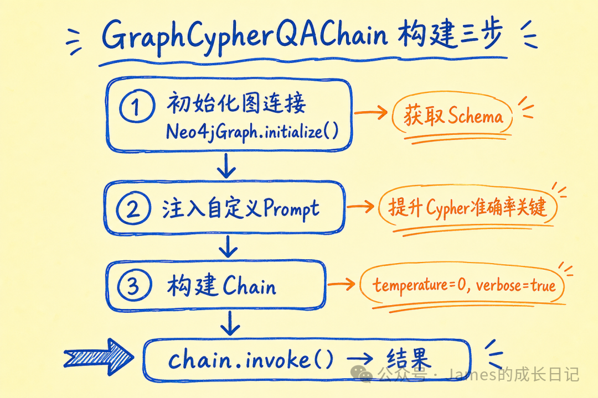

背后 LLM 自动生成的 Cypher(verbose 模式可见):
    
    
    MATCH (e:Engineer)-[r:WORKED_ON]->(p:Project)  
    WHERE p.name CONTAINS 'payment'  
    RETURN e.name, e.level, r.role  
    LIMIT 50  
    

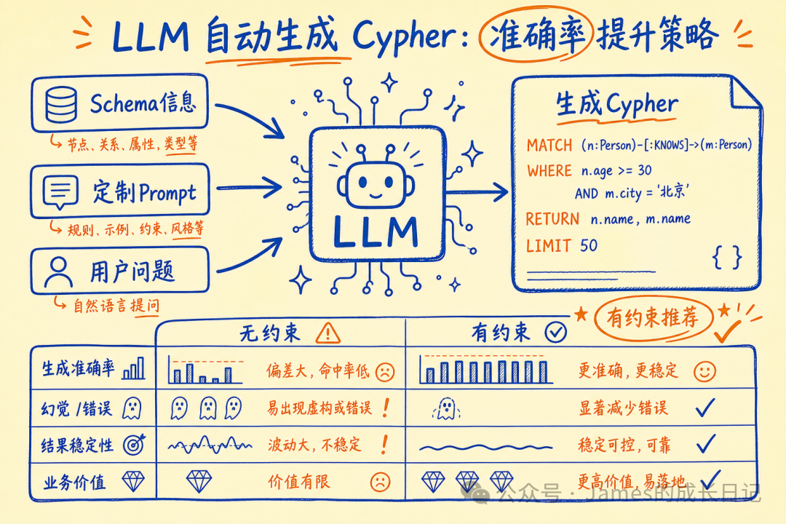

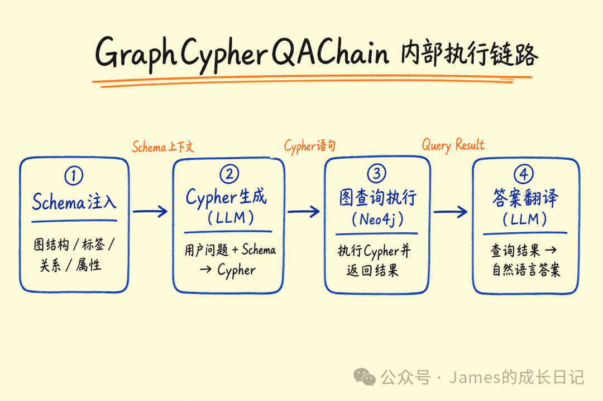

* * *

## 06 生产级建模：以技术团队知识图谱为例

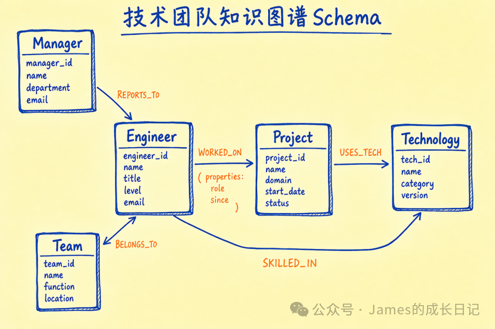

光看语法没感觉，来一个完整例子：把技术团队的人员、项目、技术栈全部关联起来。

**建模原则** ：先列实体（名词），再列关系（动词），关系属性描述“怎么发生的”。

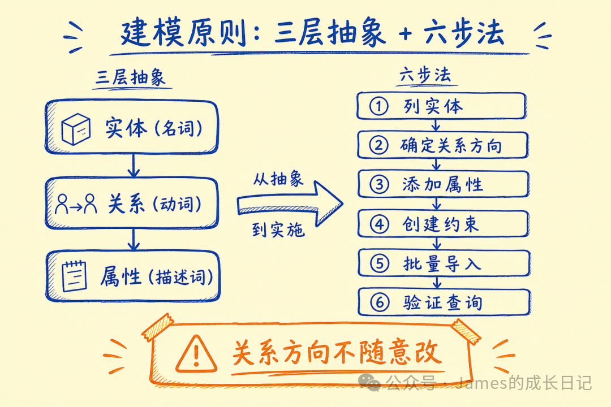
    
    
    实体节点：  
    - Engineer:id, name, level, joinDate  
    - Project:id, name, status, startDate  
    - Technology:name, category  
    - Team:id, name, department  
      
    关系(主体 → 客体,统一方向):  
    - (Engineer)-[:REPORTS_TO]->(Manager)  
    - (Engineer)-[:BELONGS_TO]->(Team)  
    - (Engineer)-[:WORKED_ON {role, since}]->(Project)  
    - (Project)-[:USES_TECH]->(Technology)  
    - (Engineer)-[:SKILLED_IN {level}]->(Technology)  
    

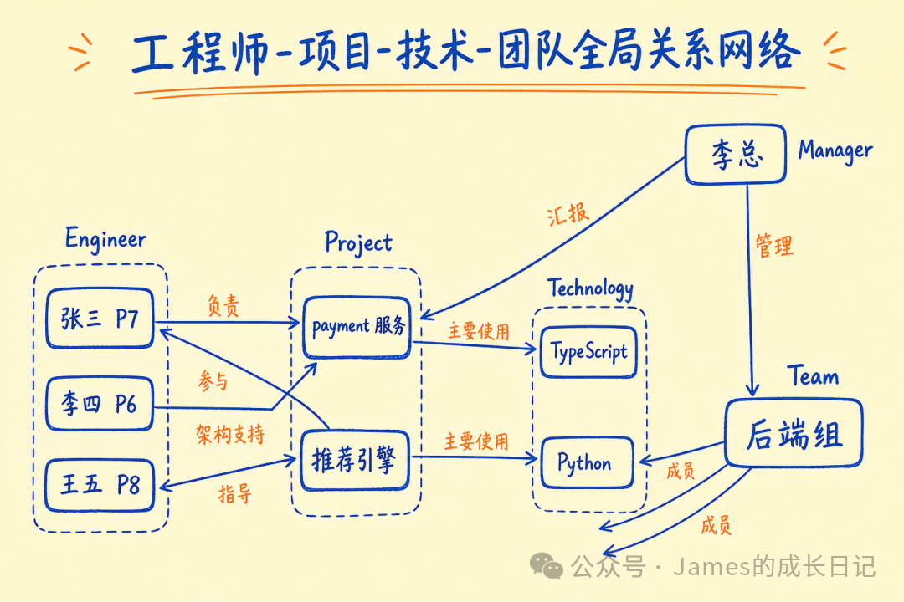

完整初始化脚本：
    
    
    async function buildKnowledgeGraph(driver: neo4j.Driver) {  
      const session = driver.session();  
      try {  
        // 创建唯一约束(相当于唯一索引,防重复 + 加速查询)  
        await session.run(`CREATE CONSTRAINT IF NOT EXISTS  
          FOR (e:Engineer) REQUIRE e.id IS UNIQUE`);  
        await session.run(`CREATE CONSTRAINT IF NOT EXISTS  
          FOR (p:Project) REQUIRE p.id IS UNIQUE`);  
      
        // 一次性批量写入工程师 + 项目 + 关系  
        await session.run(`  
          UNWIND $engineers AS eng  
          MERGE (e:Engineer {id: eng.id}) SET e += eng  
        `, {  
          engineers: [  
            { id: "E001", name: "张三", level: "P7", joinDate: "2022-03" },  
            { id: "E002", name: "李四", level: "P6", joinDate: "2023-06" },  
          ]  
        });  
      
        await session.run(`  
          UNWIND $assignments AS a  
          MATCH (e:Engineer {id: a.eid}), (p:Project {id: a.pid})  
          MERGE (e)-[r:WORKED_ON {role: a.role}]->(p)  
          SET r.since = a.since  
        `, {  
          assignments: [  
            { eid: "E001", pid: "P001", role: "lead", since: "2024-01" },  
            { eid: "E002", pid: "P001", role: "backend", since: "2024-03" },  
          ]  
        });  
      } finally {  
        await session.close();  
      }  
    }  
    
    
    
    def build_knowledge_graph(driver):  
        with driver.session() as session:  
            # 创建唯一约束（相当于唯一索引，防重复 + 加速查询）  
            session.run(  
                "CREATE CONSTRAINT IF NOT EXISTS FOR (e:Engineer) REQUIRE e.id IS UNIQUE"  
            )  
            session.run(  
                "CREATE CONSTRAINT IF NOT EXISTS FOR (p:Project) REQUIRE p.id IS UNIQUE"  
            )  
      
            # 一次性批量写入工程师  
            session.run(  
                """  
                UNWIND $engineers AS eng  
                MERGE (e:Engineer {id: eng.id}) SET e += eng  
                """,  
                engineers=[  
                    {"id": "E001", "name": "张三", "level": "P7", "joinDate": "2022-03"},  
                    {"id": "E002", "name": "李四", "level": "P6", "joinDate": "2023-06"},  
                ]  
            )  
      
            # 批量写入关系  
            session.run(  
                """  
                UNWIND $assignments AS a  
                MATCH (e:Engineer {id: a.eid}), (p:Project {id: a.pid})  
                MERGE (e)-[r:WORKED_ON {role: a.role}]->(p)  
                SET r.since = a.since  
                """,  
                assignments=[  
                    {"eid": "E001", "pid": "P001", "role": "lead", "since": "2024-01"},  
                    {"eid": "E002", "pid": "P001", "role": "backend", "since": "2024-03"},  
                ]  
            )  
    

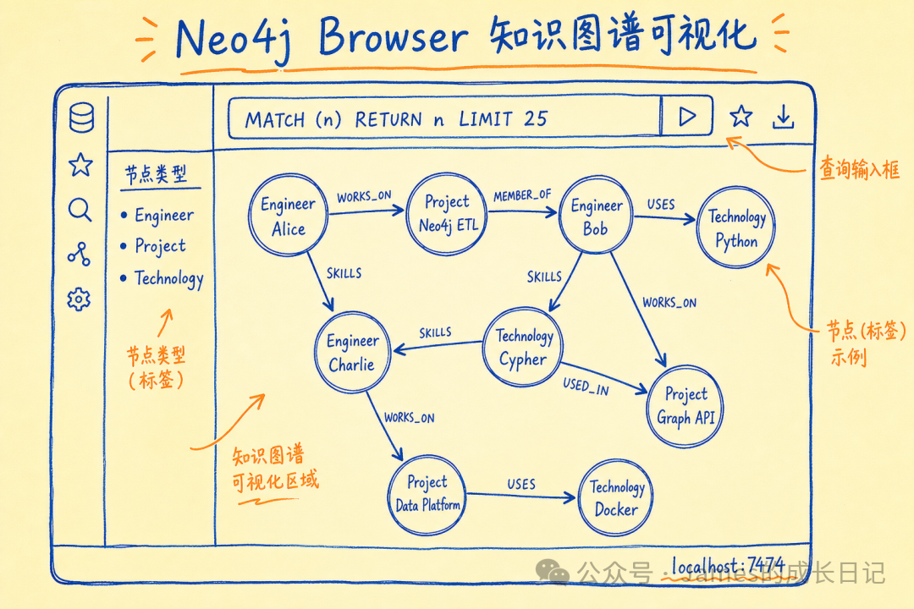

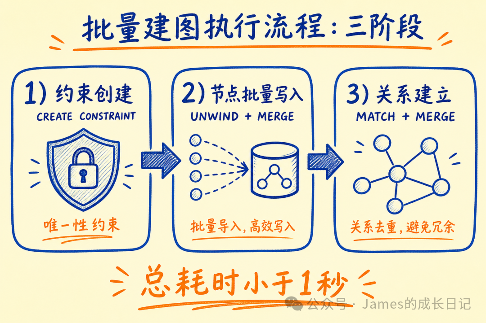

* * *

## 07 常见坑

**坑 1:关系方向写反，一条数据都查不到**

Cypher 的关系方向严格区分。`-[:WORKED_ON]->` 和 `<-[:WORKED_ON]-` 是两个方向，建图时随手写，查询时方向对不上，结果为空还以为数据没导进去。

解决：建模时统一约定方向，写进 schema 注释，查询严格对照。紧急排查可以用无向 `-[:WORKED_ON]-`(不加箭头)临时绕过，但性能略差。

**坑 2:用 CREATE 重跑脚本导致数据爆炸**

`CREATE` 每次都创建新节点，脚本跑两遍就出现两个一模一样的节点。**生产上永远用`MERGE`，不用 `CREATE`**(除非明确需要允许重复，如事件日志)。

**坑 3:LLM 生成的 Cypher 关系名大小写错误**

Neo4j 关系类型大小写敏感，`WORKED_ON` 和 `worked_on` 是两个不同关系。LLM 有时自作主张改大小写，导致查询为空。解决：在 cypherPrompt 里明确写出所有关系类型(全大写)。

**坑 4:忘记创建索引，全图扫描**

不加索引时，`MATCH (e:Engineer {name: '张三'})` 会扫所有 Engineer 节点。数据量上万就明显变慢。常用查询字段都要建索引：
    
    
    CREATE INDEX IF NOT EXISTS FOR (e:Engineer) ON (e.name);  
    CREATE INDEX IF NOT EXISTS FOR (p:Project) ON (p.name);  
    

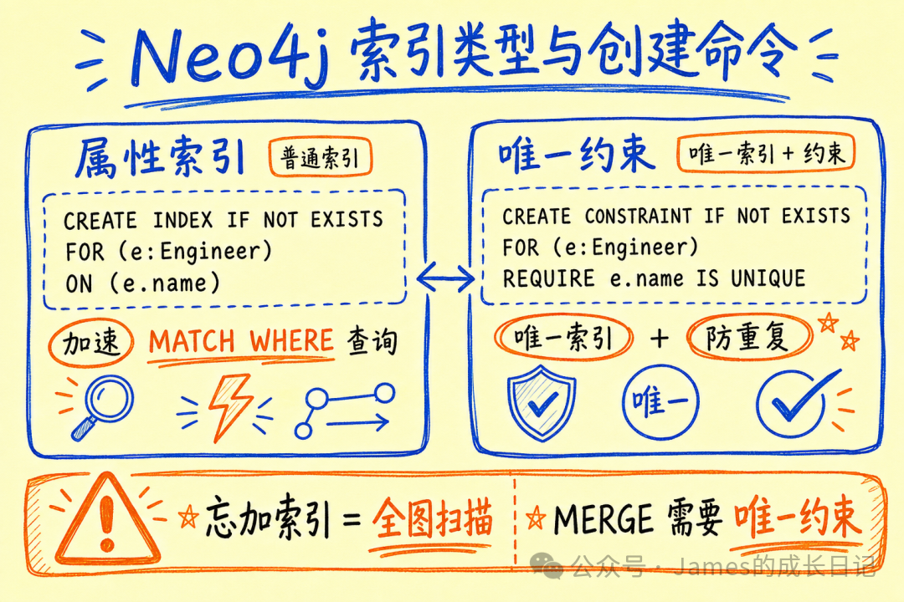

**坑 5:LIMIT 缺失导致全图返回**

LLM 生成的 Cypher 偶尔没有 LIMIT。复杂图里一次全局匹配可能返回几万条，内存直接打满。在 cypherPrompt 硬性要求加 `LIMIT 50`，并在 session 层设置超时。

**坑 6:把大段文本塞进节点属性**

图数据库的职责是**存关系结构** ，大段文章内容应存向量数据库，节点只存文档 ID 做关联。Neo4j 存「锚点」，向量库存「内容」，查完再合并——这才是正确姿势。

* * *

## 总结

这篇从头到尾把 Neo4j 知识图谱的核心链路打通了：

  * **图 vs 关系型** ：多跳关系查询是图的主场，JOIN 堆叠是关系型的死穴，两者互补不替代
  * **三要素** ：关系是一等公民，带方向、带类型、带属性，这是图数据库的根本设计
  * **Cypher 三大高频模式** ：`MERGE` 防重写入、`UNWIND` 批量写入、`*1..2` 路径深度控制，生产必会
  * **LangChain GraphCypherQAChain** ：LLM 自动生成 Cypher，`temperature=0` \+ 定制 prompt 是准确率关键
  * **建模原则** ：图存关系结构，向量库存文本内容，两边各司其职
  * **六个真实坑** ：关系方向、MERGE 代替 CREATE、索引缺失、LIMIT 缺失——上线前逐项核查

下一篇我们进入 Graph RAG 进阶，聊聊用 Neo4j 做多跳推理比纯向量检索更精准的具体场景在哪里。

* * *

关注我，James 的成长日记，持续分享干货，帮你在 AI 时代少走弯路。

---

> 本文由 Agent Reach 通过 Playwright 抓取并转换为 Markdown 格式。  
> 图片已保存至 `./images/` 目录。
