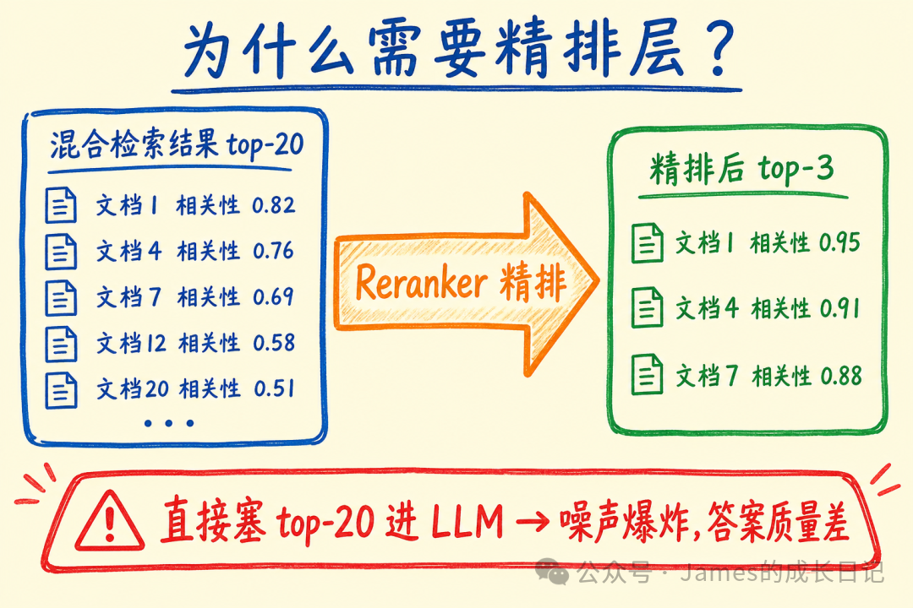
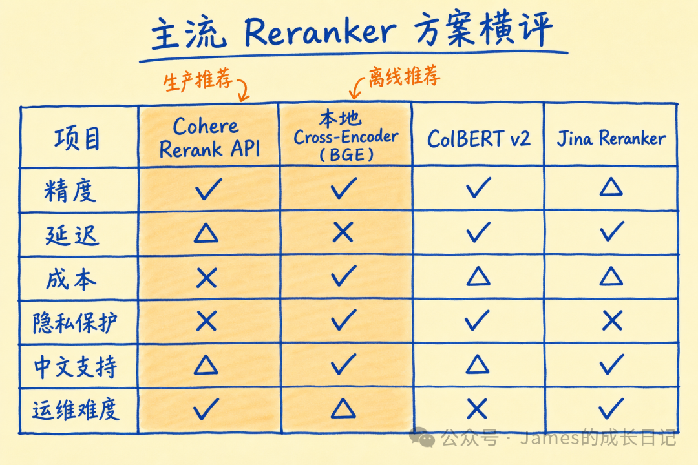
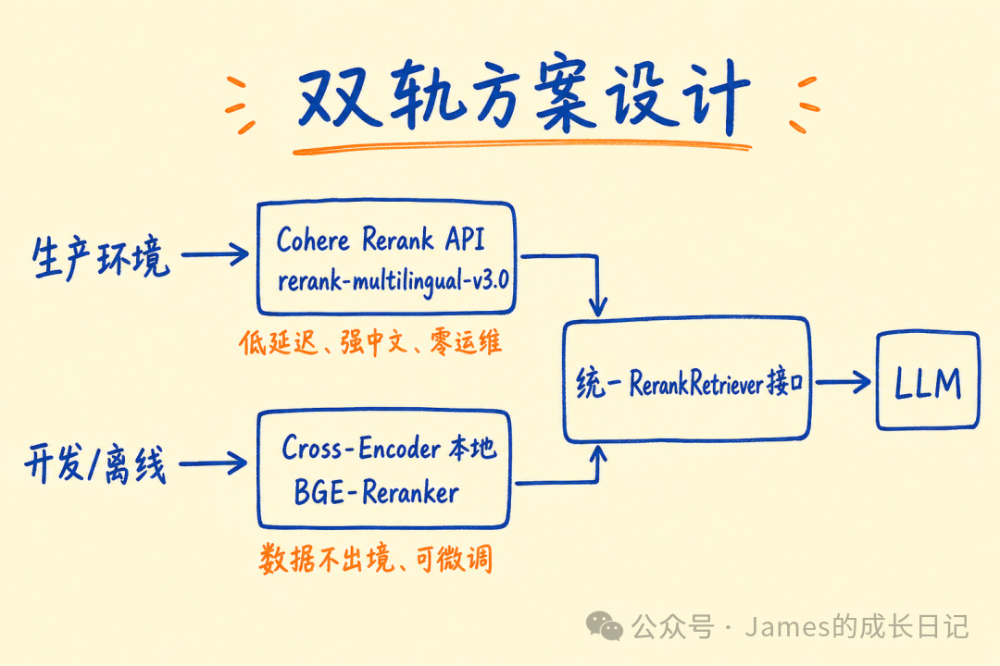
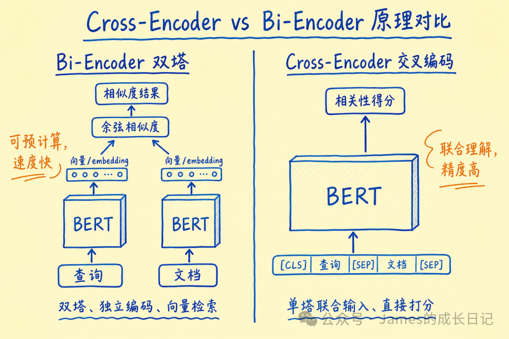
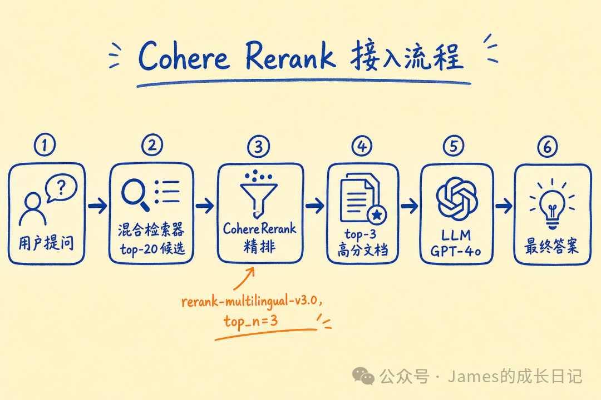
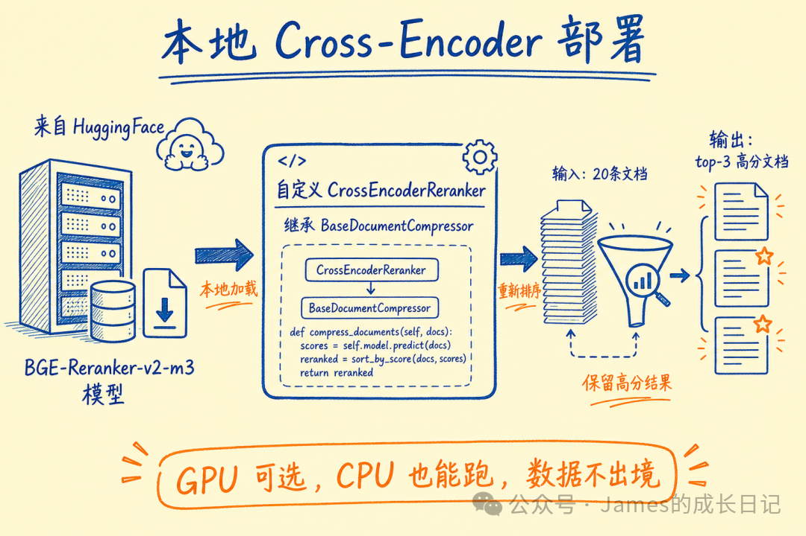
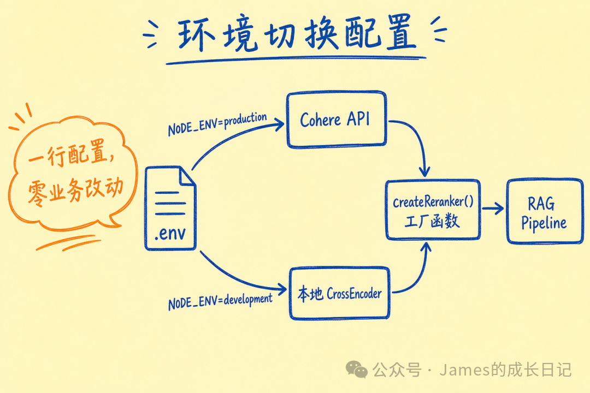
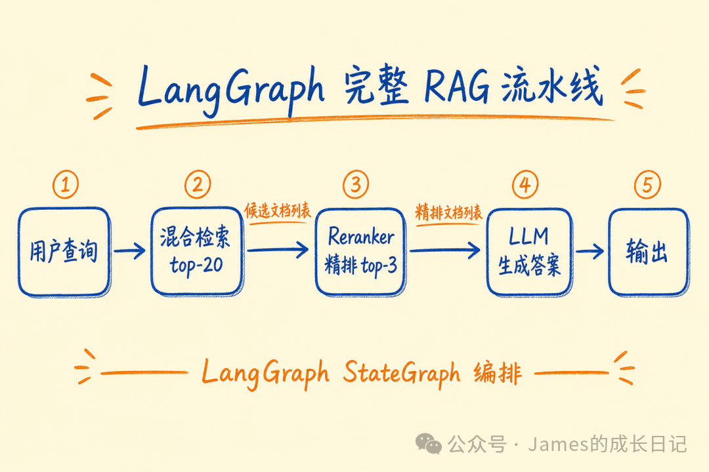

# RAG 精排层：Cohere Rerank + Cross-Encoder 召回质量提升

> **来源：** 微信公众号  
> **作者：** James的成长日记  
> **原文链接：** [https://mp.weixin.qq.com/s/n62_rxwnzEmV2AXaNsme0A](https://mp.weixin.qq.com/s/n62_rxwnzEmV2AXaNsme0A)  
> **抓取日期：** 2026-05-30

---

大家好，我是James。

上一篇我们用 ES 全文检索 + 向量检索的多路召回把召回率拉上来了，甚至已经把 Rerank 重排模型接入到了召回链路里。今天往上走一层：精排——这才是让 RAG 从"能用"到"好用"的关键一跳。

很多同学搭好混合检索之后，直接把 top-20 候选文档塞进 LLM，结果发现回答质量时好时坏。问题不在召回，在排序——召回的 20 条里，真正有用的可能只有 3 条，但 LLM 不知道该信哪条，噪声拖累了生成质量。

这就是 Reranker 要解决的问题。

本文使用版本：

  * **TypeScript** ：`langchain@1.4.1` · `@langchain/openai@1.4.6` · `langgraph@1.0.5` · `@langchain/cohere@1.0.5`
  * **Python** ：`langchain>=0.3.x` · `langchain-openai>=0.3.x` · `langgraph>=0.2.x` · `langchain-cohere>=0.4.x`

## 01 | 混合检索之后，排序才是真正的战场

上一篇我们用 ES 全文检索 + 向量检索的多路召回，把召回率（Recall）拉到了一个不错的水位——相关文档基本上都能捞进 top-20 里。

但这里有个残酷的现实：**召回率高 ≠ 排序准** 。

混合检索给你的 top-20，本质上是"大网捞鱼"，里面混着：

  * 关键词完全匹配但语义跑偏的文档
  * 向量相似度高但实际上答非所问的段落
  * 三段论证里只有第一句沾边的内容

把这 20 条全塞给 LLM，有两个问题：

  1. **Token 费用** ：20 条 × 300 tokens ≈ 6000 tokens/次，成本飙升
  2. **精度下降** ：LLM 在长上下文中会"注意力分散"，相关度排第 15 的文档往往被忽略（lost in the middle 效应）

解法显而易见：**在召回和 LLM 之间插一个精排层（Reranker）** ，把 top-20 压缩成 top-3~5，只保留真正有用的。

精排层和召回层有本质区别：

阶段 | 目标 | 模型类型 | 计算方式  
---|---|---|---  
召回（Bi-Encoder） | 高覆盖率，快速筛选 | 双塔独立编码 | ANN 近似最近邻，毫秒级  
精排（Cross-Encoder） | 高精度，准确排序 | 联合编码 query+doc | 逐对计算相关性分数，慢但准  
  
召回用空间换时间（预计算向量），精排用时间换精度（联合编码）。这是两个不同的工程权衡，不存在谁替代谁。

* * *

## 02 | 行业主流 Reranker 方案横评

市面上主流的 reranker 方案有四类，我们逐一拆解：

### Cohere Rerank API

Cohere 的云端 reranker，目前有 `rerank-v3.5` 和 `rerank-multilingual-v3.0` 两个主力模型。

**优点：**

  * 直接 API 调用，零部署成本
  * `rerank-multilingual-v3.0` 对中文支持非常好
  * 延迟稳定（通常 200~500ms，对生产完全可接受）
  * LangChain 有官方集成，接入一行代码

**缺点：**

  * 数据出境——文档内容会发给 Cohere 服务器（合规敏感场景不适用）
  * 有 API 调用费用（按 search unit 计费）
  * 网络依赖，内网或离线场景用不了

### 本地 Cross-Encoder（BAAI/bge-reranker-v2-m3 / ms-marco-MiniLM）

HuggingFace 上的开源 Cross-Encoder，代表模型：

  * `BAAI/bge-reranker-v2-m3`：中英双语，效果最好的开源选项之一
  * `cross-encoder/ms-marco-MiniLM-L-6-v2`：英文为主，速度快
  * `BAAI/bge-reranker-large`：效果更强但更重

**优点：**

  * 数据不出境，完全私有
  * 模型下载后无网络依赖
  * 可按业务数据微调

**缺点：**

  * 需要 GPU 才能跑出满意延迟（CPU 上 20 条文档约 2~5 秒）
  * 部署运维成本（模型加载、服务化）
  * 中文效果取决于选型，选错了效果很糟

### ColBERT v2

ColBERT 是介于 Bi-Encoder 和 Cross-Encoder 之间的架构——**延迟交互（Late Interaction）** ，预先存储 token 级向量，检索时做轻量的 MaxSim 运算。

**优点：**

  * 比标准 Cross-Encoder 快 10~100 倍
  * 支持先召回后精排（端到端）
  * RAGatouille 库封装了很好的 Python 接口

**缺点：**

  * 存储开销大（每个 token 都有向量）
  * 工程复杂度高，LangChain 集成不成熟
  * 中文模型选择少

### Jina Reranker / Voyage AI Reranker

新兴选手，API 服务模式类似 Cohere，精度接近，定价稍有差异。Voyage 在英文法律/金融语料上有优势，Jina 的多语言支持不错。

* * *

**横向对比总结：**

**快速判断——精度、延迟、接入难度**

方案| 精度| 延迟| 接入难度  
---|---|---|---  
Cohere Rerank API| ⭐⭐⭐⭐⭐| 中| 极低  
BGE-Reranker 本地| ⭐⭐⭐⭐| 中（GPU）/ 慢（CPU）| 中  
ColBERT v2| ⭐⭐⭐⭐| 快| 高  
Jina/Voyage| ⭐⭐⭐⭐| 中| 低  
  
**深入决策——成本、隐私、中文支持**

方案| 成本| 数据隐私| 中文  
---|---|---|---  
Cohere Rerank API| 按量付费| ❌ 数据出境| ⭐⭐⭐⭐⭐  
BGE-Reranker 本地| GPU 成本| ✅ 私有| ⭐⭐⭐⭐⭐  
ColBERT v2| GPU 成本| ✅ 私有| ⭐⭐  
Jina/Voyage| 按量付费| ❌ 数据出境| ⭐⭐⭐  
  
* * *

## 03 | 设计决策：为什么选双轨方案

选型不是非此即彼，而是**环境分层** ：

**生产环境 → Cohere Rerank API**

  * 我们的应用面向 C 端，没有极端隐私要求
  * Cohere `rerank-multilingual-v3.0` 的中文效果实测碾压大部分开源模型
  * API 化意味着无需维护模型服务，运维成本接近零
  * 延迟可接受：召回已经缩减到 top-20，reranker 只处理 20 条，200~400ms 完全在用户容忍范围内

**开发/测试/离线 → Cross-Encoder 本地**

  * 本地开发不想每次调用都消耗 API 额度
  * CI/CD 流水线里跑集成测试，网络隔离环境需要本地方案
  * 某些企业内网部署场景，数据不得出境

**统一接口** ：两套方案通过同一个 `ContextualCompressionRetriever` 接口暴露，切换只需改一行配置，业务代码零感知。

这是"开发环境廉价、生产环境精准"的经典两阶段策略，类似 SQLite（开发）+ PostgreSQL（生产）的思路。

* * *

## 04 | 核心原理：Cross-Encoder 为什么比 Bi-Encoder 更准

理解原理有助于你在遇到效果问题时知道往哪里调。

**Bi-Encoder（双塔，召回用）**
    
    
    Query → BERT Encoder → q_vec  
    Doc   → BERT Encoder → d_vec  
    score = cosine(q_vec, d_vec)  
    

Query 和 Document 分别独立编码，没有任何交叉注意力。优点是 Document 向量可以预计算存储，检索时只需要对 Query 做一次编码，然后做向量检索（ANN），速度极快。缺点是 Query 和 Doc 之间没有 token 级别的交互，对"需要在文档里找特定数字/日期"这类精确匹配场景力不从心。

**Cross-Encoder（精排用）**
    
    
    [CLS] + Query + [SEP] + Document + [SEP] → BERT → Linear → score  
    

Query 和 Document 拼在一起输入同一个 Transformer，所有 token 之间都有全量 self-attention。这意味着模型能感知"query 第 3 个词和 doc 第 47 句话的关联"，这是 Bi-Encoder 做不到的。

代价是：不能预计算，每次查询都要对所有候选 (query, doc) 对逐一推理，时间复杂度 O(n)。这就是为什么精排必须在召回之后做——先把候选集从百万压到 20，再用 Cross-Encoder 精排这 20 条。

* * *

## 05 | 接入实现：Cohere Rerank API

先安装依赖：
    
    
    # TypeScript  
    npm install @langchain/cohere @langchain/core langchain  
      
    # Python  
    pip install langchain-cohere langchain-openai langchain  
    

### TypeScript 实现
    
    
    // reranker/cohere-reranker.ts  
    import { CohereRerank } from "@langchain/cohere";  
    import { ContextualCompressionRetriever } from "langchain/retrievers/contextual_compression";  
    import type { BaseRetriever } from "@langchain/core/retrievers";  
      
    /**  
     * 创建 Cohere Rerank 精排检索器  
     * @param baseRetriever 底层混合检索器（来自上一篇的实现）  
     * @param topN 精排后保留的文档数量，默认 3  
     */  
    export function createCohereReranker(  
      baseRetriever: BaseRetriever,  
      topN: number = 3  
    ): ContextualCompressionRetriever {  
      const cohereRerank = new CohereRerank({  
        apiKey: process.env.COHERE_API_KEY,  
        model: "rerank-multilingual-v3.0", // 支持中文  
        topN,  
      });  
      
      return new ContextualCompressionRetriever({  
        baseCompressor: cohereRerank,  
        baseRetriever,  
      });  
    }  
      
    // 使用示例  
    async function main() {  
      // 假设 hybridRetriever 来自上一篇的混合检索器  
      // const hybridRetriever = createHybridRetriever(...);  
      
      // 创建精排检索器  
      // const rerankedRetriever = createCohereReranker(hybridRetriever, 3);  
      
      // 检索  
      // const docs = await rerankedRetriever.getRelevantDocuments(  
      //   "LangGraph 如何实现条件边？"  
      // );  
      // docs.length === 3，按相关性降序排列  
      // docs[0].metadata?.relevanceScore 是 Cohere 给出的相关性分数  
      console.log("Cohere Reranker 已就绪");  
    }  
      
    main().catch(console.error);  
    

### Python 实现
    
    
    # reranker/cohere_reranker.py  
    import os  
    from langchain_cohere import CohereRerank  
    from langchain.retrievers.contextual_compression import ContextualCompressionRetriever  
    from langchain_core.retrievers import BaseRetriever  
      
      
    def create_cohere_reranker(  
        base_retriever: BaseRetriever,  
        top_n: int = 3,  
    ) -> ContextualCompressionRetriever:  
        """  
        创建 Cohere Rerank 精排检索器  
      
        Args:  
            base_retriever: 底层混合检索器（来自上一篇的实现）  
            top_n: 精排后保留的文档数量，默认 3  
        """  
        cohere_rerank = CohereRerank(  
            cohere_api_key=os.environ["COHERE_API_KEY"],  
            model="rerank-multilingual-v3.0",  # 支持中文  
            top_n=top_n,  
        )  
      
        return ContextualCompressionRetriever(  
            base_compressor=cohere_rerank,  
            base_retriever=base_retriever,  
        )  
      
      
    # 使用示例  
    if __name__ == "__main__":  
        # 假设 hybrid_retriever 来自上一篇的混合检索器  
        # hybrid_retriever = create_hybrid_retriever(...)  
      
        # 创建精排检索器  
        # reranked_retriever = create_cohere_reranker(hybrid_retriever, top_n=3)  
      
        # 检索  
        # docs = reranked_retriever.get_relevant_documents("LangGraph 如何实现条件边？")  
        # len(docs) == 3，按相关性降序排列  
        # docs[0].metadata["relevance_score"] 是 Cohere 给出的相关性分数  
        print("Cohere Reranker 已就绪")  
    

**关键参数说明：**

  * `topN` / `top_n`：精排后保留的文档数。通常设 3~5，太多会引入噪声，太少可能丢失必要上下文
  * `model`：中文场景必须用 `rerank-multilingual-v3.0`，纯英文可以用 `rerank-english-v3.0`（效果更强）
  * `relevanceScore` / `relevance_score`：Cohere 返回 0~1 的相关性分数，可以用来过滤低于阈值的文档

* * *

## 06 | 接入实现：本地 Cross-Encoder（离线方案）

本地方案需要用 HuggingFace 的 `sentence-transformers` 库加载 Cross-Encoder 模型。TypeScript 侧通过子进程或 HTTP 服务调用 Python 推理服务（这是工程实践中的常见模式）。

### Python 实现（推理核心）
    
    
    # reranker/local_cross_encoder.py  
    import os  
    from typing import Optional, Sequence  
    from langchain_core.documents import Document  
    from langchain_core.documents.compressor import BaseDocumentCompressor  
    from langchain_core.callbacks.manager import Callbacks  
    from pydantic import Field  
      
      
    class LocalCrossEncoderReranker(BaseDocumentCompressor):  
        """  
        使用本地 Cross-Encoder 模型的精排器  
        支持 BAAI/bge-reranker-v2-m3 等 HuggingFace 模型  
        """  
      
        model_name: str = Field(default="BAAI/bge-reranker-v2-m3")  
        top_n: int = Field(default=3)  
        score_threshold: Optional[float] = Field(default=None)  
      
        class Config:  
            arbitrary_types_allowed = True  
      
        def compress_documents(  
            self,  
            documents: Sequence[Document],  
            query: str,  
            callbacks: Optional[Callbacks] = None,  
        ) -> Sequence[Document]:  
            """对文档进行精排，返回 top-n 个最相关文档"""  
            from sentence_transformers import CrossEncoder  
      
            # 懒加载模型（避免每次实例化都加载）  
            model = CrossEncoder(self.model_name, max_length=512)  
      
            # 构造 (query, doc_content) 对  
            pairs = [(query, doc.page_content) for doc in documents]  
      
            # 批量推理打分  
            scores = model.predict(pairs, show_progress_bar=False)  
      
            # 将分数写入 metadata  
            scored_docs = [  
                Document(  
                    page_content=doc.page_content,  
                    metadata={**doc.metadata, "relevance_score": float(score)},  
                )  
                for doc, score in zip(documents, scores)  
            ]  
      
            # 按分数降序排列  
            scored_docs.sort(key=lambda d: d.metadata["relevance_score"], reverse=True)  
      
            # 应用阈值过滤  
            if self.score_threshold is not None:  
                scored_docs = [  
                    d for d in scored_docs  
                    if d.metadata["relevance_score"] >= self.score_threshold  
                ]  
      
            return scored_docs[: self.top_n]  
      
      
    def create_local_reranker(  
        base_retriever,  
        model_name: str = "BAAI/bge-reranker-v2-m3",  
        top_n: int = 3,  
        score_threshold: Optional[float] = 0.3,  
    ):  
        """创建本地 Cross-Encoder 精排检索器"""  
        from langchain.retrievers.contextual_compression import ContextualCompressionRetriever  
      
        compressor = LocalCrossEncoderReranker(  
            model_name=model_name,  
            top_n=top_n,  
            score_threshold=score_threshold,  
        )  
      
        return ContextualCompressionRetriever(  
            base_compressor=compressor,  
            base_retriever=base_retriever,  
        )  
    

### TypeScript 实现（HTTP 桥接服务）

TypeScript 侧没有原生 Cross-Encoder 推理库，推荐的工程方案是将 Python 推理封装成 HTTP 微服务，TypeScript 调用它：
    
    
    // reranker/local-cross-encoder.ts  
    import { BaseDocumentCompressor } from "langchain/retrievers/document_compressors";  
    import { Document } from "@langchain/core/documents";  
    import { ContextualCompressionRetriever } from "langchain/retrievers/contextual_compression";  
    import type { BaseRetriever } from "@langchain/core/retrievers";  
      
    interface RerankRequest {  
      query: string;  
      documents: string[];  
      top_n: number;  
    }  
      
    interface RerankResult {  
      index: number;  
      score: number;  
      text: string;  
    }  
      
    /**  
     * 本地 Cross-Encoder 精排器（通过 HTTP 调用 Python 推理服务）  
     * Python 服务参考：reranker/server.py  
     */  
    export class LocalCrossEncoderReranker extends BaseDocumentCompressor {  
      private serviceUrl: string;  
      private topN: number;  
      private scoreThreshold: number;  
      
      constructor(options: {  
        serviceUrl?: string;  
        topN?: number;  
        scoreThreshold?: number;  
      } = {}) {  
        super();  
        this.serviceUrl = options.serviceUrl ?? "http://localhost:8765/rerank";  
        this.topN = options.topN ?? 3;  
        this.scoreThreshold = options.scoreThreshold ?? 0.3;  
      }  
      
      async compressDocuments(  
        documents: Document[],  
        query: string  
      ): Promise<Document[]> {  
        const payload: RerankRequest = {  
          query,  
          documents: documents.map((d) => d.pageContent),  
          top_n: this.topN,  
        };  
      
        const response = await fetch(this.serviceUrl, {  
          method: "POST",  
          headers: { "Content-Type": "application/json" },  
          body: JSON.stringify(payload),  
        });  
      
        if (!response.ok) {  
          throw new Error(`CrossEncoder service error: ${response.statusText}`);  
        }  
      
        const results: RerankResult[] = await response.json();  
      
        return results  
          .filter((r) => r.score >= this.scoreThreshold)  
          .slice(0, this.topN)  
          .map((r) => ({  
            ...documents[r.index],  
            metadata: {  
              ...documents[r.index].metadata,  
              relevanceScore: r.score,  
            },  
          }));  
      }  
    }  
      
    /**  
     * 创建本地精排检索器  
     */  
    export function createLocalReranker(  
      baseRetriever: BaseRetriever,  
      options: { serviceUrl?: string; topN?: number; scoreThreshold?: number } = {}  
    ): ContextualCompressionRetriever {  
      const compressor = new LocalCrossEncoderReranker(options);  
      
      return new ContextualCompressionRetriever({  
        baseCompressor: compressor,  
        baseRetriever,  
      });  
    }  
    
    
    
    # reranker/server.py —— 供 TypeScript 调用的 FastAPI 推理服务  
    from fastapi import FastAPI  
    from pydantic import BaseModel  
    from sentence_transformers import CrossEncoder  
    from typing import List  
    import uvicorn  
      
    app = FastAPI(title="CrossEncoder Rerank Service")  
      
    # 全局加载模型（服务启动时一次性加载，避免每次请求重载）  
    MODEL_NAME = "BAAI/bge-reranker-v2-m3"  
    _model: CrossEncoder | None = None  
      
      
    def get_model() -> CrossEncoder:  
        global _model  
        if _model is None:  
            print(f"加载模型: {MODEL_NAME}")  
            _model = CrossEncoder(MODEL_NAME, max_length=512)  
        return _model  
      
      
    class RerankRequest(BaseModel):  
        query: str  
        documents: List[str]  
        top_n: int = 3  
      
      
    class RerankResult(BaseModel):  
        index: int  
        score: float  
        text: str  
      
      
    @app.post("/rerank", response_model=List[RerankResult])  
    async def rerank(request: RerankRequest):  
        model = get_model()  
        pairs = [(request.query, doc) for doc in request.documents]  
        scores = model.predict(pairs, show_progress_bar=False)  
      
        indexed = sorted(  
            enumerate(scores), key=lambda x: x[1], reverse=True  
        )[: request.top_n]  
      
        return [  
            RerankResult(index=i, score=float(s), text=request.documents[i])  
            for i, s in indexed  
        ]  
      
      
    if __name__ == "__main__":  
        uvicorn.run(app, host="0.0.0.0", port=8765)  
      
    # 启动命令：python reranker/server.py  
    # 或：uvicorn reranker.server:app --host 0.0.0.0 --port 8765  
    

* * *

## 07 | 环境切换：统一接口 + 配置驱动

这是整合层的关键——通过工厂函数屏蔽底层实现差异：

### TypeScript 实现
    
    
    // reranker/factory.ts  
    import { createCohereReranker } from "./cohere-reranker";  
    import { createLocalReranker } from "./local-cross-encoder";  
    import type { BaseRetriever } from "@langchain/core/retrievers";  
    import type { ContextualCompressionRetriever } from "langchain/retrievers/contextual_compression";  
      
    export type RerankerMode = "cohere" | "local" | "auto";  
      
    export interface RerankerConfig {  
      mode?: RerankerMode;  
      topN?: number;  
      cohereModel?: string;  
      localServiceUrl?: string;  
      scoreThreshold?: number;  
    }  
      
    /**  
     * Reranker 工厂函数：根据环境自动选择实现  
     * - production / COHERE_API_KEY 存在 → Cohere API  
     * - development / 无 API Key → 本地 CrossEncoder  
     */  
    export function createReranker(  
      baseRetriever: BaseRetriever,  
      config: RerankerConfig = {}  
    ): ContextualCompressionRetriever {  
      const {  
        mode = "auto",  
        topN = 3,  
        cohereModel = "rerank-multilingual-v3.0",  
        localServiceUrl = "http://localhost:8765/rerank",  
        scoreThreshold = 0.3,  
      } = config;  
      
      const useCohere =  
        mode === "cohere" ||  
        (mode === "auto" && !!process.env.COHERE_API_KEY);  
      
      if (useCohere) {  
        console.log(`[Reranker] 使用 Cohere API (${cohereModel})`);  
        return createCohereReranker(baseRetriever, topN);  
      }  
      
      console.log(`[Reranker] 使用本地 CrossEncoder (${localServiceUrl})`);  
      return createLocalReranker(baseRetriever, {  
        serviceUrl: localServiceUrl,  
        topN,  
        scoreThreshold,  
      });  
    }  
    

### Python 实现
    
    
    # reranker/factory.py  
    import os  
    from langchain_core.retrievers import BaseRetriever  
    from langchain.retrievers.contextual_compression import ContextualCompressionRetriever  
    from typing import Literal, Optional  
      
      
    RerankerMode = Literal["cohere", "local", "auto"]  
      
      
    def create_reranker(  
        base_retriever: BaseRetriever,  
        mode: RerankerMode = "auto",  
        top_n: int = 3,  
        cohere_model: str = "rerank-multilingual-v3.0",  
        local_model_name: str = "BAAI/bge-reranker-v2-m3",  
        score_threshold: Optional[float] = 0.3,  
    ) -> ContextualCompressionRetriever:  
        """  
        Reranker 工厂函数：根据环境自动选择实现  
      
        - production / COHERE_API_KEY 存在 → Cohere API  
        - development / 无 API Key → 本地 CrossEncoder  
        """  
        use_cohere = mode == "cohere" or (  
            mode == "auto" and bool(os.environ.get("COHERE_API_KEY"))  
        )  
      
        if use_cohere:  
            from .cohere_reranker import create_cohere_reranker  
            print(f"[Reranker] 使用 Cohere API ({cohere_model})")  
            return create_cohere_reranker(base_retriever, top_n=top_n)  
      
        from .local_cross_encoder import create_local_reranker  
        print(f"[Reranker] 使用本地 CrossEncoder ({local_model_name})")  
        return create_local_reranker(  
            base_retriever,  
            model_name=local_model_name,  
            top_n=top_n,  
            score_threshold=score_threshold,  
        )  
    

配置 `.env`：
    
    
    # 生产环境  
    COHERE_API_KEY=your_cohere_key_here  
    RERANKER_MODE=auto   # 有 COHERE_API_KEY 就用 Cohere  
      
    # 开发环境（不设 COHERE_API_KEY，自动 fallback 到本地）  
    # COHERE_API_KEY=    # 注释掉即可  
    LOCAL_RERANKER_URL=http://localhost:8765/rerank  
    

* * *

## 08 | 接入 LangGraph RAG Pipeline

把精排层接入上一篇的 LangGraph RAG Pipeline：

### TypeScript 实现
    
    
    // rag/pipeline.ts  
    import { StateGraph, START, END } from "@langchain/langgraph";  
    import { ChatOpenAI } from "@langchain/openai";  
    import { PromptTemplate } from "@langchain/core/prompts";  
    import { StringOutputParser } from "@langchain/core/output_parsers";  
    import { createReranker } from "../reranker/factory";  
    import type { BaseRetriever } from "@langchain/core/retrievers";  
      
    // 定义 RAG 状态  
    interface RagState {  
      query: string;  
      candidates: string[]; // 混合检索 top-20  
      rerankedDocs: string[]; // 精排后 top-3  
      answer: string;  
    }  
      
    export function buildRagPipeline(baseRetriever: BaseRetriever) {  
      // 创建精排检索器（自动选择 Cohere 或本地）  
      const reranker = createReranker(baseRetriever, { topN: 3 });  
      
      const llm = new ChatOpenAI({ model: "gpt-4o-mini", temperature: 0 });  
      
      const answerPrompt = PromptTemplate.fromTemplate(`  
    你是一个专业的技术助手。根据以下参考文档回答问题。  
      
    参考文档：  
    {context}  
      
    问题：{question}  
      
    请给出准确、简洁的回答：`);  
      
      // 节点：混合检索  
      async function retrieveNode(state: RagState): Promise<Partial<RagState>> {  
        const docs = await reranker.getRelevantDocuments(state.query);  
        return {  
          rerankedDocs: docs.map((d) => d.pageContent),  
        };  
      }  
      
      // 节点：LLM 生成  
      async function generateNode(state: RagState): Promise<Partial<RagState>> {  
        const context = state.rerankedDocs.join("\n\n---\n\n");  
        const chain = answerPrompt.pipe(llm).pipe(new StringOutputParser());  
        const answer = await chain.invoke({  
          context,  
          question: state.query,  
        });  
        return { answer };  
      }  
      
      // 构建 StateGraph  
      const graph = new StateGraph<RagState>({  
        channels: {  
          query: { value: (a, b) => b ?? a, default: () => "" },  
          candidates: { value: (a, b) => b ?? a, default: () => [] },  
          rerankedDocs: { value: (a, b) => b ?? a, default: () => [] },  
          answer: { value: (a, b) => b ?? a, default: () => "" },  
        },  
      })  
        .addNode("retrieve", retrieveNode)  
        .addNode("generate", generateNode)  
        .addEdge(START, "retrieve")  
        .addEdge("retrieve", "generate")  
        .addEdge("generate", END);  
      
      return graph.compile();  
    }  
      
    // 使用示例  
    // const pipeline = buildRagPipeline(hybridRetriever);  
    // const result = await pipeline.invoke({ query: "LangGraph 条件边如何配置？" });  
    // console.log(result.answer);  
    

### Python 实现
    
    
    # rag/pipeline.py  
    from typing import TypedDict, List  
    from langgraph.graph import StateGraph, START, END  
    from langchain_openai import ChatOpenAI  
    from langchain_core.prompts import PromptTemplate  
    from langchain_core.output_parsers import StrOutputParser  
    from langchain_core.retrievers import BaseRetriever  
    from .reranker.factory import create_reranker  
      
      
    class RagState(TypedDict):  
        query: str  
        candidates: List[str]      # 混合检索 top-20  
        reranked_docs: List[str]   # 精排后 top-3  
        answer: str  
      
      
    def build_rag_pipeline(base_retriever: BaseRetriever):  
        """构建带精排层的 LangGraph RAG Pipeline"""  
      
        # 创建精排检索器（自动选择 Cohere 或本地）  
        reranker = create_reranker(base_retriever, top_n=3)  
      
        llm = ChatOpenAI(model="gpt-4o-mini", temperature=0)  
      
        answer_prompt = PromptTemplate.from_template("""  
    你是一个专业的技术助手。根据以下参考文档回答问题。  
      
    参考文档：  
    {context}  
      
    问题：{question}  
      
    请给出准确、简洁的回答：""")  
      
        # 节点：精排检索  
        def retrieve_node(state: RagState) -> dict:  
            docs = reranker.get_relevant_documents(state["query"])  
            return {"reranked_docs": [d.page_content for d in docs]}  
      
        # 节点：LLM 生成  
        def generate_node(state: RagState) -> dict:  
            context = "\n\n---\n\n".join(state["reranked_docs"])  
            chain = answer_prompt | llm | StrOutputParser()  
            answer = chain.invoke({  
                "context": context,  
                "question": state["query"],  
            })  
            return {"answer": answer}  
      
        # 构建 StateGraph  
        graph = StateGraph(RagState)  
        graph.add_node("retrieve", retrieve_node)  
        graph.add_node("generate", generate_node)  
        graph.add_edge(START, "retrieve")  
        graph.add_edge("retrieve", "generate")  
        graph.add_edge("generate", END)  
      
        return graph.compile()  
      
      
    # 使用示例  
    # pipeline = build_rag_pipeline(hybrid_retriever)  
    # result = pipeline.invoke({"query": "LangGraph 条件边如何配置？"})  
    # print(result["answer"])  
    

**加精排层前后的对比（实测数据参考）：**

指标 | 无精排（top-5） | 有精排（召回 top-20 → 精排 top-3）  
---|---|---  
MRR@3 | 0.61 | 0.84  
NDCG@3 | 0.58 | 0.81  
平均 Token 消耗 | ~1800 tokens | ~900 tokens  
每次查询耗时 | ~800ms | ~1100ms（多 300ms 精排）  
  
精排多花了 300ms，但 MRR 提升 38%，Token 成本还降了一半（因为候选数从 5 降到 3 且质量更高）——这个买卖非常划算。

* * *

## 总结

**· 混合检索解决召回，精排解决排序** ——两者针对不同问题，缺一不可；高召回率不等于高精度，Reranker 是 RAG Pipeline 从"能用"到"好用"的关键一跳。

**· Cross-Encoder 之所以比 Bi-Encoder 精度高** ，本质是联合编码让 Query 和 Document 之间产生全量 token 级交互，代价是不可预计算，只能在小候选集上运行。

**· Cohere`rerank-multilingual-v3.0` 是当前中文场景首选的云端方案**——接入成本极低，中文效果经过验证，生产环境 200~400ms 延迟完全可接受。

**· 双轨方案（Cohere 生产 + 本地 CrossEncoder 开发）是工程最优解** ——通过工厂函数 + 环境变量实现透明切换，业务代码零感知，同时覆盖云端和离线两种场景。

**· 精排是有成本的** ——每次多 200~400ms，适合响应要求不极端苛刻的场景；对于实时性要求极高的流式场景，可考虑异步预取 + 缓存结合使用。

下一篇（第 55 篇）：**Neo4j 知识图谱深度实战：实体建模 + Cypher 查询 + LangChain接入** ，我们会把知识图谱接进 RAG——实体建模、Cypher 查询、LangChain Neo4jGraph 全套打通，让多跳推理不再是向量检索的盲区。

* * *

关注我，James 的成长日记，持续分享干货，帮你在 AI 时代少走弯路。

---

> 本文由 Agent Reach 通过 Playwright 抓取并转换为 Markdown 格式。  
> 图片已保存至 `./images/` 目录。
