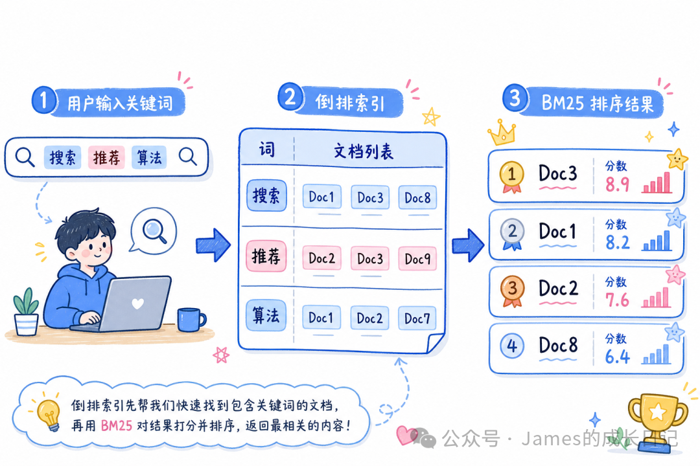
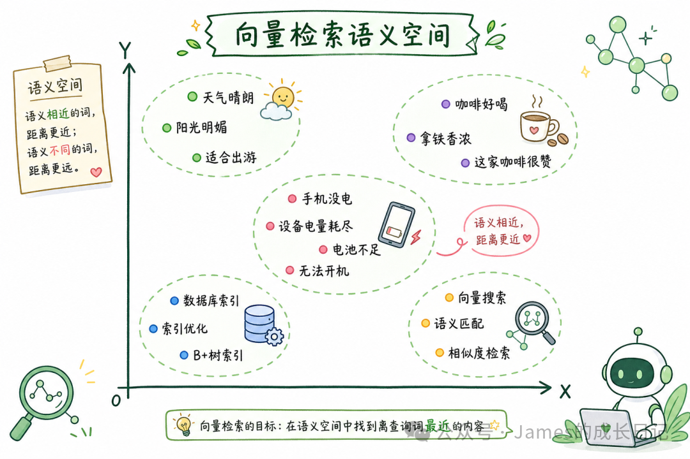
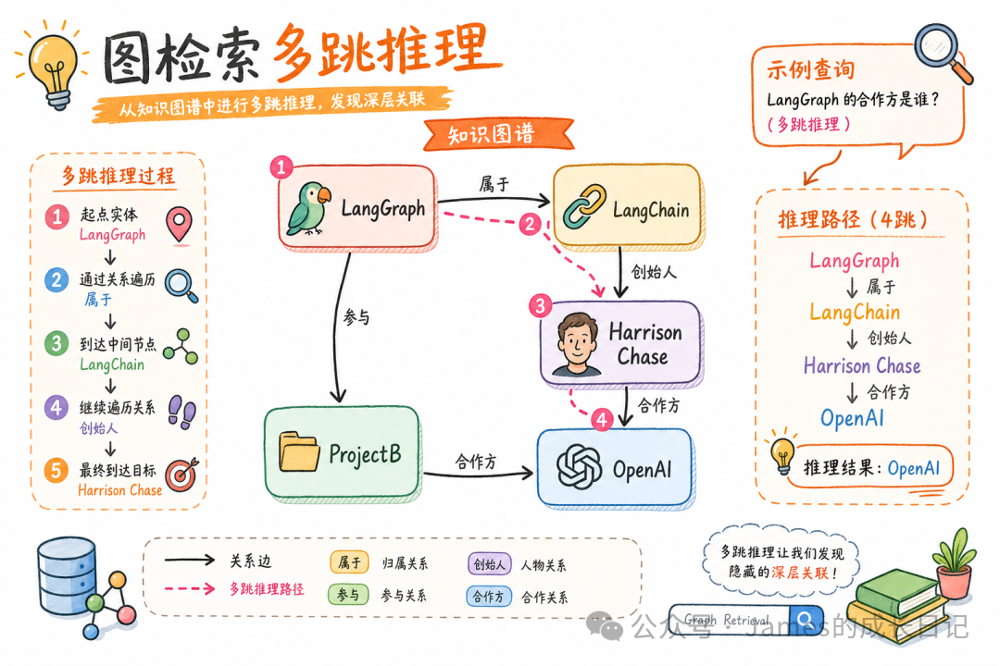
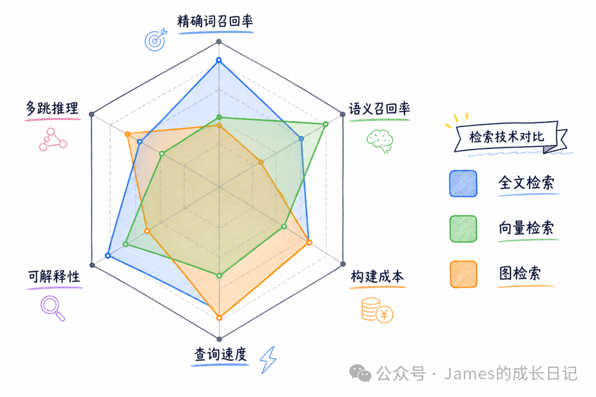
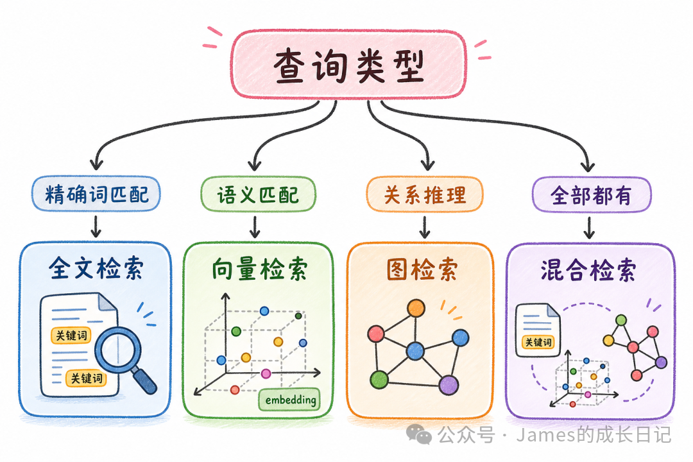
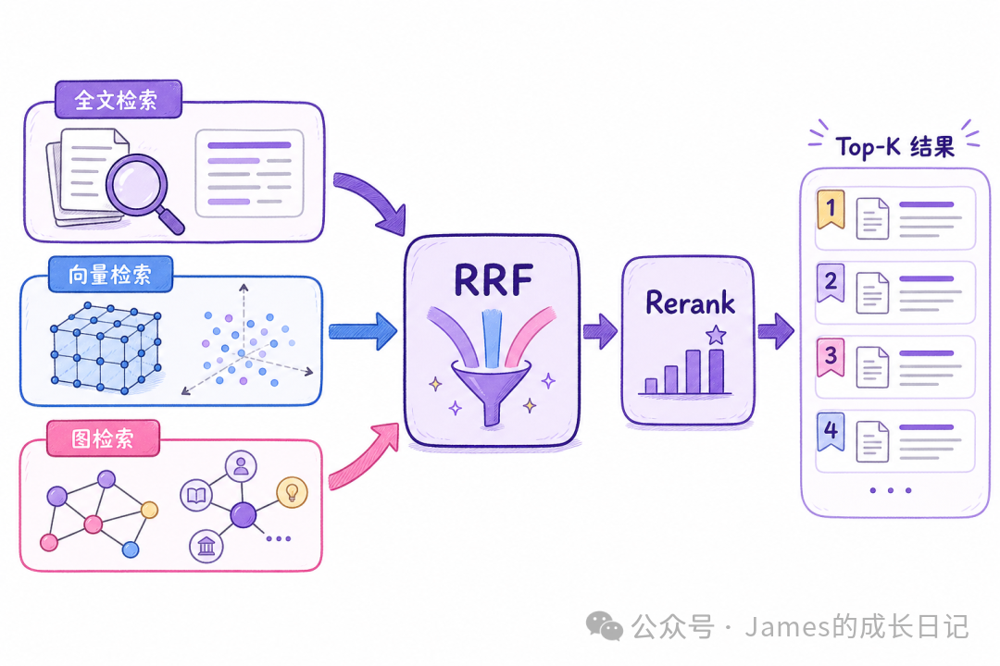
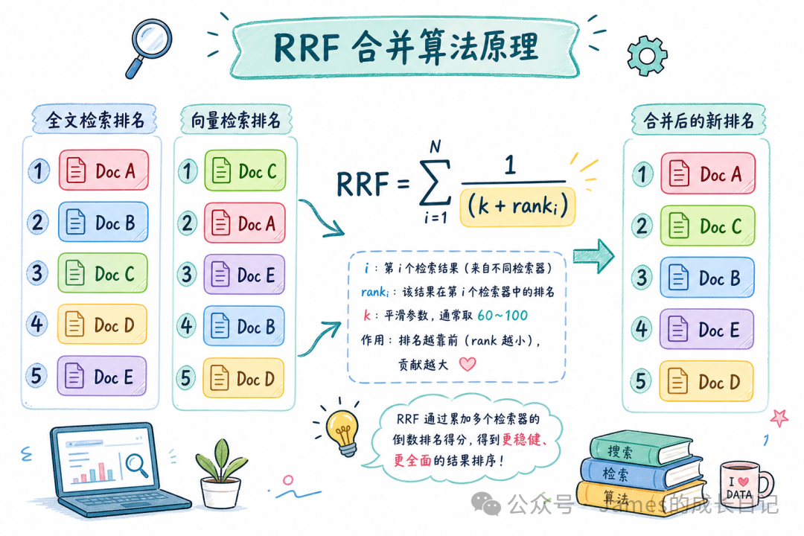
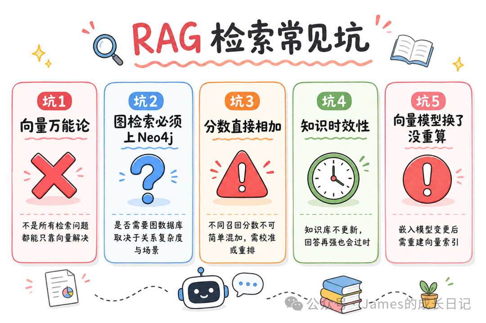
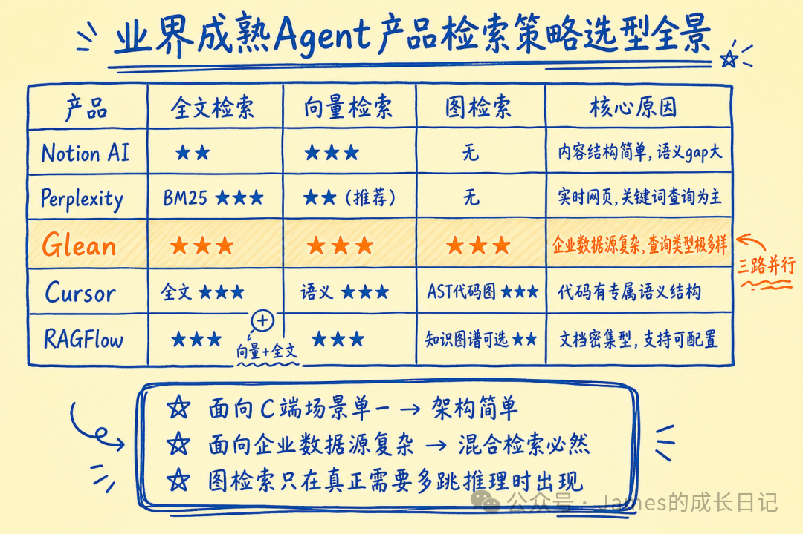

# 检索策略终极选型：全文检索 vs 向量检索 vs 图检索

> **来源：** 微信公众号  
> **作者：** James的成长日记  
> **原文链接：** [https://mp.weixin.qq.com/s/o19R7GLraF9hWFTUT1rIAA](https://mp.weixin.qq.com/s/o19R7GLraF9hWFTUT1rIAA)  
> **抓取日期：** 2026-05-30

---

大家好，我是James。

上一篇我们聊了 Graph RAG 如何用 Neo4j 做多跳推理，把知识图谱检索的能力拉满。那篇发完，好几个读者问我同一个问题：「既然图检索这么强，我是不是直接上图就完事了？」

这个问题问得很典型，也很容易踩坑。我见过一个团队，把整个知识库迁到 Neo4j，结果上线后发现——用户问「最新的退款政策是什么」这类问题，召回率反而比原来的 ES 差了 30%。不是 Neo4j 的问题，是用错场景了。

全文检索、向量检索、图检索，这三种技术各自解决的是完全不同的问题。没有哪种是「最强的」，只有「最合适的」。这篇我把三种检索的底层逻辑、适用场景、选型决策树全部拆开，配上真实对比数据，一次说清楚。

* * *

## 01 全文检索：倒排索引 + BM25，「字面精准」的王者

先说全文检索的底子。你在 Elasticsearch 里搜一个词，它干的事情是这样的：

> 用户输入「退款政策2024」 → 分词：[「退款」, 「政策」, 「2024」] → 倒排索引查找：「退款」→ [doc3, doc7, doc12, doc18]；「政策」→ [doc1, doc3, doc9, doc12]；「2024」→ [doc5, doc12, doc20] → 取交集 + BM25打分排序 → 返回：doc12(分最高) > doc3 > ...

BM25 的计分逻辑背后是三个思想：词频饱和（同一词出现100次，不是比出现5次重要20倍）、稀有词权重更高（「SPLADE」这种罕见术语，一出现就加大分）、文档长度归一化（短文档和长文档的词频不能用同一把尺子量）。
    
    
    // LangChain.js 里用 ES 做全文检索  
    import { Client } from "@elastic/elasticsearch";  
      
    const client = new Client({ node: "http://localhost:9200" });  
      
    async function fullTextSearch(query: string, indexName: string) {  
      const response = await client.search({  
        index: indexName,  
        body: {  
          query: {  
            multi_match: {  
              query: query,  
              fields: ["content^2", "title^3"],  // title权重更高  
              type: "best_fields",  
              fuzziness: "AUTO",  // 容错一两个字  
            },  
          },  
          highlight: {  
            fields: { content: { fragment_size: 150 } },  
          },  
        },  
      });  
      
      return response.hits.hits.map((hit) => ({  
        score: hit._score,  
        content: hit._source.content,  
        highlight: hit.highlight?.content,  
      }));  
    }  
    
    
    
    # Python 版本（elasticsearch==8.x · langchain-elasticsearch==0.2.x）  
    from elasticsearch import Elasticsearch  
      
    client = Elasticsearch("http://localhost:9200")  
      
    def full_text_search(query: str, index_name: str) -> list[dict]:  
        response = client.search(  
            index=index_name,  
            body={  
                "query": {  
                    "multi_match": {  
                        "query": query,  
                        "fields": ["content^2", "title^3"],  # title 权重更高  
                        "type": "best_fields",  
                        "fuzziness": "AUTO",  # 容错一两个字  
                    }  
                },  
                "highlight": {  
                    "fields": {"content": {"fragment_size": 150}}  
                },  
            },  
        )  
        return [  
            {  
                "score": hit["_score"],  
                "content": hit["_source"]["content"],  
                "highlight": hit.get("highlight", {}).get("content"),  
            }  
            for hit in response["hits"]["hits"]  
        ]  
    

**全文检索碾压其他两种的场景：**

  * 用户输入的是精确词汇：型号（`iPhone 15 Pro Max`）、法规条文编号（`合同法第52条`）、人名（`张三`）
  * 数据里有大量专业术语、缩写：医疗编码 `ICD-10`、技术规范 `RFC 7231`
  * 低延迟强需求：BM25 搜索比向量检索快 5-10 倍，资源消耗小一个数量级

**全文检索彻底扑街的场景：** 用户问「手机没电了怎么办」，但文档里写的是「设备电量耗尽处理方案」。BM25 拿「手机」「没电」去匹配，一条都召不回来，因为字面上根本不重合。

* * *

## 02 向量检索：语义空间里的「意义匹配」

向量检索的核心思想是：把语言映射到数学空间，让意思相近的句子，距离也相近。

> 「手机没电了」 → [0.82, -0.31, 0.47, ..., 0.12]（1536维） 「设备电量耗尽」 → [0.79, -0.28, 0.51, ..., 0.15]（1536维） 余弦相似度 = 0.94 ← 非常近，能召回

这就是为什么「语义检索」能找到「表达方式不同，但意思相同」的内容。
    
    
    // LangChain.js 向量检索完整示例  
    import { OpenAIEmbeddings } from "@langchain/openai";  
    import { Milvus } from "@langchain/community/vectorstores/milvus";  
      
    const embeddings = new OpenAIEmbeddings({ model: "text-embedding-3-small" });  
      
    const vectorStore = await Milvus.fromExistingCollection(embeddings, {  
      collectionName: "knowledge_base",  
      clientConfig: { address: "localhost:19530" },  
    });  
      
    // 语义检索 - 表达不同也能找到  
    async function semanticSearch(query: string, topK = 5) {  
      const results = await vectorStore.similaritySearchWithScore(query, topK);  
      return results  
        .filter(([_, score]) => score > 0.7)  
        .map(([doc, score]) => ({  
          content: doc.pageContent,  
          score,  
          metadata: doc.metadata,  
        }));  
    }  
      
    // MMR 避免返回重复内容  
    async function diverseSearch(query: string) {  
      return await vectorStore.maxMarginalRelevanceSearch(query, {  
        k: 8,  
        fetchK: 20,  
        lambda: 0.6,  // 0=最大多样性，1=最大相关性  
      });  
    }  
    
    
    
    # Python 版本（langchain-openai==0.1.x · langchain-milvus==0.1.x）  
    from langchain_openai import OpenAIEmbeddings  
    from langchain_milvus import Milvus  
      
    embeddings = OpenAIEmbeddings(model="text-embedding-3-small")  
      
    vector_store = Milvus(  
        embedding_function=embeddings,  
        collection_name="knowledge_base",  
        connection_args={"host": "localhost", "port": 19530},  
    )  
      
    # 语义检索 - 表达不同也能找到  
    def semantic_search(query: str, top_k: int = 5) -> list[dict]:  
        results = vector_store.similarity_search_with_score(query, k=top_k)  
        return [  
            {"content": doc.page_content, "score": score, "metadata": doc.metadata}  
            for doc, score in results  
            if score > 0.7  
        ]  
      
    # MMR 避免返回重复内容  
    def diverse_search(query: str) -> list:  
        return vector_store.max_marginal_relevance_search(  
            query,  
            k=8,  
            fetch_k=20,  
            lambda_mult=0.6,  # 0=最大多样性，1=最大相关性  
        )  
    

**向量检索真正发挥威力的场景：** 问答型 RAG（用户问「这个产品怎么退货」，文档里是「退款流程说明」）、多语言检索、模糊意图理解。

**向量检索踩坑最多的场景：** 精确数字/编号查询；否定语义（「不含咖啡因的饮料」——模型经常把「咖啡因」的相似度拉上来，反而召回含咖啡因的）；超长文档（单向量压缩了太多信息，检索精度大幅下降）。

* * *

## 03 图检索：关系网络里的「路径推理」

前两种检索的共同盲区是：**它们都把每个文档当独立个体对待，看不到文档之间的关系** 。

图检索解决的是另一类问题：

> 向量检索：搜「LangGraph 作者 OpenAI 合作」→ 没直接命中 → 召回失败
> 
> 图检索的推理路径： LangGraph → 属于 → LangChain → 创始人 → Harrison Chase Harrison Chase → 参与 → [项目A, 项目B, 项目C] 项目B → 合作方 → OpenAI → 找到了，3跳关系推理
    
    
    // LangChain.js + Neo4j 图检索 + 自然语言转 Cypher  
    import { Neo4jGraph } from "@langchain/community/graphs/neo4j_graph";  
    import { GraphCypherQAChain } from "langchain/chains/graph_qa/cypher";  
    import { ChatOpenAI } from "@langchain/openai";  
      
    const graph = await Neo4jGraph.initialize({  
      url: "bolt://localhost:7687",  
      username: "neo4j",  
      password: "your-password",  
      database: "knowledge",  
    });  
      
    const llm = new ChatOpenAI({ model: "gpt-4o", temperature: 0 });  
      
    const chain = GraphCypherQAChain.fromLLM({  
      llm,  
      graph,  
      returnIntermediateSteps: true,  
      cypherPrompt: `  
        你是 Neo4j 专家，将用户问题转换为 Cypher 查询。  
        只生成 MATCH/RETURN，不要 DELETE/UPDATE。  
        节点：Person, Organization, Project, Technology  
        关系：CREATED, WORKS_FOR, COLLABORATES_WITH, USES, BELONGS_TO  
      `,  
    });  
      
    const result = await chain.invoke({  
      query: "LangGraph 的创建者还参与了哪些项目？",  
    });  
      
    console.log("生成的 Cypher:", result.intermediateSteps[0].query);  
    console.log("答案:", result.result);  
    
    
    
    # Python 版本（langchain-community==0.2.x · neo4j==5.x）  
    from langchain_community.graphs import Neo4jGraph  
    from langchain.chains import GraphCypherQAChain  
    from langchain_openai import ChatOpenAI  
      
    graph = Neo4jGraph(  
        url="bolt://localhost:7687",  
        username="neo4j",  
        password="your-password",  
        database="knowledge",  
    )  
      
    llm = ChatOpenAI(model="gpt-4o", temperature=0)  
      
    chain = GraphCypherQAChain.from_llm(  
        llm=llm,  
        graph=graph,  
        return_intermediate_steps=True,  
        cypher_prompt_template="""  
        你是 Neo4j 专家，将用户问题转换为 Cypher 查询。  
        只生成 MATCH/RETURN，不要 DELETE/UPDATE。  
        节点：Person, Organization, Project, Technology  
        关系：CREATED, WORKS_FOR, COLLABORATES_WITH, USES, BELONGS_TO  
        """,  
    )  
      
    result = chain.invoke({"query": "LangGraph 的创建者还参与了哪些项目？"})  
    print("生成的 Cypher:", result["intermediate_steps"][0]["query"])  
    print("答案:", result["result"])  
    

**图检索专属的战场：** 多跳推理（供应商的供应商）、关系型问答（企业关系图谱）、路径发现（从技术A到技术B需要学哪些中间知识）、影响分析（改了这个模块，影响哪些下游服务）。

* * *

## 04 三种检索的横向对比：你真的需要图检索吗？

这是一份综合 benchmark 和工程实践的对比数据：

指标 | 全文检索(BM25) | 向量检索 | 图检索 | 混合检索  
---|---|---|---|---  
**精确词召回率** | ★★★★★ | ★★☆☆☆ | ★★★☆☆ | ★★★★☆  
**语义召回率** | ★★☆☆☆ | ★★★★★ | ★★★☆☆ | ★★★★☆  
**多跳关系推理** | ★☆☆☆☆ | ★☆☆☆☆ | ★★★★★ | ★★★☆☆  
**构建成本** | 低（导入即用） | 中（需Embedding） | 高（需抽取关系） | 中高  
**查询延迟** | 极低 <50ms | 低 50-200ms | 中 200-500ms | 中 100-300ms  
**知识更新成本** | 低（增量索引） | 低（增量向量化） | 高（维护图结构） | 低-中  
**可解释性** | ★★★★★ | ★★☆☆☆ | ★★★★☆ | ★★★☆☆  
  
看完这张表，结论很清楚：**图检索的多跳推理能力是独一无二的，但构建和维护成本比其他两种高出一个档次** 。

* * *

## 05 选型决策树：什么业务用什么检索

  * **精确词/编号/术语匹配** → 全文检索（ES/BM25）：型号查询、法规条文、合同编号
  * **「意思」而不是「词」的匹配** → 向量检索（Milvus/Weaviate）：FAQ问答、文档理解、多语言
  * **实体之间的关系推理** → 图检索（Neo4j）：供应链分析、组织架构、知识图谱问答
  * **以上都有** → 混合检索（多路召回 + Rerank）：实际生产系统 80% 属于这里

**具体业务场景速查：**

业务场景 | 推荐策略 | 理由  
---|---|---  
电商商品搜索 | 全文 + 向量混合 | 商品型号要精确，语义也要匹配  
企业知识库问答 | 向量 + 全文混合 | 问法多样，但也有精确词  
法律合规检索 | 全文检索为主 | 法条引用必须精确，不能「语义近似」  
医疗诊断知识图谱 | 图检索 | 症状-疾病-治疗的多跳推理  
代码文档检索 | 全文 + 向量混合 | API 名字要精确，注释要语义匹配  
供应链风险分析 | 图检索为主 | 企业关联关系的多跳分析  
客服对话系统 | 向量检索为主 | 用户问法千变万化  
产品说明书问答 | 向量检索为主 | 用户自然语言问，文档是结构化写法  
  
* * *

## 06 混合检索的工程实现：三路召回 + RRF 合并

实际生产里，80% 的系统最终都走到了「混合检索」。这里是完整实现：
    
    
    // 三路召回 + RRF (Reciprocal Rank Fusion) 合并 + Rerank 精排  
    import { CohereRerank } from "@langchain/cohere";  
      
    interface SearchResult {  
      content: string;  
      score: number;  
      source: "fulltext" | "vector" | "graph";  
      metadata?: Record<string, unknown>;  
    }  
      
    // RRF：消除不同检索系统分数不可比的问题  
    // 关键：只用排名，不用分数绝对值  
    function reciprocalRankFusion(  
      results: SearchResult[][],  
      k = 60  
    ): SearchResult[] {  
      const scoreMap = new Map<string, { score: number; doc: SearchResult }>();  
      
      for (const resultList of results) {  
        resultList.forEach((doc, rank) => {  
          const key = doc.content.slice(0, 100);  
          const rrfScore = 1 / (k + rank + 1);  
          if (scoreMap.has(key)) {  
            scoreMap.get(key)!.score += rrfScore;  
          } else {  
            scoreMap.set(key, { score: rrfScore, doc });  
          }  
        });  
      }  
      
      return Array.from(scoreMap.values())  
        .sort((a, b) => b.score - a.score)  
        .map((item) => item.doc);  
    }  
      
    // 判断是否需要图检索（关系推理关键词触发）  
    function needsRelationalReasoning(query: string): boolean {  
      const keywords = [  
        "的上级", "的下级", "负责人", "属于", "管理",  
        "关联", "依赖", "影响", "供应商", "合作方",  
      ];  
      return keywords.some((kw) => query.includes(kw));  
    }  
      
    async function hybridSearch(query: string, topK = 5) {  
      const tasks: Promise<SearchResult[]>[] = [  
        fullTextSearch(query).then((r) =>  
          r.map((d) => ({ ...d, source: "fulltext" as const }))  
        ),  
        semanticSearch(query).then((r) =>  
          r.map((d) => ({ ...d, source: "vector" as const }))  
        ),  
      ];  
      
      // 图检索按需开启，成本高  
      if (needsRelationalReasoning(query)) {  
        tasks.push(  
          graphSearch(query).then((r) =>  
            r.map((d) => ({ ...d, source: "graph" as const }))  
          )  
        );  
      }  
      
      const allResults = await Promise.all(tasks);  
      const merged = reciprocalRankFusion(allResults);  
      
      // Rerank 精排（提升质量但+100ms延迟）  
      if (merged.length > topK) {  
        const reranker = new CohereRerank({ model: "rerank-multilingual-v3.0" });  
        return await reranker.compressDocuments(  
          merged.slice(0, 20).map((r) => ({  
            pageContent: r.content,  
            metadata: r.metadata ?? {},  
          })),  
          query  
        );  
      }  
      
      return merged.slice(0, topK);  
    }  
    
    
    
    # Python 版本（langchain-cohere==0.1.x · langchain-community==0.2.x）  
    import asyncio  
    from dataclasses import dataclass, field  
    from langchain_cohere import CohereRerank  
    from langchain_core.documents import Document  
      
    @dataclass  
    class SearchResult:  
        content: str  
        score: float  
        source: str  # "fulltext" | "vector" | "graph"  
        metadata: dict = field(default_factory=dict)  
      
    # RRF：消除不同检索系统分数不可比的问题，只用排名  
    def reciprocal_rank_fusion(  
        results: list[list[SearchResult]], k: int = 60  
    ) -> list[SearchResult]:  
        score_map: dict[str, dict] = {}  
        for result_list in results:  
            for rank, doc in enumerate(result_list):  
                key = doc.content[:100]  
                rrf_score = 1 / (k + rank + 1)  
                if key in score_map:  
                    score_map[key]["score"] += rrf_score  
                else:  
                    score_map[key] = {"score": rrf_score, "doc": doc}  
        return [  
            item["doc"]  
            for item in sorted(score_map.values(), key=lambda x: x["score"], reverse=True)  
        ]  
      
    # 判断是否需要图检索（关系推理关键词触发）  
    def needs_relational_reasoning(query: str) -> bool:  
        keywords = ["的上级", "的下级", "负责人", "属于", "管理",  
                    "关联", "依赖", "影响", "供应商", "合作方"]  
        return any(kw in query for kw in keywords)  
      
    async def hybrid_search(query: str, top_k: int = 5) -> list:  
        tasks = [  
            asyncio.to_thread(full_text_search, query),  
            asyncio.to_thread(semantic_search, query),  
        ]  
        # 图检索按需开启，成本高  
        if needs_relational_reasoning(query):  
            tasks.append(asyncio.to_thread(graph_search, query))  
      
        all_results = await asyncio.gather(*tasks)  
        merged = reciprocal_rank_fusion(list(all_results))  
      
        # Rerank 精排（提升质量但 +100ms 延迟）  
        if len(merged) > top_k:  
            reranker = CohereRerank(model="rerank-multilingual-v3.0")  
            docs = [Document(page_content=r.content, metadata=r.metadata) for r in merged[:20]]  
            return reranker.compress_documents(docs, query)[:top_k]  
      
        return merged[:top_k]  
    

* * *

## 07 常见坑：选型踩过的那些雷

**坑 1：「向量检索万能论」**

把原来的 ES 全换成了向量库。结果上线后，产品编号搜索准确率从 95% 掉到了 60%。原因：向量检索对精确词不友好，「iPhone15ProMax-256G-黑色」和「iPhone 15 Pro Max 256GB 黑」在向量空间里距离不一定近。

**修复** ：保留 ES 做精确词的兜底召回，向量库做语义补充。

**坑 2：「图检索必须上 Neo4j」**

花了 3 个月把知识库全迁到 Neo4j，结果发现 80% 的查询根本不是关系推理，纯文档问答反而比 ES 差。

**修复** ：先问自己「我的查询真的需要多跳推理吗」。如果 95% 的问题是「找内容」，ES + 向量就够了。

**坑 3：「混合检索 = 结果简单合并」**

把 BM25 的分数和向量相似度分数直接相加——BM25 分数可能是 12.5，向量相似度是 0.87，单位完全不同，直接加没意义。

**修复** ：用 RRF，只用排名，不用分数绝对值。

**坑 4：图检索忽略知识时效性**

「张三的上级是李四」——但李四上个月离职了。图库没更新机制，推理结果可能是错的，而且 LLM 会把错误结果包装成「自信」的回答。

**修复** ：图节点和边要携带时间戳，查询时加时效过滤。

**坑 5：Embedding 模型换了，旧向量不重算**

把 `text-embedding-ada-002` 换成 `text-embedding-3-small` 后，新文档入库用新模型，旧文档没重算——两批向量在不同的空间里，相似度比较完全失效。这是血泪教训。

**修复** ：更换 Embedding 模型后，必须全量重算所有向量。

* * *

## 08 业界实战：成熟 Agent 产品怎么选检索策略

理论讲完了，来看看真实世界里那些被几千万用户验证过的产品，到底是怎么选的。

### Notion AI：向量检索为主，全文检索兜底

Notion AI 的知识库问答是目前最主流的 RAG 落地案例之一。它的检索架构公开资料显示是**双路召回** ：

  * **主路** ：OpenAI `text-embedding-3-large` 向量检索，覆盖用户用口语问、文档用正式语写的语义 gap
  * **兜底** ：Postgres `tsvector` 全文检索，捕捉精确的页面标题、block ID 引用
  * **没有图检索** ：Notion 的内容结构是树形（page → block），关系相对简单，图检索的收益不足以覆盖维护成本

**选型逻辑** ：Notion 用户问问题的特点是「我知道大概写在哪，但不记得具体用词了」——这恰好是向量检索最擅长的场景。页面标题引用用全文兜底，覆盖率接近 100%。

### Perplexity：全文检索驱动，向量做语义补充

Perplexity 的核心是实时网页检索，BM25 在这里是主力。原因很直接：**网页搜索的查询词往往是关键词组合** （「特斯拉 Q1 2024 财报」），全文检索精度天然占优；实时性要求高，向量化有冷启动延迟。

但 Perplexity 同时维护一个向量索引用于「相关问题推荐」——把当前问题和历史高质量问答做语义匹配，推荐相关追问。这是向量检索做「发现」而不是「精确召回」的典型用法。

**选型逻辑** ：主任务（找答案）用全文，辅助任务（推荐发现）用向量。不混用，职责清晰。

### Glean（企业搜索）：三路全开的混合检索

Glean 是企业内部知识搜索的标杆产品，覆盖 Slack、Confluence、Jira、Google Drive 等 100+ 数据源。它的检索架构是目前公开案例里最复杂的：

  * **全文检索** ：每个数据源建独立的 ES 索引，处理精确的 Jira issue 编号、Slack 消息关键词
  * **向量检索** ：跨数据源的语义联合检索，解决「Slack 里说的和 Confluence 里写的意思一样但用词不同」
  * **图检索** ：员工关系图（谁负责什么、谁在哪个团队）+ 文档引用关系图，支持「找张三负责的所有项目的相关文档」这类多跳查询

    
    
    // Glean 风格的混合检索（简化版）  
    // 三路并发，RRF 合并，按数据源权重加成  
    async function enterpriseSearch(query: string, userCtx: UserContext) {  
      const [ftResults, vecResults, graphResults] = await Promise.all([  
        fullTextSearch(query, { sources: userCtx.accessibleSources }),  
        vectorSearch(query, { crossSource: true }),  
        graphSearch(query, {  
          personId: userCtx.userId,  
          hops: 2,  // 最多2跳，控制延迟  
        }),  
      ]);  
      
      // 按数据源新鲜度加权（最近修改的文档权重更高）  
      const weighted = applyFreshnessBoost([  
        ...ftResults.map(r => ({ ...r, source: 'fulltext' })),  
        ...vecResults.map(r => ({ ...r, source: 'vector' })),  
        ...graphResults.map(r => ({ ...r, source: 'graph' })),  
      ]);  
      
      return reciprocalRankFusion([weighted]);  
    }  
    
    
    
    # Python 版本（langchain-community==0.2.x）  
    import asyncio  
    from dataclasses import dataclass  
      
    @dataclass  
    class UserContext:  
        user_id: str  
        accessible_sources: list[str]  
      
    async def enterprise_search(query: str, user_ctx: UserContext) -> list:  
        ft_task = asyncio.to_thread(full_text_search, query, user_ctx.accessible_sources)  
        vec_task = asyncio.to_thread(vector_search, query, cross_source=True)  
        graph_task = asyncio.to_thread(graph_search, query,  
                                       person_id=user_ctx.user_id, hops=2)  
      
        ft_results, vec_results, graph_results = await asyncio.gather(  
            ft_task, vec_task, graph_task  
        )  
      
        # 按数据源新鲜度加权  
        all_results = (  
            [{**r, "source": "fulltext"} for r in ft_results] +  
            [{**r, "source": "vector"} for r in vec_results] +  
            [{**r, "source": "graph"} for r in graph_results]  
        )  
        weighted = apply_freshness_boost(all_results)  
        return reciprocal_rank_fusion([weighted])  
    

**选型逻辑** ：企业知识库的查询类型极度多样——有人搜 issue 编号（全文），有人问「上个季度 infra 团队做了什么」（向量），有人问「李总的直接下属负责哪些项目」（图）。三路全开是被迫的，不是炫技。

### Cursor / GitHub Copilot：代码库检索的特殊策略

代码检索是一个有趣的特例，既不是纯全文也不是纯向量：

  * **全文检索** ：函数名、变量名、import 路径必须精确匹配——`getUserById` 和 `get_user_by_id` 是不同函数，向量可能把它们当同一个
  * **向量检索** ：注释和文档字符串的语义检索，找「实现了分页逻辑的函数」
  * **结构化检索** ：AST 解析后的符号索引（TypeScript 的 `go to definition` 背后就是这个）——这既不是全文也不是向量，是专门的代码图谱

Cursor 的实现里，三种检索并行，但权重会根据查询类型动态调整：问「这个函数怎么用」偏向语义；问「哪里调用了 X 函数」偏向全文+结构化。

**选型逻辑** ：代码有自己的语义结构（AST），纯文本检索策略不够用，需要专门的代码理解层。

### 一张图总结：业界产品的选型模式

产品 | 主力检索 | 辅助检索 | 图检索 | 核心原因  
---|---|---|---|---  
Notion AI | 向量 | 全文兜底 | ✗ | 内容结构简单，语义gap大  
Perplexity | 全文(BM25) | 向量(推荐) | ✗ | 实时网页，关键词查询为主  
Glean | 三路并行 | - | ✓ | 企业数据源复杂，查询类型极多样  
Cursor | 全文+语义 | AST结构化 | ✓(代码图谱) | 代码有专属语义结构  
RAGFlow | 向量+全文 | 知识图谱 | 可选 | 文档密集型，支持可配置  
  
**结论很清晰** ：没有产品只用一种检索。越是面向 C 端、场景单一的产品，检索架构越简单（Notion/Perplexity）；越是面向企业、数据源复杂的产品，混合检索越复杂（Glean）。图检索只在真正需要多跳关系推理时才出现——不是因为酷，是因为别无选择。

* * *

## 总结

这篇从底层原理到工程实现，把三种检索方式的选型逻辑说清楚了：

  * **全文检索是精确词匹配的王** ：型号、编号、法规、术语，BM25 碾压其他方案，延迟最低，可解释性最强
  * **向量检索解决「意思对了但词不同」** ：90% 的 FAQ 问答、文档理解场景，向量检索是首选，成本可控
  * **图检索是关系推理的专属武器** ：多跳推理、实体关系分析，没有替代品，但构建维护成本不容忽视
  * **生产系统基本都是混合检索** ：全文 + 向量双路召回，RRF 合并，再 Rerank 精排，这套是当前工业界主流
  * **选型先问场景，别被技术热点带跑** ：图检索很酷，但大多数业务用不上多跳推理；先把全文 + 向量做扎实

下一篇我们进入「生产级 Agent 可观测性」板块，聊聊 LangSmith 全链路观测——怎么追踪 Agent 的每一个调用、量化评估 RAG 检索质量，从开发调试到生产监控一套搞定。

* * *

关注我，James 的成长日记，持续分享干货，帮你在 AI 时代少走弯路。

---

> 本文由 Agent Reach 通过 Playwright 抓取并转换为 Markdown 格式。  
> 图片已保存至 `./images/` 目录。
