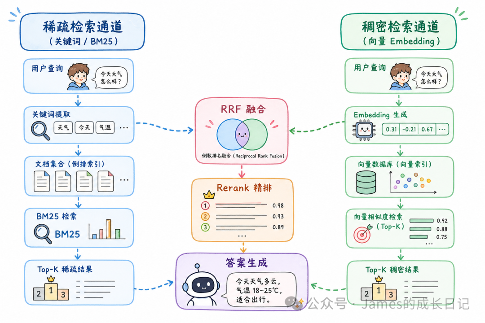
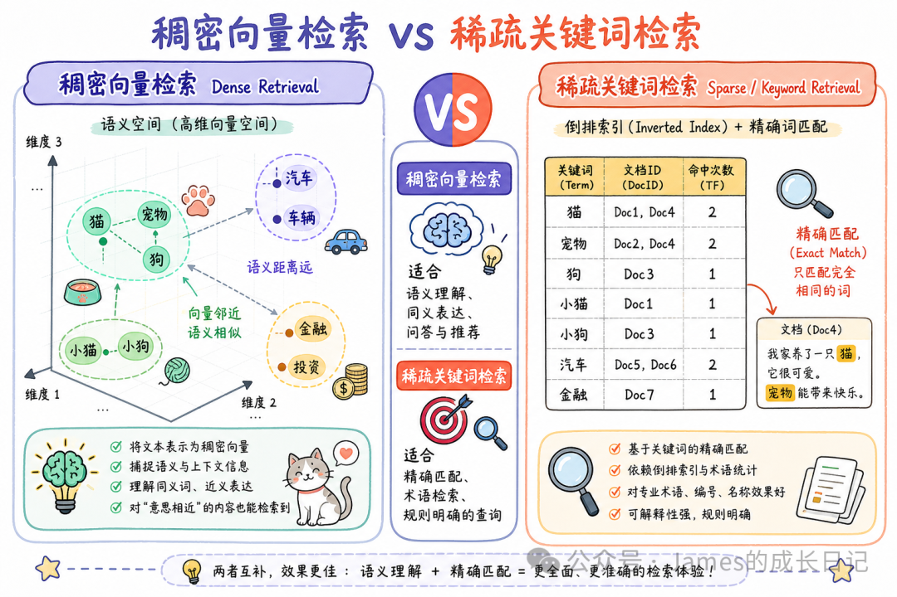

# 混合检索 RAG 实战：ES 全文检索 + 向量检索多路召回 + Rerank 重排，三招让召回率提升 40%

> **来源：** 微信公众号  
> **作者：** James的成长日记  
> **原文链接：** [https://mp.weixin.qq.com/s/1jifpImlAIq21zi3lQxL2A](https://mp.weixin.qq.com/s/1jifpImlAIq21zi3lQxL2A)  
> **抓取日期：** 2026-05-30

---

大家好，我是James。

上一篇我们拆解了 ElasticSearch 的倒排索引、IK 分词器和 BM25 算法——现在你手里有了全文检索这把刀，该聊聊怎么把它和向量检索拼在一起用了。

很多同学搭 RAG 系统时，第一版上线的都是纯向量检索。跑起来感觉不错，Demo 效果也挺顺滑。结果切换到真实数据之后发现：用户一输入产品型号、人名缩写或者专有术语，检索结果稀烂。比如搜「GPT-3.5-turbo」，向量居然给你返回「大语言模型发展历史」；搜「iOS 17.2 beta」，给你返回「苹果秋季发布会感想」。

不是向量检索不行，是**纯向量面对精确词汇时天生有盲区** 。但反过来，纯关键词检索又识别不了「怎么让 AI 记住对话历史」这种语义模糊的问题。

这就是混合检索要解决的问题：**两路召回，各取所长，最后用 RRF + Rerank 做精排** 。

* * *

## 01 为什么纯向量检索会翻车：稠密 vs 稀疏的底层差异

在讲怎么做之前，先搞清楚两种检索各自的底层逻辑。

**稠密向量检索（Dense Retrieval）** ，就是我们常说的向量检索。文本经过 Embedding 模型后变成一个 1536 维的浮点数组，相似语义的文本在高维空间里距离相近。检索时计算 cosine 相似度或点积，找最近邻。流程是：用户提问 → Embedding Model → 1536 维浮点数组 → ANN 近似最近邻搜索 → 返回语义相近文档。

**稀疏向量检索（Sparse Retrieval）** ，就是关键词检索那套。每个词是一个维度，文档的表示是一个超高维但极稀疏的向量（99% 都是 0），BM25 基于词频和逆文档频率打分。流程是：用户提问 → 分词（如「GPT-3.5-turbo API 调用」拆成 GPT、3.5、turbo、API、调用） → BM25 打分 → 精确匹配「GPT-3.5-turbo」的文档得高分。

**两种检索的致命短板** ：

场景 | 稠密向量检索 | 稀疏关键词检索  
---|---|---  
语义相近但用词不同 | ✅ 能找到 | ❌ 找不到  
精确产品型号/ID | ❌ 经常找错 | ✅ 精准命中  
缩写词（RAG/LLM/API） | ❌ 不稳定 | ✅ 精准命中  
多义词理解 | ✅ 结合上下文 | ❌ 机械匹配  
跨语言检索 | ✅ 支持 | ❌ 基本不行  
处理拼写错误 | ✅ 容错好 | ❌ 完全失效  
  
真实项目里，这两类问题**同时存在** 。你的用户既会问「怎么优化 Token 消耗」（语义模糊），也会问「@langchain/openai 1.2.0 有什么 Breaking Change」（精确术语）。

混合检索的思路很简单：**两路各自召回 Top-K，然后合并排序** 。

* * *

---

> 本文由 Agent Reach 通过 Playwright 抓取并转换为 Markdown 格式。  
> 图片已保存至 `./images/` 目录。
